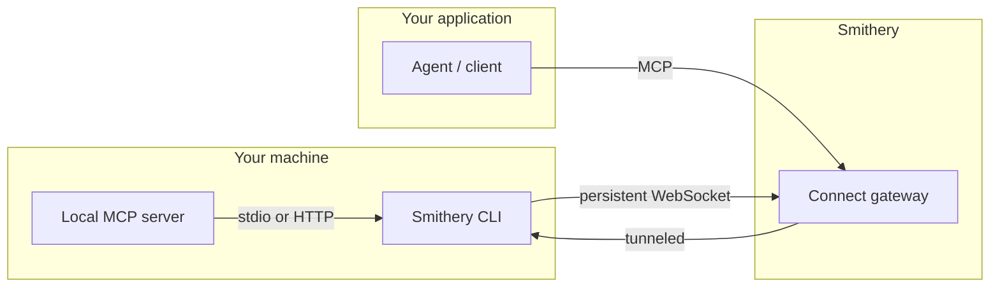

<!-- markdownlint-disable MD024 -->
## Goal

Setup and run Smithery MCP connections: log in, add MCP servers (`smithery mcp add`), list and call tools (`smithery tool list/call`), manage OAuth and API-key configuration, mint service tokens for browser/mobile clients, expose local MCP servers via Uplink, scope tokens per user/workspace, handle deep links, and integrate with the Vercel AI SDK. The full reference is embedded under `## Smithery Reference` below.

## Subgoals

1. **Auth** — `smithery auth login` and API key from `smithery.ai/account/api-keys`.
2. **Connect** — Add an MCP server with `smithery mcp add <url-or-package> --id <name>` (optionally `--headers` for API keys, query params for project IDs).
3. **Use** — `smithery tool list <id>`; `smithery tool call <id> <tool> '<json-args>'`.
4. **Multi-user** — Tag connections with `metadata.userId`; filter with `--metadata`.
5. **Tokens** — Mint scoped service tokens via `smithery auth token --policy '[...]'`; never expose API keys to clients.
6. **Uplink** — Expose localhost MCP or stdio command via `smithery mcp add http://localhost:PORT/mcp --id …` or `smithery mcp add --id … -- bunx -y <pkg>`.
7. **Integrate** — `createConnection` from `@smithery/api/mcp` with `@ai-sdk/mcp` or raw MCP SDK.

## Personas

- **Developer** — SDK/CLI setup, first connection, tool calls.
- **Integrator** — Multi-user app wiring, OAuth redirect, service tokens.
- **Reviewer** — Security validation (scoped tokens, TTLs, credential hygiene).

## Personality

- **Tone**: Reference-first, practical.
- **Style**: Cite the embedded Smithery documents for exact fields and endpoints.
- **Avoid**: Inventing server IDs, config schemas, or endpoints not in the reference.
- **Encourage**: Service tokens over API keys for client-facing code, explicit `auth_required`/`input_required` handling, reusing `connectionId` across retries.

## Context

Reference content was converted from `smithery-setup.prompt.txt` (a concatenated scrape of the official Smithery docs, llms.txt layout). It is authoritative for commands, statuses, and policy shapes. Prefer stated values over assumptions.

## Rules

1. **Reference-first** — For exact fields, endpoints, and statuses, use the `## Smithery Reference` below; do not guess parameters.
2. **Credential hygiene** — Never print or commit API keys; use `SMITHERY_API_KEY` env var; prefer scoped service tokens for client-facing code.
3. **TTL discipline** — When minting service tokens, always set a TTL (max 24h); scope to the minimum operations and metadata needed.
4. **Connection reuse** — Save `connectionId` and retry with it after OAuth (`auth_required` → `setupUrl` → retry).
5. **Config completeness** — For `input_required` connections, provide all `missing` fields (headers vs. query params per the server schema) before calling tools.
6. **Safe uplink** — Only uplink local servers/commands you trust; one tunnel per connection, use `--force` deliberately.
7. **Verify** — After every `smithery mcp add`, run `smithery tool list <id>` to confirm the connection before use.

## Workflow

Execute in phases; verify each phase before the next.

### Phase 1 — Authenticate

1. Run `smithery auth login` (or set `SMITHERY_API_KEY` from `smithery.ai/account/api-keys`).
2. Verify auth: `smithery mcp list`.

### Phase 2 — Connect a Server

3. Add an MCP server (hosted, config-required, uplink-local, or stdio command):

   ```bash
   smithery mcp add exa --id exa
   # with config: API keys -> --headers, project IDs -> query params on the URL
   smithery mcp add '@browserbasehq/mcp-browserbase?browserbaseProjectId=<pid>' \
     --id my-bb --headers '{"browserbaseApiKey":"<key>"}'
   # local HTTP (uplink) or stdio package
   smithery mcp add http://localhost:9090/mcp --id chrome
   smithery mcp add --id chrome -- bunx -y @chromedevtools/chrome-devtools-mcp
   ```

4. Check the returned status: `connected` (ready), `auth_required` (OAuth via `setupUrl`), `input_required` (provide `missing` fields), or `error`.

### Phase 3 — Use Tools

5. `smithery tool list <id>` to enumerate tools.
6. `smithery tool call <id> <tool> '<json-args>'` to invoke.
7. For apps, wire via `createConnection` from `@smithery/api/mcp` (+ `@ai-sdk/mcp` or MCP SDK), or use the namespace endpoint `https://mcp.smithery.run/{namespace}`.

### Phase 4 — Multi-User & Tokens

8. Tag connections with `metadata.userId` (`--metadata '{"userId":"..."}'`) and filter with `--metadata`.
9. Mint scoped service tokens: `smithery auth token --policy '[...]'` with namespace/resource/operation/metadata constraints and TTL ≤24h.
10. Narrow existing tokens for specific users instead of minting new broad ones.

### Phase 5 — Uplink Local Servers

11. For local development, `smithery mcp add <localhost-url|command> --id <name>` opens a tunnel; keep the CLI running (status `connected`; `--force` to take over).

### Phase 6 — Verify & Document

12. Confirm each connection with `smithery tool list <id>`; handle auth/config states per the embedded reference.
13. Record namespaces, connection IDs, token scopes, and expiry in the project docs.

## Quick Reference — CLI Cheat-sheet

```bash
smithery auth login
smithery mcp add exa --id exa
smithery mcp add '@browserbasehq/mcp-browserbase?browserbaseProjectId=<pid>' --id my-bb --headers '{"browserbaseApiKey":"<key>"}'
smithery mcp add http://localhost:9090/mcp --id chrome                      # uplink (local)
smithery mcp add --id chrome -- bunx -y @chromedevtools/chrome-devtools-mcp  # stdio
smithery tool list <id>
smithery tool call <id> search '{"query":"mcp"}'
smithery mcp list --metadata '{"userId":"user-123"}'
smithery auth token --policy '[{"namespaces":"my-app","resources":"connections","operations":["read","execute"],"metadata":{"userId":"user-123"},"ttl":"1h"}]'
```

## Quick Reference — Connection Statuses

| Status           | Meaning                                                        | Next action                                    |
|| ---------------- | -------------------------------------------------------------- | ---------------------------------------------- ||
| `connected`      | Ready to use                                                   | Call tools                                     |
| `auth_required`  | OAuth needed; `setupUrl` provided            | Redirect user to `setupUrl`, then retry        |
| `input_required` | Config missing (API keys etc.)               | Provide fields from `missing`/`http` schema    |
| `error`          | Connection failed                             | Inspect `message`, fix, retry                  |

## Verification

- `smithery tool list <id>` returns the server's tools for a fresh connection.
- `auth_required` connections direct to `setupUrl` and resume with the saved `connectionId`.
- `input_required` connections list `missing` fields and become `connected` once provided.
- Service tokens can reach ONLY their scoped connections/metadata and expire at TTL.
- Uplink connections report `connected`; they drop to `disconnected` when the CLI exits.
- Deep-link config decodes into a valid `stdio`/`http` MCP config.

## Smithery Reference

## Connect to MCPs

> Manage MCP connections with a simple REST API - OAuth, tokens, and sessions handled for you.

Smithery gives you a simple REST interface for connecting to MCP servers. Instead of implementing the MCP protocol directly, handling OAuth flows, and managing credentials yourself, Smithery handles all of it for you.

The auth and credential layer is powered by the open-source [agent.pw](https://agent.pw).

### Why Smithery?

Smithery lets you add MCP server integrations to your app without managing the complexity yourself:

* **Zero OAuth configuration** — No redirect URIs, client IDs, or secrets to configure. Smithery maintains OAuth apps for popular integrations.
* **Automatic token refresh** — Tokens refresh automatically before expiry. If a refresh fails, the connection status changes to `auth_required`.
* **Secure credential storage** — Credentials are encrypted and write-only. They can be used to make requests but never read back.
* **Stateless for you** — Smithery manages connection lifecycle. Make requests without worrying about reconnects, keepalives, or session state.
* **Scoped service tokens** — Mint short-lived tokens for browser or mobile clients to call tools directly, scoped to specific users and namespaces.

### Quick Start


#### CLI

```bash
# 1. Log in to Smithery
smithery auth login

# 2. Connect to the Exa search server
smithery mcp add exa --id exa

# 3. List available tools
smithery tool list exa

# 4. Call a tool
smithery tool call exa search '{"query": "latest news about MCP"}'
```


#### AI SDK

```bash
bun install @smithery/api @ai-sdk/mcp ai @ai-sdk/anthropic
```

```typescript
import { createMCPClient } from '@ai-sdk/mcp';
import { generateText } from 'ai';
import { anthropic } from '@ai-sdk/anthropic';
import { createConnection } from '@smithery/api/mcp';

const { transport } = await createConnection({
  mcpUrl: 'https://mcp.exa.ai',
});

const mcpClient = await createMCPClient({ transport });
const tools = await mcpClient.tools();

const { text } = await generateText({
  model: anthropic('claude-sonnet-4-20250514'),
  tools,
  prompt: 'Search for the latest news about MCP.',
});

await mcpClient.close();
```


#### MCP TypeScript SDK

```bash
bun install @smithery/api @modelcontextprotocol/sdk
```

```typescript
import { Client } from '@modelcontextprotocol/sdk/client/index.js';
import { createConnection } from '@smithery/api/mcp';

const { transport } = await createConnection({
  mcpUrl: 'https://mcp.exa.ai',
});

// Connect using the MCP SDK Client
const mcpClient = new Client({ name: 'my-app', version: '1.0.0' });
await mcpClient.connect(transport);

// Use the MCP SDK's ergonomic API
const { tools } = await mcpClient.listTools();
const result = await mcpClient.callTool({
  name: 'search',
  arguments: { query: 'latest news about MCP' }
});
```


#### Typed SDK

> **Warning:** > Typed SDKs are in preview. Breaking changes may happen without notice.


Every MCP server published on Smithery gets a typed TypeScript SDK generated from its tool and trigger schemas. Use it when you already have a live Smithery connection and want typed tool calls instead of string-based `callTool` calls. Create or reuse a connection first, then pass its `namespace` and `connectionId`.

```bash
bun install https://pkg.smithery.ai/exa
```

```typescript
import { Exa } from '@smithery/exa';

const exa = new Exa({
  namespace: 'my-app',
  connectionId: 'exa',
});

const result = await exa.tools.search({
  query: 'latest news about MCP',
});
```

For tools with output schemas, the typed SDK returns `structuredContent` typed from that schema. If a server returns structured data as a JSON or XML string, the SDK parses it first, converts XML into JSON-shaped data, and validates the parsed value before returning the result.

SDKs are served from `pkg.smithery.ai` paths shaped like `namespace/slug`. The class name is the PascalCase form of the slug, so `smithery-ai/github` exports `Github`; if there is no slug, the namespace becomes the class name, like `exa` exporting `Exa`.

```typescript
// Use callTool when a tool was added after your SDK was generated.
const result = await exa.callTool('search', { query: 'latest news about MCP' });
```


### Servers with Configuration

Some MCP servers require configuration like API keys or project IDs. How you pass each config value depends on the server's schema — some values go as **headers** (typically API keys), while others go as **query parameters** in the MCP URL.

Check the server's page on [smithery.ai](https://smithery.ai) to see what configuration it requires and where each value should go.


#### CLI

```bash
# Add a server with config (API key as header, project ID as query param)
smithery mcp add \
  '@browserbasehq/mcp-browserbase?browserbaseProjectId=your-project-id' \
  --id my-browserbase \
  --headers '{"browserbaseApiKey": "your-browserbase-api-key"}'
```


#### TypeScript SDK

```typescript
import Smithery from '@smithery/api';
import { createConnection } from '@smithery/api/mcp';

const smithery = new Smithery();

// 1. Create a connection with the server's config
//    - API keys go in `headers`
//    - Other config goes as query params in `mcpUrl`
const conn = await smithery.connections.set('my-browserbase', {
  namespace: 'my-app',
  mcpUrl: 'https://mcp.browserbase.com/mcp?browserbaseProjectId=your-project-id',
  headers: {
    'browserbaseApiKey': 'your-browserbase-api-key',
  },
});
// conn.status.state === "connected" — ready to use immediately

// 2. Get a transport for the connection
const { transport } = await createConnection({
  client: smithery,
  namespace: 'my-app',
  connectionId: conn.connectionId,
});
```


#### cURL

```bash
curl -X POST "https://smithery.run/my-app" \
  -H "Authorization: Bearer $SMITHERY_API_KEY" \
  -H "Content-Type: application/json" \
  -d '{
    "mcpUrl": "https://mcp.browserbase.com/mcp?browserbaseProjectId=your-project-id",
    "headers": {
      "browserbaseApiKey": "your-browserbase-api-key"
    }
  }'
```


Unlike OAuth-based servers that return `auth_required`, servers configured with API keys return `connected` immediately when all required fields are provided upfront. If any required fields are missing, the connection returns `input_required` with the config schema and missing fields — see [Handling Configuration](#handling-configuration-input_required) below.


> **Note:** > Each server's config schema specifies whether a field is passed as a **header** or **query parameter** via the `x-from` metadata. See [Session Configuration](/docs/build/session-config) for details on how servers declare their config transport.


### Multi-User Setup

When your agent serves multiple users, you'll need to track which connections belong to which user. Use the `metadata` field to associate connections with your users, then filter by metadata to retrieve a specific user's connections.

#### 1. Create a Connection for a User

When a user wants to connect an integration (e.g., GitHub), create a connection with their `userId` in metadata:


#### CLI

```bash
smithery mcp add github \
  --id user-123-github \
  --name "GitHub" \
  --metadata '{"userId": "user-123"}'

# If OAuth is required, the CLI outputs the auth URL:
# → auth_required
# → https://auth.smithery.ai/...
# Visit the URL to authorize
```


#### TypeScript SDK

```typescript
const conn = await smithery.connections.set('user-123-github', {
  namespace: 'my-app',
  mcpUrl: 'https://github.run.tools',
  name: 'GitHub',
  metadata: { userId: 'user-123' }
});

if (conn.status.state === 'auth_required') {
  // Redirect user to the hosted Smithery setup flow
  redirect(conn.status.setupUrl);
}
```


#### 2. List a User's Connections

When your agent needs to know what tools are available for a user, list their connections:


#### CLI

```bash
smithery mcp list --metadata '{"userId": "user-123"}'
```


#### TypeScript SDK

```typescript
const result = await smithery.connections.list('my-app', {
  metadata: { userId: 'user-123' }
});

// Show the user their connected integrations
for (const conn of result.connections) {
  console.log(`${conn.name}: ${conn.status.state}`);
}
```


#### 3. Use Tools Across Connections

Create MCP clients for each connection and aggregate their tools:


#### CLI

```bash
# List tools for a connection
smithery tool list user-123-github

# Call a tool
smithery tool call user-123-github search_repositories \
  '{"query": "mcp"}'
```


#### TypeScript SDK

```typescript
const allTools = [];

for (const conn of result.connections) {
  if (conn.status.state === 'connected') {
    const { transport } = await createConnection({
      namespace: 'my-app',
      connectionId: conn.connectionId,
    });
    const client = await createMCPClient({ transport });
    allTools.push(...await client.tools());
  }
}

// Now your agent has tools from all the user's connected integrations
const { text } = await generateText({
  model: anthropic('claude-sonnet-4-20250514'),
  tools: allTools,
  prompt: userMessage,
});
```


Or skip the iteration entirely and hand a [single namespace URL](#namespace-mcp-endpoint) to an MCP client.

### Namespace MCP Endpoint

A namespace URL bundles all of a namespace's connections behind one MCP endpoint, so the same set of tools is portable across clients (Claude.ai, Cursor, ChatGPT, MCP Inspector) without configuring each connection in each app:

```text
https://mcp.smithery.run/{namespace}
```

Tool names come back prefixed with their connection ID — `notion-personal.search`, `user-123-github.search_repositories` — so they stay unique. On `tools/call`, Connect strips the prefix and forwards to the matching connection.

To restrict the URL to one user's connections, mint a [service token](#service-tokens) scoped to `metadata.userId` — same metadata model as [Multi-User Setup](#multi-user-setup). The endpoint also advertises protected-resource metadata, so MCP clients run the [OAuth flow](#oauth-flow) on their own without extra wiring.

### Core Concepts

#### Namespaces

A namespace is a globally unique identifier that groups your connections. Create one namespace per application or environment (e.g., `my-app`, `my-app-staging`). If you don't specify a namespace, the SDK uses your first existing namespace or creates one automatically.

#### Connections

A connection is a long-lived session to an MCP server that persists until terminated. Each connection:

* Has a `connectionId` (developer-defined or auto-generated)
* Stores credentials securely (write-only—credentials can never be read back, only used to execute requests)
* Can include custom `metadata` for filtering (e.g., `userId` to associate connections with your users)
* Returns `serverInfo` with the MCP server's name and version

**createConnection Options**

  | Option         | Type        | Description                                                                                  |
  | -------------- | ----------- | -------------------------------------------------------------------------------------------- |
  | `client`       | `Smithery?` | The Smithery client instance. If not provided, auto-created using `SMITHERY_API_KEY` env var |
  | `mcpUrl`       | `string?`   | The MCP server URL. Required when `connectionId` is not provided                             |
  | `namespace`    | `string?`   | If omitted, uses first existing namespace or creates one                                     |
  | `connectionId` | `string?`   | If omitted, an ID is auto-generated                                                          |

  Returns a SmitheryConnection object (transport, connectionId, url).
  Throws `SmitheryAuthorizationError` if OAuth authorization is required (see [Handling Authorization](#handling-authorization)).


#### Connection Status

When you create or retrieve a connection, it includes a `status` field:

| Status           | Description                                                                                                                           |
|| ---------------- | ------------------------------------------------------------------------------------------------------------------------------------- ||
| `connected`      | Connection is ready to use                                                                                                            |
| `auth_required`  | OAuth authorization needed. Includes `setupUrl`                                                                                       |
| `input_required` | Server needs configuration (e.g., API keys). Includes `setupUrl`, `http` (the config schema), and `missing` (fields not yet provided) |
| `error`          | Connection failed. Includes error `message`                                                                                           |

#### Authentication

Smithery uses two authentication methods:

| Token             | Use Case                | Access                                |
|| ----------------- | ----------------------- | ------------------------------------- ||
| **API Key**       | Backend only            | Full namespace access                 |
| **Service Token** | Browser, mobile, agents | Scoped access to specific connections |

Get your API key from [smithery.ai/account/api-keys](https://smithery.ai/account/api-keys).


> **Warning:** > Never expose your API key to untrusted clients or agents. Use scoped service tokens for browser and mobile apps.


#### OAuth Flow

When an MCP server requires OAuth:

1. Create a connection—the response status will be `auth_required` with a hosted `setupUrl`
2. Redirect the user to `setupUrl`
3. User completes OAuth with the upstream provider (e.g., GitHub)
4. User is redirected back to your app
5. The connection is now ready—subsequent requests will succeed

You don't need to register OAuth apps, configure redirect URIs, or handle token exchange. Smithery manages the OAuth relationship with upstream providers and stores credentials securely on your behalf.

#### Handling Authorization

When you need to send a user through OAuth, prefer creating or updating the connection first and redirecting to the hosted `setupUrl`. That gives you a stable `connectionId` to retry with after the user returns to your app.


#### CLI

```bash
# Connect to a server that requires OAuth
smithery mcp add github

# If auth is required, the CLI outputs the setup URL:
# → auth_required
# → https://auth.smithery.ai/...
# → connection_id: abc-123-github
# Visit the URL to authorize, then retry
```


#### TypeScript SDK

```typescript
const conn = await smithery.connections.set('abc-123-github', {
  namespace: 'my-app',
  mcpUrl: 'https://github.run.tools',
});

if (conn.status?.state === 'auth_required') {
  redirect(conn.status.setupUrl);
}

// Save conn.connectionId and retry with it after the user returns
```


After the user completes authorization and returns to your app, retry with the saved `connectionId`:


#### CLI

```bash
# After authorization, the connection is ready
smithery tool list abc-123-github
```


#### TypeScript SDK

```typescript
const { transport } = await createConnection({
  connectionId: savedConnectionId,
});

const mcpClient = await createMCPClient({ transport });
const tools = await mcpClient.tools();
```


#### Handling Configuration (`input_required`)

When a server requires configuration that wasn't provided, the connection returns `input_required` with:

* **`setupUrl`** — a hosted Smithery setup page you can redirect the user to instead of building your own form
* **`http`** — the config schema (headers and query parameters the server accepts)
* **`missing`** — which fields still need to be provided

In a TTY terminal, the CLI prompts for missing values automatically. Otherwise, provide them explicitly:


#### CLI

```bash
# Interactive: CLI prompts for missing fields
smithery mcp add browserbase --id my-browserbase

# Non-interactive: pass config upfront
smithery mcp add \
  'https://mcp.browserbase.com/mcp?browserbaseProjectId=your-project-id' \
  --id my-browserbase \
  --headers '{"browserbaseApiKey": "your-api-key"}'
```


#### TypeScript SDK

```typescript
const conn = await smithery.connections.set('my-browserbase', {
  namespace: 'my-app',
  mcpUrl: 'https://mcp.browserbase.com/mcp',
});

if (conn.status.state === 'input_required') {
  // Option 1: redirect(conn.status.setupUrl)
  // Option 2: render your own form from conn.status.http
  // conn.status.http has the config schema, conn.status.missing lists unfilled fields
  const updated = await smithery.connections.set('my-browserbase', {
    namespace: 'my-app',
    mcpUrl: 'https://mcp.browserbase.com/mcp?browserbaseProjectId=your-project-id',
    headers: { browserbaseApiKey: 'your-api-key' },
  });
}
```


#### cURL

```bash
# Create — returns input_required if config is missing
curl -X PUT "https://smithery.run/my-app/my-browserbase" \
  -H "Authorization: Bearer $SMITHERY_API_KEY" \
  -H "Content-Type: application/json" \
  -d '{"mcpUrl": "https://mcp.browserbase.com/mcp"}'

# Update with required config (same endpoint, PUT is an upsert)
curl -X PUT "https://smithery.run/my-app/my-browserbase" \
  -H "Authorization: Bearer $SMITHERY_API_KEY" \
  -H "Content-Type: application/json" \
  -d '{
    "mcpUrl": "https://mcp.browserbase.com/mcp?browserbaseProjectId=your-project-id",
    "headers": { "browserbaseApiKey": "your-api-key" }
  }'
```


> **Note:** > MCP requests to a connection in `input_required` state will be rejected until the required configuration is provided. While `input_required`, the `mcpUrl` can be updated with query parameters as long as the host and path remain the same.


### Service Tokens

Service tokens let you safely use Smithery from browsers, mobile apps, and AI agents without exposing your API key. Your backend mints a scoped token, then your client uses it to call tools directly.


#### CLI

```bash
smithery auth token --policy '[{
  "namespaces": "my-app",
  "resources": "connections",
  "operations": ["read", "execute"],
  "metadata": { "userId": "user-123" },
  "ttl": "1h"
}]'
```


#### TypeScript SDK

```typescript
// Create a token scoped to a specific user's connections
const { token } = await smithery.tokens.create({
  policy: [
    {
      namespaces: 'my-app',
      resources: 'connections',
      operations: ['read', 'execute'],
      metadata: { userId: 'user-123' },
      ttl: '1h',
    },
  ],
})

// Send `token` to your client — safe for browser use
```


#### cURL

```bash
curl -X POST https://api.smithery.ai/tokens \
  -H "Authorization: Bearer $SMITHERY_API_KEY" \
  -H "Content-Type: application/json" \
  -d '{
    "policy": [
      {
        "namespaces": "my-app",
        "resources": "connections",
        "operations": ["read", "execute"],
        "metadata": { "userId": "user-123" },
        "ttl": "1h"
      }
    ]
  }'
```


This token can only access connections in `my-app` where `metadata.userId` matches `user-123`. Initialize the client with the token:


#### CLI

```bash
# Use the scoped token to call tools
SMITHERY_API_KEY=$TOKEN smithery tool list user-123-github
```


#### TypeScript SDK

```typescript
const smithery = new Smithery({ apiKey: token })

const { transport } = await createConnection({
  client: smithery,
  namespace: 'my-app',
  connectionId: 'user-123-github',
})
```


> **Note:** > Need workspace-level scoping, read-only tokens, or token narrowing? See [Token Scoping](/docs/use/token-scoping) for the full guide.


### Advanced

For full API documentation, see the API Reference section in the sidebar.

#### Calling tools

Use the CLI or an MCP client over your connection's transport:


#### CLI

```bash
# List available tools
smithery tool list user-123-github

# Call a tool
smithery tool call user-123-github search_repositories \
  '{"query": "mcp"}'
```


#### TypeScript SDK

```typescript
const { transport } = await createConnection({
  client: smithery,
  namespace: 'my-app',
  connectionId: 'user-123-github',
})

const mcpClient = await createMCPClient({ transport })
const tools = await mcpClient.tools()
const result = await mcpClient.callTool({
  name: 'search_repositories',
  arguments: { query: 'mcp' },
})
await mcpClient.close()
```


## Uplink

> Expose a local MCP server as a Smithery connection without deploying it.

**Uplink** exposes an MCP server running on any machine as a regular Smithery connection. The CLI holds a secure tunnel open and forwards every request from Smithery to the local process, so agents and apps reach it through the same REST surface as any hosted server.

Uplink is useful when:

* You're developing an MCP server and want to test it against a real agent before publishing.
* The server needs something only a specific machine can reach — a browser, a local database, an SSH key, a code editor.
* You want to run a private tool for yourself or your team without hosting it.

### Quick Start

Uplink uses `smithery mcp add`. If the URL resolves to `localhost` (or `127.0.0.1`), or you pass a command in place of a URL, the CLI opens an uplink tunnel in the background and registers the connection against your namespace.


#### Smithery package

```bash
# Pull a hosted Smithery package and run it locally — no setup required
smithery mcp add smithery/mouseless
```

[`smithery/mouseless`](https://github.com/smithery-ai/mouseless) is our computer-use MCP. The CLI launches it on your machine and exposes it through Smithery.


##### Local HTTP server

```bash
# Point at an MCP server already running locally
smithery mcp add http://localhost:9090/mcp --id chrome
```


##### Stdio command

```bash
# Let the CLI spawn and manage a stdio MCP server
smithery mcp add --id chrome -- bunx -y @chromedevtools/chrome-devtools-mcp
```


The CLI stays running and prints live status:

```
Uplink connected → my-app/chrome (status: connected)
```

While the CLI is running, `my-app/chrome` behaves like any other Smithery connection.

### Call it like any other connection

Reach the uplinked server through the standard Smithery surface — no special transport handling required:


#### CLI

```bash
smithery tool list chrome
smithery tool call chrome navigate '{"url": "https://smithery.ai"}'
```


#### TypeScript SDK

```typescript
import Smithery from '@smithery/api';
import { createConnection } from '@smithery/api/mcp';
import { createMCPClient } from '@ai-sdk/mcp';

const smithery = new Smithery();

const { transport } = await createConnection({
  client: smithery,
  namespace: 'my-app',
  connectionId: 'chrome',
});

const mcpClient = await createMCPClient({ transport });
const tools = await mcpClient.tools();
```


### How it works



When `smithery mcp add` sees a localhost URL or a trailing command, it:

1. Registers a connection on your namespace marked as uplink-backed.
2. Opens a persistent WebSocket to Smithery scoped to that connection.
3. Connects to your local HTTP server, or spawns the command as a subprocess, and bridges JSON-RPC between the WebSocket and the local process.

Incoming requests flow over the WebSocket to your local MCP server and back. The tunnel is transparent to the MCP spec: stateful sessions, progress notifications, server-initiated messages (sampling, elicitation, roots), and streamed responses all pass through. Auth, permissions, service tokens, and session handling are identical to hosted connections — uplink is a transport detail underneath the existing surface.

### Connection lifecycle

An uplink connection reports one of:

| Status         | Description                                                                                     |
|| -------------- | ----------------------------------------------------------------------------------------------- ||
| `connected`    | Tunnel is live; requests are being forwarded                                                    |
| `disconnected` | No CLI is attached (never paired, exited, or lost its WebSocket). Cached tool lists are dropped |
| `error`        | The tunnel or the local process errored                                                         |

When the CLI exits, the connection stays in the namespace but its `serverInfo` is cleared, so callers don't see a stale tool list. Re-running `smithery mcp add` with the same `--id` reattaches the tunnel.

### One tunnel per connection

Each connection can carry only one live tunnel at a time. Running `smithery mcp add` for the same `--id` from a second machine fails with a conflict. Pass `--force` to take over:

```bash
smithery mcp add http://localhost:9090/mcp --id chrome --force
```

Use `--force` deliberately — the previous CLI is disconnected immediately, and any requests it was mid-handling fail.

### Security

* Traffic is end-to-end TLS from Smithery to the CLI. The local MCP server speaks plain stdio or loopback HTTP to the CLI as it normally would.
* Uplink forwards arbitrary traffic to a process on the host machine. Only uplink servers you trust, and treat any trailing command as you would any other local executable.

### Limitations

* **One tunnel per connection.** See [above](#one-tunnel-per-connection).
* **Availability follows the host.** If the CLI is offline, the connection reports `disconnected` and calls fail fast. Uplink is a development and personal-automation primitive, not a hosting solution — publish your server to Smithery when you're ready for production.
* **Latency includes your network.** Every request makes a round trip to the host machine.


## Token Scoping

> Control which connections and operations a token can access — by user, workspace, or any custom dimension.


> **Warning:** > **Preview** — Token Scoping is in preview. API surface may change.
>   [Join our Discord](https://discord.gg/Afd38S5p9A) for support and feedback.


Service tokens let you safely expose Smithery to browsers, mobile apps, and AI agents without leaking your API key. Each token carries **constraints** that restrict which namespaces, resources, operations, and metadata it can access.

For general Smithery setup, see [Connect to MCPs](/docs/use/connect).

### Scope a Token to a User

When your app serves multiple users, you'll want each user's token to only access their own connections. You do this by tagging connections with `metadata` (e.g., `{ userId: "user-123" }`) when you create them, then creating a token with the same metadata constraint. The token will only be able to see connections whose metadata matches.


#### CLI

```bash
smithery auth token --policy '[{
  "namespaces": "my-app",
  "resources": "connections",
  "operations": ["read", "execute"],
  "metadata": { "userId": "user-123" },
  "ttl": "1h"
}]'
```


#### TypeScript SDK

```typescript
const { token, expiresAt } = await smithery.tokens.create({
  policy: [
    {
      namespaces: 'my-app',
      resources: 'connections',
      operations: ['read', 'execute'],
      metadata: { userId: 'user-123' },
      ttl: '1h',
    },
  ],
})

// Send `token` to your client — safe for browser use
```


#### cURL

```bash
curl -X POST https://api.smithery.ai/tokens \
  -H "Authorization: Bearer $SMITHERY_API_KEY" \
  -H "Content-Type: application/json" \
  -d '{
    "policy": [
      {
        "namespaces": "my-app",
        "resources": "connections",
        "operations": ["read", "execute"],
        "metadata": { "userId": "user-123" },
        "ttl": "1h"
      }
    ]
  }'
```


This token can list and call tools on connections in `my-app` where `metadata.userId` is `user-123` — nothing else. Even if the client tries to access another user's connection, the request is denied.

You can also match on multiple metadata fields at once. Fields within a single metadata object are AND'd, so the token below only matches connections where both `userId` and `tier` match:


#### CLI

```bash
smithery auth token --policy '[{
  "namespaces": "my-app",
  "resources": "connections",
  "operations": ["read", "execute"],
  "metadata": { "userId": "user-123", "tier": "pro" },
  "ttl": "1h"
}]'
```


#### TypeScript SDK

```typescript
const { token } = await smithery.tokens.create({
  policy: [
    {
      namespaces: 'my-app',
      resources: 'connections',
      operations: ['read', 'execute'],
      metadata: { userId: 'user-123', tier: 'pro' },
      ttl: '1h',
    },
  ],
})
```


#### cURL

```bash
curl -X POST https://api.smithery.ai/tokens \
  -H "Authorization: Bearer $SMITHERY_API_KEY" \
  -H "Content-Type: application/json" \
  -d '{
    "policy": [
      {
        "namespaces": "my-app",
        "resources": "connections",
        "operations": ["read", "execute"],
        "metadata": { "userId": "user-123", "tier": "pro" },
        "ttl": "1h"
      }
    ]
  }'
```


### Multi-Level Access (Workspace / Org)

Real apps often have multiple access levels. For example, a user should see:

* Their own connections
* Connections shared with their workspace
* Global connections configured by an admin

Pass **multiple constraints** in the `policy` array. Each constraint is an independent grant — the token can access anything that matches **any** of them.


#### CLI

```bash
smithery auth token --policy '[
  {
    "namespaces": "my-app",
    "resources": "connections",
    "operations": ["read", "execute"],
    "metadata": { "userId": "user-123" },
    "ttl": "1h"
  },
  {
    "namespaces": "my-app",
    "resources": "connections",
    "operations": ["read", "execute"],
    "metadata": { "workspaceId": "ws-acme" },
    "ttl": "1h"
  },
  {
    "namespaces": "my-app",
    "resources": "connections",
    "operations": ["read", "execute"],
    "metadata": { "scope": "global" },
    "ttl": "1h"
  }
]'
```


#### TypeScript SDK

```typescript
const { token } = await smithery.tokens.create({
  policy: [
    // Grant 1: user's own connections
    {
      namespaces: 'my-app',
      resources: 'connections',
      operations: ['read', 'execute'],
      metadata: { userId: 'user-123' },
      ttl: '1h',
    },
    // Grant 2: workspace-shared connections
    {
      namespaces: 'my-app',
      resources: 'connections',
      operations: ['read', 'execute'],
      metadata: { workspaceId: 'ws-acme' },
      ttl: '1h',
    },
    // Grant 3: global connections (admin-configured)
    {
      namespaces: 'my-app',
      resources: 'connections',
      operations: ['read', 'execute'],
      metadata: { scope: 'global' },
      ttl: '1h',
    },
  ],
})
```


#### cURL

```bash
curl -X POST https://api.smithery.ai/tokens \
  -H "Authorization: Bearer $SMITHERY_API_KEY" \
  -H "Content-Type: application/json" \
  -d '{
    "policy": [
      {
        "namespaces": "my-app",
        "resources": "connections",
        "operations": ["read", "execute"],
        "metadata": { "userId": "user-123" },
        "ttl": "1h"
      },
      {
        "namespaces": "my-app",
        "resources": "connections",
        "operations": ["read", "execute"],
        "metadata": { "workspaceId": "ws-acme" },
        "ttl": "1h"
      },
      {
        "namespaces": "my-app",
        "resources": "connections",
        "operations": ["read", "execute"],
        "metadata": { "scope": "global" },
        "ttl": "1h"
      }
    ]
  }'
```


The token holder sees connections matching **any** of the three grants. This replaces the need for separate tokens per access level.


> **Note:** > For this to work, tag your connections with the right metadata when you create them:
>
> * User connections: `metadata: { userId: 'user-123' }`
> * Workspace connections: `metadata: { workspaceId: 'ws-acme' }`
> * Global connections: `metadata: { scope: 'global' }`


### Narrow a Token

You can create a narrower token from an existing service token. The new token can only have **equal or fewer** permissions — it cannot exceed the parent token's scope.

This is useful when your backend holds a broad token and needs to hand out more restricted tokens per request. For example, using the multi-level token from the previous section as the starting point:


#### CLI

```bash
# Narrow the broad token to just one user's connections
SMITHERY_API_KEY=$BROAD_SERVICE_TOKEN smithery auth token \
  --policy '[{
    "resources": "connections",
    "operations": "read",
    "metadata": { "userId": "user-123" },
    "ttl": "20m"
  }]'
```


#### TypeScript SDK

```typescript
// Broad token from earlier — covers user, workspace, and global connections
const smitheryWithBroadToken = new Smithery({ apiKey: token })

// Narrow it to just this user's connections, read-only, shorter TTL
const { token: userToken } = await smitheryWithBroadToken.tokens.create({
  policy: [
    {
      resources: 'connections',
      operations: 'read',
      metadata: { userId: 'user-123' },
      ttl: '20m',
    },
  ],
})

// userToken can only read user-123's connections —
// the workspace and global grants from the parent are excluded
```


#### cURL

```bash
# Narrow the broad token to just one user's connections
curl -X POST https://api.smithery.ai/tokens \
  -H "Authorization: Bearer $BROAD_SERVICE_TOKEN" \
  -H "Content-Type: application/json" \
  -d '{
    "policy": [
      {
        "resources": "connections",
        "operations": "read",
        "metadata": { "userId": "user-123" },
        "ttl": "20m"
      }
    ]
  }'
```


**When to use this:** Your backend mints one broad token at startup (e.g., all connections in a namespace). Per request, it narrows that token for the specific user or context before passing it to client code.

### Operation Scoping

Control what operations a token can perform on each resource.

| Resource      | Operations      | Description                         |
|| ------------- | --------------- | ----------------------------------- ||
| `connections` | `read`          | List and get connections            |
| `connections` | `write`         | Create and delete connections       |
| `connections` | `execute`       | Call MCP tools through a connection |
| `servers`     | `read`, `write` | Server metadata and configuration   |
| `namespaces`  | `read`, `write` | Namespace management                |

#### Read-Only Dashboard Token


#### CLI

```bash
smithery auth token --policy '[{
  "namespaces": "my-app",
  "resources": "connections",
  "operations": "read",
  "ttl": "1h"
}]'
```


#### TypeScript SDK

```typescript
const { token } = await smithery.tokens.create({
  policy: [
    {
      namespaces: 'my-app',
      resources: 'connections',
      operations: 'read',
      ttl: '1h',
    },
  ],
})
```


#### cURL

```bash
curl -X POST https://api.smithery.ai/tokens \
  -H "Authorization: Bearer $SMITHERY_API_KEY" \
  -H "Content-Type: application/json" \
  -d '{
    "policy": [
      {
        "namespaces": "my-app",
        "resources": "connections",
        "operations": "read",
        "ttl": "1h"
      }
    ]
  }'
```


#### Execute-Only Agent Token


#### CLI

```bash
smithery auth token --policy '[{
  "namespaces": "my-app",
  "resources": "connections",
  "operations": "execute",
  "metadata": { "userId": "user-123" },
  "ttl": "30m"
}]'
```


#### TypeScript SDK

```typescript
const { token } = await smithery.tokens.create({
  policy: [
    {
      namespaces: 'my-app',
      resources: 'connections',
      operations: 'execute',
      metadata: { userId: 'user-123' },
      ttl: '30m',
    },
  ],
})
```


#### cURL

```bash
curl -X POST https://api.smithery.ai/tokens \
  -H "Authorization: Bearer $SMITHERY_API_KEY" \
  -H "Content-Type: application/json" \
  -d '{
    "policy": [
      {
        "namespaces": "my-app",
        "resources": "connections",
        "operations": "execute",
        "metadata": { "userId": "user-123" },
        "ttl": "30m"
      }
    ]
  }'
```


#### Multi-Resource Token

A single token can grant access to multiple resources by passing multiple constraints in the `policy` array:


#### CLI

```bash
smithery auth token --policy '[
  {
    "namespaces": "my-app",
    "resources": "connections",
    "operations": ["read", "execute"],
    "metadata": { "userId": "user-123" },
    "ttl": "1h"
  },
  {
    "namespaces": "my-app",
    "resources": "servers",
    "operations": "read",
    "ttl": "1h"
  }
]'
```


#### TypeScript SDK

```typescript
const { token } = await smithery.tokens.create({
  policy: [
    {
      namespaces: 'my-app',
      resources: 'connections',
      operations: ['read', 'execute'],
      metadata: { userId: 'user-123' },
      ttl: '1h',
    },
    {
      namespaces: 'my-app',
      resources: 'servers',
      operations: 'read',
      ttl: '1h',
    },
  ],
})
```


#### cURL

```bash
curl -X POST https://api.smithery.ai/tokens \
  -H "Authorization: Bearer $SMITHERY_API_KEY" \
  -H "Content-Type: application/json" \
  -d '{
    "policy": [
      {
        "namespaces": "my-app",
        "resources": "connections",
        "operations": ["read", "execute"],
        "metadata": { "userId": "user-123" },
        "ttl": "1h"
      },
      {
        "namespaces": "my-app",
        "resources": "servers",
        "operations": "read",
        "ttl": "1h"
      }
    ]
  }'
```


### Constraint Reference

The `policy` array contains **constraints** — each one is a self-contained grant describing what the token can access.

```typescript
interface Constraint {
  namespaces?: string | string[]
  resources?: 'connections' | 'servers' | 'namespaces' | 'skills'
    | ('connections' | 'servers' | 'namespaces' | 'skills')[]
  operations?: 'read' | 'write' | 'execute'
    | ('read' | 'write' | 'execute')[]
  metadata?: Record
    | Record[]
  ttl?: string | number  // e.g., "1h", "30m", "20s", 3600
}
```

Two rules govern every constraint:

* **Adding a field narrows** (AND). Each field adds a condition. More fields = more restrictive.
* **Adding to a list widens** (OR). Each list element adds an alternative. More elements = more permissive.

```typescript
// Adding fields narrows the grant
{ resources: 'connections' }
// → any operation on connections

{ resources: 'connections', operations: 'read' }
// → only read connections

{ resources: 'connections', operations: 'read', metadata: { userId: 'user-123' } }
// → only read user-123's connections

// Adding to a list widens the grant
{ operations: ['read', 'write'] }
// → read OR write

{ metadata: [{ userId: 'user-123' }, { workspaceId: 'ws-acme' }] }
// → userId=user-123 OR workspaceId=ws-acme
```

When you pass **multiple constraints** in the `policy` array, each is an independent grant. The token can access anything matching **any** constraint.


#### CLI

```bash
# Two grants: read alice's connections OR read/write servers
smithery auth token --policy '[
  {
    "resources": "connections",
    "operations": "read",
    "metadata": { "owner": "alice" }
  },
  {
    "resources": "servers",
    "operations": ["read", "write"]
  }
]'
```


#### TypeScript SDK

```typescript
// Two grants: read alice's connections OR read/write servers
const { token } = await smithery.tokens.create({
  policy: [
    {
      resources: 'connections',
      operations: 'read',
      metadata: { owner: 'alice' },
    },
    {
      resources: 'servers',
      operations: ['read', 'write'],
    },
  ],
})
```


#### cURL

```bash
# Two grants: read alice's connections OR read/write servers
curl -X POST https://api.smithery.ai/tokens \
  -H "Authorization: Bearer $SMITHERY_API_KEY" \
  -H "Content-Type: application/json" \
  -d '{
    "policy": [
      {
        "resources": "connections",
        "operations": "read",
        "metadata": { "owner": "alice" }
      },
      {
        "resources": "servers",
        "operations": ["read", "write"]
      }
    ]
  }'
```


> **Note:** > Metadata within a single object is AND'd: `{ owner: 'alice', env: 'prod' }` means owner is alice **and** env is prod. Use a list for OR: `[{ owner: 'alice' }, { env: 'prod' }]` means owner is alice **or** env is prod.


### Security Best Practices

* **Always set a TTL.** Tokens expire after the TTL (max 24 hours). Shorter is better — mint fresh tokens per session.
* **Scope to the minimum needed.** A token for calling tools only needs `connections:execute`, not `connections:write`.
* **Use metadata for row-level filtering.** Don't rely on connection IDs alone — metadata constraints are enforced server-side.
* **Narrow before passing to untrusted code.** If you hand a token to a browser, agent, or sandbox, restrict it to the specific user and operations needed.
* **Tokens cannot mint other tokens from nothing.** Only API keys or existing tokens can create tokens, and child tokens can never exceed their parent's scope.


## Deep Linking

> Deep links provide a seamless way to integrate Smithery MCPs into supported clients.

Deep links provide a seamless way to integrate Smithery MCPs into supported clients.
When a user clicks a deep link from our server page, the client automatically configures the MCP with the correct settings.

To get started with integration, please contact us at [contact@smithery.ai](mailto:contact@smithery.ai) or join our [Discord community](https://discord.gg/sKd9uycgH9) for support.


> Reference image: Magic Link Integration Flow


### Protocol Specification

Deep links use the following URL format:

```typescript
`${clientScheme}://{optionalDeepLinkHandler}/mcp/install?name=${encodeURIComponent(displayName)}&config=${encodeURIComponent(config)}`

// Example:
// cursor://anysphere.cursor-deeplink/mcp/install?&
```

| **Component**        | **Description**                                       |
|| :------------------- | :---------------------------------------------------- ||
| `{client-schema}://` | Protocol scheme                                       |
| `{optional-handler}` | Deeplink handler                                      |
| `/mcp/install`       | Path                                                  |
| `name`               | Query parameter for the server name                   |
| `config`             | Query parameter for base64 encoded JSON configuration |

The `config` parameter contains a URL-encoded JSON object with the following schema:

```typescript
interface StdioMCPConfig {
  type: "stdio";
  command: string; // Example: "bunx"
  args: string[];  // Command line arguments for the MCP CLI
}

// Note: The configuration does not require an "env" field because
// Smithery automatically handles sensitive data through saved configurations.

interface HttpMCPConfig {
  type: "http";
  url: string;    // URL of the MCP server
}

type MCPConfig = StdioMCPConfig | HttpMCPConfig;
```

The configuration fields are detailed in the table below:

| Field   | Description                                                                                                                                       | Example                                                               |
|| ------- | ------------------------------------------------------------------------------------------------------------------------------------------------- | --------------------------------------------------------------------- ||
| type    | Server connection type                                                                                                                            | `"stdio"` or `"http"`                                                 |
| command | Command to start the server executable (required for stdio type). The command needs to be available on your system path or contain its full path. | `"bunx"`                                                               |
| args    | Array of arguments passed to the command (required for stdio type).                                                                               | `["-y", "smithery@latest", "run", "@wonderwhy-er/desktop-commander"]` |
| url     | URL of the MCP server (required for http type)                                                                                                    | `"https://exa.run.tools"`                                             |

### Example Configurations

#### stdio-based Configuration:

```json
{
  "type": "stdio",
  "command": "bunx",
  "args": ["-y", "smithery@latest", "run", "@wonderwhy-er/desktop-commander"]
}
```

#### HTTP-based Configuration:

```json
{
  "type": "http",
  "url": "https://exa.run.tools"
}
```

### Handling Deep links

When your client receives a deeplink:

1. Parse the URL-encoded config parameter using `decodeURIComponent`
2. Parse the resulting string as JSON
3. Create the transport with provided arguments

Example implementation:

#### Deeplink Handler

```typescript
// Parse deeplink and return name and config
function handleDeepLink(url: string) {
  const urlObj = new URL(url)
  const name = urlObj.searchParams.get('name')
  const config = JSON.parse(decodeURIComponent(urlObj.searchParams.get('config')))
  return { config, name }
}
```

#### Stdio Example

```typescript
// Example with stdio transport
async function setupStdioMCP(url: string) {
  const config = handleDeepLink(url)
  const transport = new StdioClientTransport({
    command: config.command,
    args: config.args
  })

  const client = new Client({ name: "Test client" })
  await client.connect(transport)
  return client
}
```

#### HTTP Example

```typescript
// Example with HTTP transport
async function setupHttpMCP(url: string) {
  const config = handleDeepLink(url)
  const transport = new StreamableHTTPClientTransport(config.url)

  const client = new Client({ name: "Test client" })
  await client.connect(transport)
  return client
}
```


## Listing Your Client

> Get your MCP client listed on Smithery for easy discovery and installation by end users

We offer client developers the opportunity to have their MCP clients listed on server pages within the Smithery platform. This provides easy installation and discovery for end users looking to connect to MCP servers.


> Reference image: MCP Clients


### Benefits of Getting Listed

When your client is listed on Smithery:

* **Increased Visibility**: Your client appears on relevant server pages, making it easier for users to discover
* **Easy Installation**: Users can quickly install and connect your client to servers using [deep linking](/docs/use/deep-linking) or the [Smithery CLI](/docs/concepts/cli)
* **Better User Experience**: Simplified onboarding process for users wanting to use MCP servers

### How to Get Listed

To get your MCP client listed on Smithery, please contact us at [contact@smithery.ai](mailto:contact@smithery.ai) or join our [Discord community](https://discord.gg/sKd9uycgH9) for support.

### Attribution Requirements

To maintain the quality and discoverability of the MCP ecosystem, we require attribution back to Smithery. You can fulfill this requirement in one of the following ways:

#### Option 1: Registry API Integration

Integrate directly with our registry to help users discover more servers:

* Use our [Registry API](/docs/concepts/registry_search_servers) to fetch and display available servers
* This creates a seamless experience for users to explore MCP servers

#### Option 2: Backlink Integration

Include a link back to Smithery to help users explore more servers:

* Add a "Explore more servers" link that directs users to [smithery.ai](https://smithery.ai)
* This can be placed in your client's interface, or settings


## Vercel AI SDK Integration

> Integrate MCP servers with Vercel AI SDK using Smithery

The [Vercel AI SDK](https://ai-sdk.dev/docs/ai-sdk-core/mcp-tools) has built-in support for MCP servers. This guide shows how to use Smithery with the AI SDK to add MCP tools to your AI applications.

### Installation

```bash
bun install ai @ai-sdk/mcp @ai-sdk/anthropic @smithery/api
```

### Quick Start

Use `createConnection` from `@smithery/api/mcp` to get a transport for the AI SDK's MCP client:

```typescript
import { createMCPClient } from '@ai-sdk/mcp';
import { generateText } from 'ai';
import { anthropic } from '@ai-sdk/anthropic';
import { createConnection } from '@smithery/api/mcp';

const { transport } = await createConnection({
  mcpUrl: 'https://exa.run.tools',
});

const mcpClient = await createMCPClient({ transport });
const tools = await mcpClient.tools();

const { text } = await generateText({
  model: anthropic('claude-sonnet-4-20250514'),
  tools,
  prompt: 'Search for the latest news about MCP.',
});

await mcpClient.close();
```

Smithery handles OAuth, token refresh, and connection management automatically.

### Streaming Responses

Use `streamText` for streaming responses. Close the client in `onFinish`:

```typescript
import { createMCPClient } from '@ai-sdk/mcp';
import { streamText } from 'ai';
import { anthropic } from '@ai-sdk/anthropic';
import { createConnection } from '@smithery/api/mcp';

const { transport } = await createConnection({
  mcpUrl: 'https://exa.run.tools',
});

const mcpClient = await createMCPClient({ transport });
const tools = await mcpClient.tools();

const result = await streamText({
  model: anthropic('claude-sonnet-4-20250514'),
  tools,
  prompt: 'Search the web for the latest AI news',
  onFinish: async () => {
    await mcpClient.close();
  },
});
```

### Multiple MCP Servers

Connect to multiple servers and aggregate their tools:

```typescript
import { createMCPClient } from '@ai-sdk/mcp';
import { createConnection } from '@smithery/api/mcp';

const servers = [
  'https://exa.run.tools',
  'https://gmail.run.tools',
];

const clients = await Promise.all(
  servers.map(async (mcpUrl) => {
    const { transport } = await createConnection({ mcpUrl });
    return createMCPClient({ transport });
  })
);

// Aggregate tools from all servers
const allTools = Object.assign({}, ...(await Promise.all(clients.map(c => c.tools()))));
```

### Learn More

* [Connect to MCPs](/docs/use/connect) — Full guide including OAuth handling, multi-user setups, and service tokens
* [Token Scoping](/docs/use/token-scoping) — Secure browser and mobile access
* [Vercel AI SDK MCP Documentation](https://ai-sdk.dev/docs/ai-sdk-core/mcp-tools)
