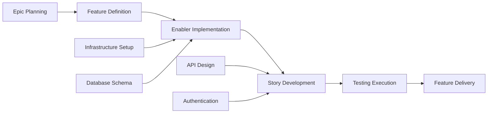

# Estimate

> Extracted from `breakdown-plan.prompt.md`.

## Estimate

{Story points or effort estimate}
```

### 4. Priority and Value Matrix

| Priority | Value | Criteria | Labels |
| --- | --- | --- | --- |
| P0 | High | Critical path, blocking release | `priority-critical`, `value-high` |
| P1 | High | Core functionality, user-facing | `priority-high`, `value-high` |
| P1 | Medium | Core functionality, internal | `priority-high`, `value-medium` |
| P2 | Medium | Important but not blocking | `priority-medium`, `value-medium` |
| P3 | Low | Nice to have, technical debt | `priority-low`, `value-low` |

#### 5. Estimation Guidelines

##### Story Point Scale (Fibonacci)

- **1 point**: Simple change, <4 hours
- **2 points**: Small feature, <1 day
- **3 points**: Medium feature, 1-2 days
- **5 points**: Large feature, 3-5 days
- **8 points**: Complex feature, 1-2 weeks
- **13+ points**: Epic-level work, needs breakdown

##### T-Shirt Sizing (Epics/Features)

- **XS**: 1-2 story points total
- **S**: 3-8 story points total
- **M**: 8-20 story points total
- **L**: 20-40 story points total
- **XL**: 40+ story points total (consider breaking down)

#### 6. Dependency Management



##### Dependency Types

- **Blocks**: Work that cannot proceed until this is complete
- **Related**: Work that shares context but not blocking
- **Prerequisite**: Required infrastructure or setup work
- **Parallel**: Work that can proceed simultaneously

#### 7. Sprint Planning Template

##### Sprint Capacity Planning

- **Team Velocity**: {Average story points per sprint}
- **Sprint Duration**: {2-week sprints recommended}
- **Buffer Allocation**: 20% for unexpected work and bug fixes
- **Focus Factor**: 70-80% of total time on planned work

##### Sprint Goal Definition

```markdown