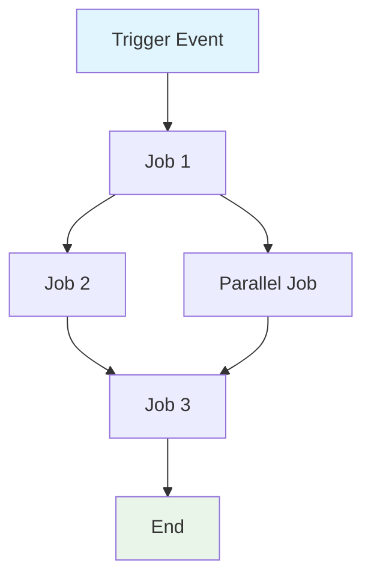

# Execution Flow Diagram

> Extracted from `create-github-action-workflow-specification.prompt.md`.

## Execution Flow Diagram


```mermaid
graph TD
    A[Trigger Event] --> B[Job 1]
    B --> C[Job 2]
    C --> D[Job 3]
    D --> E[End]

    B --> F[Parallel Job]
    F --> D

    style A fill:#e1f5fe
    style E fill:#e8f5e8
```
````
