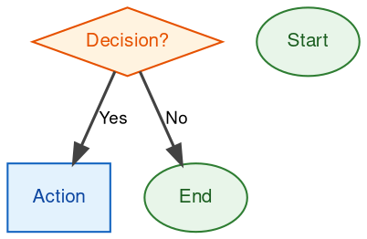

# Graphviz Conventions for Skill Flowcharts

## Style Rules



## Node Shapes

| Node Type | Shape | Fill Color | Border | Text Color |
|-----------|-------|------------|--------|------------|
| Decision | diamond | #FFF3E0 | #E65100 | #E65100 |
| Process/Action | box | #E3F2FD | #1565C0 | #0D47A1 |
| Start/End | ellipse | #E8F5E9 | #2E7D32 | #1B5E20 |
| Input/Output | parallelogram | #FCE4EC | #C2185B | #880E4F |

## Edge Labels

- Use concise labels: "Yes"/"No", "true"/"false", "match"/"no match"
- Label on edge, not separate node
- Maximum 15 characters per label

## Layout

- Top-to-bottom (TB) for sequential workflows
- Left-to-right (LR) for parallel branches
- Keep under 20 nodes per diagram
- Split complex flows into multiple diagrams

## When to Use Flowcharts

**USE for:**
- Non-obvious decision points
- Process loops where you might stop too early
- "When to use A vs B" decisions

**NEVER USE for:**
- Reference material → Tables, lists
- Code examples → Markdown blocks
- Linear instructions → Numbered lists
- Labels without semantic meaning (step1, helper2)

## Visualizing for Your Human Partner

Use `render-graphs.js` in this directory to render a skill's flowcharts to SVG:

```bash
./render-graphs.js ../some-skill           # Each diagram separately
./render-graphs.js ../some-skill --combine # All diagrams in one SVG
```

The script auto-discovers `.dot` files in `references/` and renders them.
