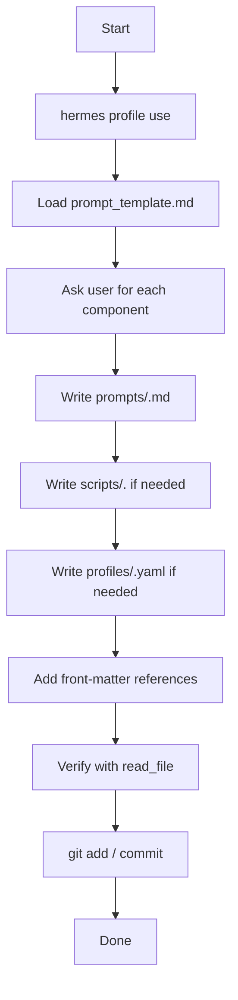
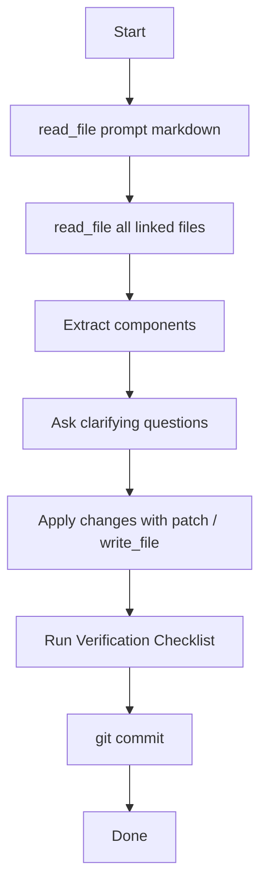
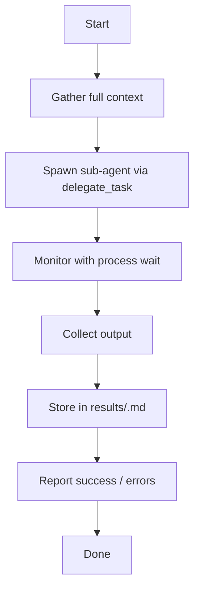

# Prompt Workflow Reference

## Overview
This document describes the three-phase lifecycle of a prompt in the `prompt-management` skill.

---

## Phase 1 – Create Prompt (Interactive)

**Interactive questions** (prompted to user):
1. Prompt name & brief description
2. Desired model / provider
3. Required toolsets
4. Personality / tone
5. High‑level success criteria

---

## Phase 2 – Update Prompt

---

## Phase 3 – Execute Prompt

---

## Integration Points
- `templates/prompt_template.md` – main skeleton
- `templates/plans_and_specs_template.md` – for Plans‑and‑Specs section
- `templates/script_template.md` – for Scripts section
- `templates/persona_template.md` – for Personas section
- `templates/profile_template.md` – for Profile section
- `references/prompt_library_integration.md` – library reuse guide