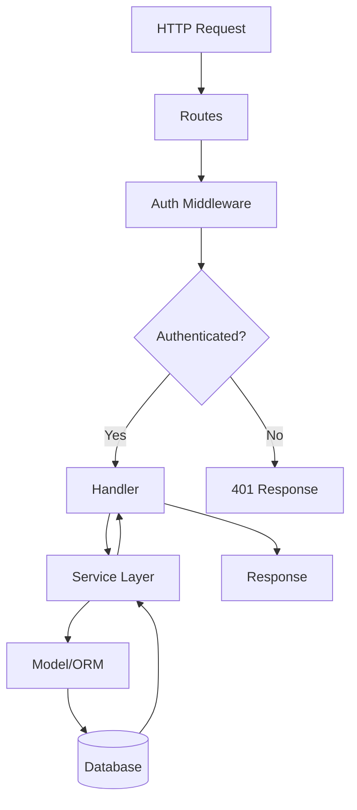

# Code Map

## Overview

Generate comprehensive hierarchical code maps (codemaps) for unfamiliar repositories. A codemap documents the directory structure, module boundaries, key files, and architectural patterns of a codebase — enabling faster onboarding and safer changes.

## When to Use

- Onboarding to a new or unfamiliar codebase
- Understanding the structure of a repository before making changes
- Documenting architecture for team reference
- Planning refactoring or migrations that span multiple modules
- Analyzing large or complex projects
- Creating technical documentation

## When NOT to Use

- Quick single-file lookups — use search_files instead
- Familiar codebases you've already mapped
- Small projects with <10 files (just read the files)
- Real-time code changes (codemap is a static snapshot)

## Skills Required

| Skill | Purpose |
|-------|---------|
| `context-map` | Map component boundaries and data flows |
| `project-docs` | Generate full documentation set |
| `architecture-blueprint-generator` | Full architecture blueprint |

## Workflow

### Phase 1: Scan Repository

1. Identify project type and language:
   ```bash
   # Detect language by file extensions
   find . -name "*.ts" -o -name "*.py" -o -name "*.go" -o -name "*.rs" | head -5

   # Check package manifests
   ls package.json Cargo.toml go.mod requirements.txt pom.xml 2>/dev/null
   ```

2. List directory structure:
   ```bash
   # Directory tree (exclude noise)
   find . -type d -not -path '*/node_modules/*' -not -path '*/.git/*' -not -path '*/__pycache__/*' -not -path '*/dist/*' -not -path '*/build/*' | sort

   # Top-level structure
   ls -la
   ls src/ lib/ app/ cmd/ internal/ pkg/ 2>/dev/null
   ```

3. Count files by type:
   ```bash
   find src/ -name "*.ts" | wc -l    # TypeScript files
   find src/ -name "*.test.*" | wc -l # Test files
   find . -name "*.md" | wc -l        # Documentation files
   ```

### Phase 2: Build Hierarchy

Create a hierarchical map with annotations:

```
src/
├── api/                    # HTTP API layer
│   ├── routes/             # Route definitions
│   ├── middleware/          # Auth, logging, error handling
│   └── handlers/           # Request handlers
├── models/                 # Data models / ORM entities
├── services/               # Business logic layer
├── utils/                  # Shared utilities
├── config/                 # Configuration management
└── index.ts               # Application entry point

tests/
├── unit/                   # Unit tests (mirrors src/ structure)
├── integration/            # Integration tests
└── fixtures/               # Test data

docs/
├── api.md                  # API documentation
└── architecture.md        # Architecture decisions
```

### Phase 3: Identify Key Components

For each major directory/module, document:

1. **Purpose:** What does this module do?
2. **Entry points:** Main files, exports, public API
3. **Dependencies:** What other modules does it import?
4. **Key files:** The 2-3 most important files
5. **Patterns:** What architectural patterns are used? (MVC, clean architecture, etc.)

### Phase 4: Document Data Flow

Trace how data moves through the system:

```
Request → Routes → Middleware (auth) → Handler → Service → Model → Database
                                                         ↓
                                                   Cache Layer
                                                         ↓
Response ← Serializer ← Service Result ← Database Result
```

### Phase 5: Generate Output

Save the codemap to `docs/codemap.md`:

```markdown
# Code Map — [Project Name]

**Language:** TypeScript
**Framework:** Express.js + Prisma
**Last Updated:** 2026-06-14

## Directory Structure
[tree diagram]

## Module Index
| Module | Purpose | Key Files | Dependencies |
|--------|---------|-----------|--------------|
| api/ | HTTP layer | routes/index.ts | models/, services/ |
| services/ | Business logic | user-service.ts | models/, utils/ |
| models/ | Data layer | user.model.ts | prisma/ |

## Data Flow
[diagram or description]

## Key Architectural Decisions
- Clean architecture with service layer abstraction
- Prisma ORM for database access
- JWT-based authentication via middleware
```

## Verification Checklist

- [ ] Directory structure fully mapped
- [ ] All major modules identified with purpose
- [ ] Key files documented per module
- [ ] Dependencies between modules mapped
- [ ] Data flow documented
- [ ] Architectural patterns identified
- [ ] Codemap saved to docs/codemap.md
- [ ] Diagrams included (ASCII tree or Mermaid)

## Pitfalls

- **Outdated maps:** Codemaps rot as code changes — update when making significant structural changes
- **Too much detail:** Focus on module-level structure, not every file
- **Missing hidden structure:** Some structure is in config files, not directories — check package.json scripts, tsconfig paths
- **Ignoring tests:** Include test structure — it reveals how the code is meant to be used
- **Static snapshot:** A codemap is a point-in-time view — note the date and update periodically

## Example Mermaid Diagram


