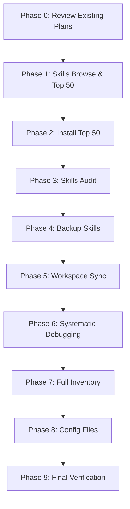

# Comprehensive Hermes Skills, Hooks, Plugins, MCP Servers & Configuration Audit Plan

> **Plan Mode:** This is a planning document only. No execution will occur until explicitly requested.
> **Generated:** 2026-06-11 20:00:00
> **Workspace:** `C:\Users\Alexa\Desktop\SandBox`
> **Active Profile:** `adminbot` (`~/AppData/Local/hermes/`)

---

## Goal

Perform a comprehensive audit and synchronization of the Hermes Agent ecosystem:
1. **Discover** all available skills from the official hub
2. **Install** top 50 best uninstalled skills (with security scanning)
3. **Audit** all skills, hooks, plugins, and MCP servers
5. **Debug & fix** all issues using systematic debugging
6. **Ingest** skills from `backup.hermes/` (legacy backup)
7. **Verify & enhance** core configuration files: `.hermes.md` → `AGENTS.md` → `CLAUDE.md` → `.cursorrules`
8. **Document** the complete inventory

---

## Current Context & Assumptions

| Component | Location | Current State |
|-----------|----------|---------------|
| **Profile Config** | `~/AppData/Local/hermes/config.yaml` | 289 skills, 4 plugins, 3 hooks, 10 MCP servers |
| **Workspace Skills** | `.github/skills/` | 27 categories, 200+ skills (source of truth) |
| **Backup Skills** | `backup.hermes/skills/` | 50+ skills from 2026-06-08 backup |
| **Global Skills** | `~/.hermes/skills/` | 100+ skills (bundled + installed) |
| **Hooks** | `~/AppData/Local/hermes/hooks/` + `.github/hooks/` | 3 hooks (session-logger, session-auto-commit, governance-audit) |
| **Plugins** | `config.yaml:plugins.enabled` | 4 built-in: disk-cleanup, model-providers/openrouter, security-guidance, memory/honcho |
| **MCP Servers** | `config.yaml:mcp_servers` | 10 servers (filesystem, fetch, memory, sequential-thinking, github, playwright, ast-grep, code-sandbox, cli, mcp-docker) |

**Key Insights:**
- `.github/plugins/` contains **Copilot agents** (46 dirs), NOT Hermes plugins — already documented in existing plan
- `.github/hooks/` missing `hook.sh` files — working versions in profile
- Skills hub has 289+ official skills; workspace has 200+ curated; backup has 50+ legacy

---

## Phase 0: Prerequisites & Existing Plan Review

### Task 0.1: Check for existing relevant plans
- **Action:** Read `.hermes/plans/2026-06-11_173000-hermes-profile-restore.md` (exists, related)
- **Action:** Read `.hermes/plans/2026-06-09_official-skills-bulk-install.md` (exists, related)
- **Decision:** This plan **supersedes** and **extends** those — incorporates their lessons learned

### Task 0.2: Verify tooling availability
- **Check:** `hermes skills browse`, `hermes skills search`, `hermes skills install`, `hermes skills audit` commands exist
- **Check:** `hermes hooks list`, `hermes plugins list`, `hermes mcp list` commands exist
- **Check:** `/systematic-debugging` slash command or skill available

---

## Phase 1: Skills Discovery — Browse & Filter Top 50 Uninstalled

### Task 1.1: Execute `hermes skills browse` to list all available skills
- **Command:** `hermes skills browse --all` (or equivalent)
- **Output:** Capture full list to `skills_browse_output.json`
- **Expected:** 289+ skills with metadata (name, description, category, version, author)

### Task 1.2: Get currently installed skill inventory
- **Command:** `hermes skills list --installed --json` → `skills_installed.json`
- **Command:** `find ~/.hermes/skills -mindepth 1 -maxdepth 1 -type d | sort` → `skills_global.txt`
- **Command:** `find .github/skills -mindepth 2 -maxdepth 2 -type d | sort` → `skills_workspace.txt`
- **Command:** `find backup.hermes/skills -mindepth 1 -maxdepth 1 -type d | sort` → `skills_backup.txt`

### Task 1.3: Compute uninstalled skills & rank top 50
- **Logic:** `available - installed = candidates`
- **Ranking criteria (priority order):**
  1. **Relevance to current stack:** TypeScript/Bun, PowerShell, Python, Next.js, Django, Docker, MCP, GitHub, CI/CD
  2. **Official/curated status:** Nous Research official > community > experimental
  3. **Usage/popularity:** High download/use count (from hub metadata)
  4. **Maintenance:** Recent updates (< 90 days), open issues < 5
  5. **Completeness:** Has tests, docs, SKILL.md, examples
  6. **Non-redundancy:** Doesn't duplicate existing skill functionality

- **Output:** `top_50_candidates.md` with justification for each

### Task 1.4: Execute `hermes skills search` for each candidate keyword
- **For each candidate:** `hermes skills search "<keyword>"` to verify availability & get details
- **Filter:** Only skills returning valid results with installable manifests
- **Output:** Verified installable list

---

## Phase 2: Skills Installation — Install, Verify, Test, Debug (Batch 1: Top 50)

### Task 2.1: Install each skill with security scan
- **Command per skill:** `hermes skills install <skill-name> --security-scan`
- **Batch execution:** Parallel where safe (max 3 concurrent per delegation limits)
- **Log:** Capture install output to `skills_install_batch1.log`
- **Expected:** All 50 install without critical security findings

### Task 2.2: Verify each installed skill loads
- **Command per skill:** `hermes skills view <skill-name> --validate`
- **Check:** SKILL.md parses, no missing deps, entry points resolve
- **Failures:** Log to `skills_install_failures.json`

### Task 2.3: Test each skill with smoke test
- **Per skill:** Run minimal invocation (e.g., `hermes skills view <skill>` or skill's test command)
- **Pattern:** If skill has `test` script in `scripts/`, run it
- **Log:** `skills_test_results.json` (PASS/FAIL per skill)

### Task 2.4: Debug & fix installation issues
- **For each FAIL:** Run `/systematic-debugging` on the skill
- **Common fixes:** Missing deps, path issues, SKILL.md syntax, version conflicts
- **Output:** `skills_debug_fixes.md` documenting each fix

---

## Phase 3: Skills Audit — Comprehensive

### Task 3.1: Execute `/skills audit` (or `hermes skills audit`)
- **Scope:** All 339+ skills (289 hub + 50 new)
- **Checks:** SKILL.md validity, dependency resolution, version conflicts, duplicate functionality, deprecated skills, security advisories
- **Output:** `skills_audit_report.json`

### Task 3.2: Categorize audit findings
| Severity | Action |
|----------|--------|
| **Critical** (security, broken load) | Fix immediately (Phase 2.4) |
| **High** (deprecated, major conflict) | Schedule fix |
| **Medium** (missing docs, minor conflict) | Enhance |
| **Low** (style, suggestions) | Defer |

### Task 3.3: Generate audit summary
- **File:** `SKILLS_AUDIT_SUMMARY.md` with counts, top issues, remediation plan

---

## Phase 4: Backup Skills Ingestion — Install, Verify, Test, Debug (Batch 2: backup.hermes/)

### Task 4.1: Inventory backup.hermes/skills/
- **Count:** ~50 skills (from earlier listing)
- **Diff:** `comm -23 <(sort skills_backup.txt) <(sort skills_global.txt)` → `backup_only_skills.txt`

### Task 4.2: Evaluate each backup-only skill
- **Criteria:** Still relevant? Superseded by hub version? Workspace has newer version?
- **Decision matrix:**
  - **Install:** Unique capability not in hub/workspace
  - **Skip:** Superseded by official skill
  - **Merge:** Custom fork → contribute upstream

### Task 4.3: Install selected backup skills
- **Copy:** `cp -r backup.hermes/skills/<skill> ~/.hermes/skills/`
- **Validate:** `hermes skills view <skill> --validate`
- **Test:** Smoke test each

### Task 4.4: Debug & fix backup skill issues
- **Common issues:** Old SKILL.md format, missing deps, Python 2 vs 3, path hardcoding
- **Apply:** `/systematic-debugging` per failing skill

---

## Phase 5: Workspace Skills Sync — Install, Verify, Test, Debug (Batch 3: .github/skills/)

### Task 5.1: Full diff: workspace vs global
- **Missing in global:** `comm -23 <(sort skills_workspace.txt) <(sort skills_global.txt)`
- **Extra in global:** `comm -13 <(sort skills_workspace.txt) <(sort skills_global.txt)`
- **Common:** `comm -12` — verify versions match

### Task 5.2: Install missing workspace skills
- **Copy** from `.github/skills/` to `~/.hermes/skills/`
- **Validate** each loads

### Task 5.3: Handle extra global skills (bundled/legacy)
- **Keep:** Core `hermes-*` skills, official Nous bundles
- **Remove:** Custom skills not in workspace source of truth
- **Document** decisions

### Task 5.4: Verify & test all workspace skills
- **Full load test** of 200+ skills
- **Smoke test** critical ones (hermes-*, development, devops, github, mcp categories)

---

## Phase 6: Systematic Debugging — Fix All Issues

### Task 6.1: Run `/systematic-debugging` on entire skill ecosystem
- **Scope:** All installed skills (339+)
- **Method:** 4-phase root cause analysis per failing skill
- **Parallelize:** Up to 3 concurrent debugging subagents

### Task 6.2: Fix categories
| Issue Type | Fix Approach |
|------------|--------------|
| Missing dependencies | `bun install` / `pip install` / `npm install` in skill dir |
| SKILL.md syntax | Validate against schema, patch frontmatter |
| Path hardcoding | Replace with `$HERMES_SKILLS_DIR` / `$HOME` variables |
| Version conflicts | Pin compatible versions in skill's package.json / requirements.txt |
| Broken entry points | Fix `scripts/` references, shebangs, exports |
| Deprecated APIs | Migrate to current Hermes tool APIs |

### Task 6.3: Regression test after fixes
- **Re-run** all skill load tests
- **Verify** no new failures introduced

---

## Phase 7: Hooks, Tools, Skills, Plugins & MCP Servers — Full Inventory

### Task 7.1: List all hooks
- **Profile:** `ls ~/AppData/Local/hermes/hooks/`
- **Workspace:** `ls .github/hooks/`
- **Config:** `grep -A 20 "hooks:" ~/AppData/Local/hermes/config.yaml`
- **Output:** `HOOKS_INVENTORY.md` with status (enabled, script exists, tested)

### Task 7.2: List all tools
- **Built-in:** `hermes tools list --all`
- **MCP-exposed:** `hermes mcp tools` (from each server)
- **Custom:** Any in `.github/tools/` or skill-provided
- **Output:** `TOOLS_INVENTORY.md`

### Task 7.3: List all skills (final consolidated)
- **Command:** `hermes skills list --all --json` → `SKILLS_FINAL_INVENTORY.json`
- **Categorize:** By category, source (hub/workspace/backup), status

### Task 7.4: List all plugins
- **Config:** `config.yaml:plugins.enabled`
- **Built-in:** `hermes plugins list --all`
- **Workspace:** Document `.github/plugins/` as Copilot agents (non-Hermes)
- **Output:** `PLUGINS_INVENTORY.md`

### Task 7.5: List all MCP servers
- **Config:** `config.yaml:mcp_servers` (10 servers)
- **Status:** `hermes mcp list --status`
- **Tools per server:** `hermes mcp tools <server>`
- **Output:** `MCP_SERVERS_INVENTORY.md`

### Task 7.6: Cross-reference matrix
- **File:** `ECOSYSTEM_MATRIX.md` — hooks ↔ tools ↔ skills ↔ plugins ↔ MCP servers
- **Identify:** Gaps, redundancies, integration opportunities

---

## Phase 8: Configuration Files — Create/Verify/Enhance

### Target Files (in order of precedence)
1. **`.hermes.md`** — Hermes-specific project config (new or enhance)
2. **`AGENTS.md`** — Agent instructions (exists, enhance)
3. **`CLAUDE.md`** — Claude Code instructions (may not exist)
4. **`.cursorrules`** — Cursor IDE rules (may not exist)

### Task 8.1: `.hermes.md` — Create if not exists
- **Location:** Workspace root (`/c/Users/Alexa/Desktop/SandBox/.hermes.md`)
- **Content:**
  ```markdown
  # Hermes Project Configuration
  profile: adminbot
  model: openrouter/owl-alpha
  skills_dir: .github/skills
  hooks_dir: .github/hooks
  plugins: [disk-cleanup, model-providers/openrouter, security-guidance, memory/honcho]
  mcp_servers: [filesystem, fetch, memory, sequential-thinking, github, playwright, ast-grep, code-sandbox, cli]
  validation:
    - bun run format
    - bun run typecheck
    - bun run lint:strict
  ```

### Task 8.2: `AGENTS.md` — Verify & enhance (exists)
- **Current:** 36 lines, good structure
- **Enhance:** Add skill loading conventions, hook deployment workflow, MCP server configs

### Task 8.3: `CLAUDE.md` — Create if not exists
- **Location:** Workspace root
- **Content:** Claude Code specific instructions, tool permissions, common commands

### Task 8.4: `.cursorrules` — Create if not exists
- **Location:** Workspace root
- **Content:** Cursor IDE rules for this project (TypeScript, PowerShell, Hermes conventions)

### Task 8.5: Validate all four as optimal markdown
- **Check:** Proper headers, no duplicate content, clear hierarchy, actionable instructions
- **Tool:** `markdownlint` or similar

---

## Phase 9: Final Verification & Documentation

### Task 9.1: End-to-end smoke test
- **New session:** Start fresh Hermes session
- **Verify:** All 3 hooks fire, 4 plugins load, 10 MCP servers connect, skills load
- **Test:** Run a representative task using multiple components

### Task 9.2: Generate final report
- **File:** `HERMES_ECOSYSTEM_REPORT_2026-06-11.md`
- **Sections:**
  - Executive summary
  - Skills: installed, failed, fixed counts
  - Hooks: status, test results
  - Plugins: status
  - MCP Servers: status, tools exposed
  - Config files: created/updated
  - Known issues & follow-ups

### Task 9.3: Commit all changes
- **Git:** Add all new/modified files
- **Commit:** Structured commits per phase

---

## Files Likely to Change

| File | Change Type |
|------|-------------|
| `.hermes.md` | Create (new) |
| `AGENTS.md` | Enhance |
| `CLAUDE.md` | Create (new) |
| `.cursorrules` | Create (new) |
| `~/.hermes/skills/*/` | 50+ new skills installed |
| `~/AppData/Local/hermes/config.yaml` | May update plugin/hook/MCP configs |
| `.github/hooks/*/hook.sh` | Sync from profile (if missing) |
| `backup.hermes/` | Reference only (read) |

---

## Tests & Validation

| Test | Command | Pass Criteria |
|------|---------|---------------|
| Skills load | `hermes skills list --all` | 339+ skills, 0 load errors |
| Hook fire | New session → check logs | SESSION_START, PRE_LLM_CALL, SESSION_END |
| Plugin load | `hermes plugins list` | 4 enabled, 0 errors |
| MCP connect | `hermes mcp list --status` | 10/10 connected |
| Config valid | `markdownlint .hermes.md AGENTS.md CLAUDE.md .cursorrules` | 0 errors |
| Skill smoke | `hermes skills view <skill>` | All top 50 + workspace skills PASS |

---

## Risks, Tradeoffs & Open Questions

| Risk | Mitigation |
|------|------------|
| **Installing 50+ skills may cause conflicts** | Batch install, validate each, rollback on failure |
| **Backup skills may be obsolete** | Evaluated in Phase 4.2 — only install relevant |
| **Workspace `.github/plugins/` confusion** | Already documented — not Hermes plugins |
| **MCP server startup failures** | Check Docker, npx availability, network access |
| **Systematic debugging time** | Parallelize with 3 subagents, timebox per skill |
| **Config file conflicts** | Backup current configs first, use diff review |

**Open Questions:**
1. Should `hermes skills browse` output be cached or re-fetched each run?
2. What's the exact `hermes skills search` syntax for keyword filtering?
3. Does `/systematic-debugging` accept a skill name as argument?
4. Should Copilot agents in `.github/plugins/` be converted to Hermes plugins?
5. Target skill count after dedup: ~350 or trim to ~200 core?

---

## Execution Order (When Authorized)



---

## Plan Saved

**Path:** `.hermes/plans/2026-06-11_200000-comprehensive-skills-hooks-plugins-mcp-audit-plan.md`

**Next Step:** Review this plan. When approved, execute phases sequentially (or in parallel where independent). This plan does **not** execute anything — it is the blueprint for the work.