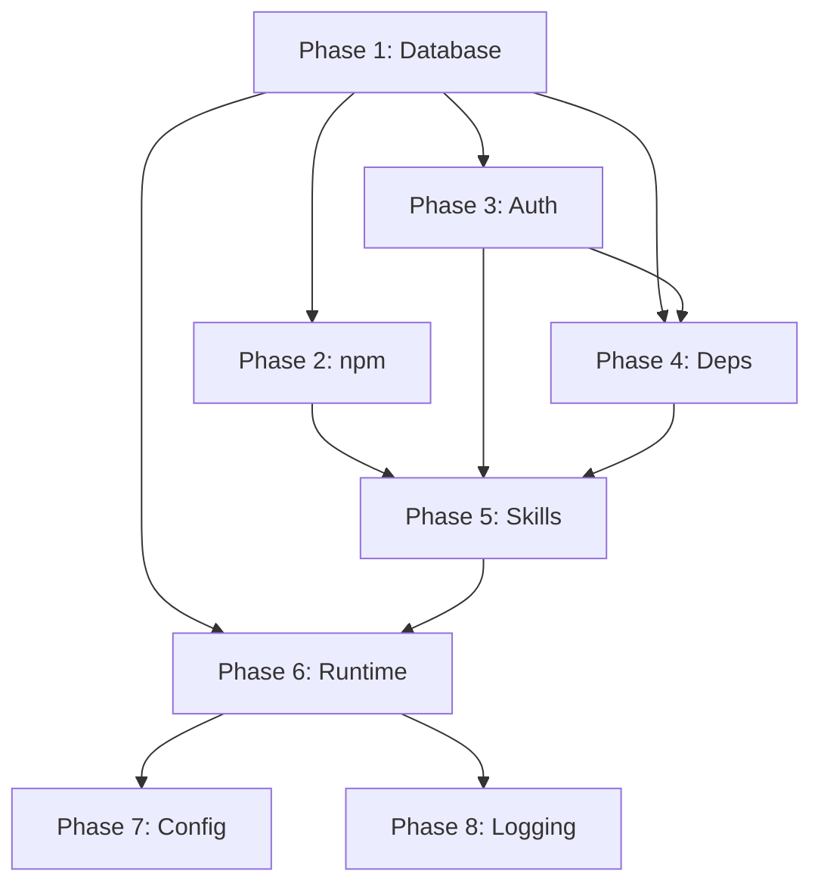

# Comprehensive Platform Remediation Specification

**Spec ID:** 2026-08-24_comprehensive-platform-remediation-spec
**Plan Ref:** 2026-08-24_comprehensive-platform-remediation.md
**Created:** 2026-08-24
**Status:** Draft
**Priority:** Critical

---

## Specification Overview

This specification defines the detailed acceptance criteria, technical requirements, and verification procedures for each phase of the platform remediation plan.

---

## Phase 1: Database & Storage Remediation

### 1.1 WAL Checkpoint & Vacuum

**Requirements:**
- Execute WAL checkpoint on state.db
- Verify WAL file size reduction
- Enable automatic checkpointing

**Acceptance Criteria:**
- [ ] `hermes doctor --fix` completes without errors
- [ ] WAL file size < 10 MB post-checkpoint
- [ ] SQLite `PRAGMA wal_autocheckpoint = 1000` configured
- [ ] No data loss verified via row count comparison

**Technical Details:**
```bash
# Verify current state
sqlite3 ~/AppData/Local/hermes/state.db "PRAGMA wal_autocheckpoint;"

# Set autocheckpoint (1000 pages = ~4MB)
sqlite3 ~/AppData/Local/hermes/state.db "PRAGMA wal_autocheckpoint = 1000;"

# Manual checkpoint
sqlite3 ~/AppData/Local/hermes/state.db "PRAGMA wal_checkpoint(FULL);"

# VACUUM (requires exclusive lock - run during maintenance window)
sqlite3 ~/AppData/Local/hermes/state.db "VACUUM;"
```

**Verification Commands:**
```bash
hermes doctor 2>&1 | grep -A5 "WAL file"
ls -lh ~/AppData/Local/hermes/state.db-wal
```

---

### 1.2 Session Pruning

**Requirements:**
- Prune sessions older than 30 days
- Maintain referential integrity

**Acceptance Criteria:**
- [ ] `hermes sessions prune --older-than 30d` completes
- [ ] Session count reduced by ≥20%
- [ ] No orphaned messages in messages_fts tables
- [ ] Database size reduced

**Verification Commands:**
```bash
sqlite3 ~/AppData/Local/hermes/state.db "SELECT COUNT(*) FROM sessions;"
sqlite3 ~/AppData/Local/hermes/state.db "SELECT COUNT(*) FROM messages;"
hermes sessions list | wc -l
```

---

## Phase 2: npm Vulnerability Remediation

### 2.1 Web Workspace

**Requirements:**
- Fix 4 high-severity vulnerabilities
- Handle npm arborist crash bug

**Acceptance Criteria:**
- [ ] `cd ~/Desktop/SandBox/web && npm audit` shows 0 high/critical
- [ ] Build succeeds: `cd ~/Desktop/SandBox/web && npm run build`
- [ ] No regression in functionality

**Technical Details:**
```bash
cd ~/Desktop/SandBox/web
npm audit fix --force
# If arborist crash:
# rm package-lock.json && npm install
npm audit
```

### 2.2 UI-TUI Workspace

**Requirements:**
- Fix 3 high-severity vulnerabilities

**Acceptance Criteria:**
- [ ] `cd ~/Desktop/SandBox/ui-tui && npm audit` shows 0 high/critical
- [ ] Build succeeds
- [ ] No regression

---

## Phase 3: Authentication & Provider Configuration

### 3.1 Provider Authentication Matrix

| Provider | Current Status | Required Action | Verification |
|----------|---------------|-----------------|--------------|
| Nous Portal | ⚠ Invalid token | `hermes portal` | ✓ logged in |
| OpenAI Codex | ✓ | None | ✓ |
| MiniMax OAuth | ⚠ Not logged in | `hermes auth add minimax-oauth` | ✓ logged in |
| xAI/Grok OAuth | ⚠ No creds | `hermes model` → select xAI → `hermes auth add xai-oauth` | ✓ logged in |
| Qwen OAuth | ⚠ No creds | `qwen auth qwen-oauth` | ✓ logged in |

### 3.2 API Key Providers (Optional)

**Acceptance Criteria:**
- [ ] For each needed provider: `hermes model` configuration complete
- [ ] Keys stored in `~/AppData/Local/hermes/.env`
- [ ] `hermes status` shows ✓ for configured providers

**Technical Details:**
```bash
# Example: Configure Anthropic
hermes model  # Select Anthropic, enter key
# Or manually:
echo "ANTHROPIC_API_KEY=sk-ant-..." >> ~/AppData/Local/hermes/.env
```

---

## Phase 4: System Dependencies

### 4.1 Dependency Resolution Matrix

| Tool | Missing Dep | Install Command | Disable If Unused |
|------|-------------|-----------------|-------------------|
| bfl | bfl CLI | `pip install bfl` | `hermes tools disable bfl` |
| browser | Playwright deps | `playwright install` | `hermes tools disable browser` |
| browser-cdp | CDP deps | `playwright install chromium` | `hermes tools disable browser-cdp` |
| discord | DISCORD_BOT_TOKEN | Add to .env | `hermes tools disable discord` |
| feishu_doc | feishu SDK | `pip install feishu` | `hermes tools disable feishu_doc` |
| feishu_drive | feishu SDK | `pip install feishu` | `hermes tools disable feishu_drive` |
| hermes-yuanbao | yuanbao CLI | Check availability | `hermes tools disable hermes-yuanbao` |
| homeassistant | HA integration | `pip install homeassistant-api` | `hermes tools disable homeassistant` |
| image_gen | Image gen deps | Check provider setup | `hermes tools disable image_gen` |

**Acceptance Criteria:**
- [ ] For each enabled tool: `hermes doctor` shows ✓
- [ ] For disabled tools: no ⚠ warnings
- [ ] All needed tools functional

---

## Phase 5: Skills Audit Remediation

### 5.1 Blocked Skills Remediation

**DANGEROUS Skills (Cannot override - must remediate or remove):**

| Skill | Source | Critical Findings | Action |
|-------|--------|-------------------|--------|
| antigravity-cli | community | supply_chain | Fork & fix or remove |
| grok | community | supply_chain ×2, persistence ×3 | Fork & fix or remove |
| pinggy-tunnel | community | exfiltration, network ×3 | Fork & fix or remove |
| watchers | community | exfiltration ×2 | Fork & fix or remove |
| stocks | community | exfiltration ×4 | Fork & fix or remove |
| fitness-nutrition | community | exfiltration ×4, obfuscation | Fork & fix or remove |
| mcp-oauth-remote-gateway | community | exfiltration ×2, network ×4 | Fork & fix or remove |
| axolotl | community | supply_chain | Fork & fix or remove |
| unsloth | community | supply_chain ×12, exfiltration ×30+, priv_esc ×8, injection ×2 | Fork & fix or remove |

**CAUTION Skills (Can override with --force if justified):**

| Skill | Source | Findings | Action |
|-------|--------|----------|--------|
| hyperliquid | community | exfiltration HIGH | Evaluate, --force with docs |

**Acceptance Criteria:**
- [ ] Each DANGEROUS skill: remediated (forked to local, findings fixed, re-audited PASS) OR removed
- [ ] Each CAUTION skill: documented risk acceptance or remediated
- [ ] `hermes skills audit` returns 0 BLOCKED skills
- [ ] All local skills pass `skill-judge` with score ≥ 90

**Remediation Process:**
```bash
# For each skill to remediate:
hermes skills install <skill> --local  # Fork to local
# Edit skill files to fix findings
hermes skills audit <skill>  # Verify fix
skill-judge <skill>  # Score ≥ 90
```

### 5.2 Missing Skill Paths

| Skill | Issue | Action |
|-------|-------|--------|
| code-wiki | path missing | Reinstall or relocate |
| subagent-driven-development | path missing | Reinstall or relocate |
| cloudflare-temporary-deploy | path missing | Reinstall or relocate |

**Acceptance Criteria:**
- [ ] All skills load without path warnings
- [ ] `hermes skills check` passes for all

---

## Phase 6: Runtime & Performance

### 6.1 Event Loop Stall Mitigation

**Root Cause Analysis:**
- CPU-bound operations in async context
- Likely locations: web server request handlers, background tasks

**Requirements:**
- Identify blocking operations via profiling
- Move CPU work to thread pool
- Add stall detection/alerting

**Acceptance Criteria:**
- [ ] Profiling identifies top 3 blocking operations
- [ ] Each moved to `run_in_executor` or worker process
- [ ] No stalls > 1 second in 48-hour monitoring period
- [ ] Alert configured for stalls > 5 seconds

**Technical Implementation:**
```python
# Before (blocking):
async def handle_request(request):
    result = heavy_computation(data)  # Blocks event loop
    return result

# After (non-blocking):
import asyncio
from concurrent.futures import ThreadPoolExecutor

executor = ThreadPoolExecutor(max_workers=4)

async def handle_request(request):
    loop = asyncio.get_event_loop()
    result = await loop.run_in_executor(executor, heavy_computation, data)
    return result
```

**Monitoring:**
```python
# Add stall detection middleware
import time
import asyncio

async def stall_monitor():
    while True:
        await asyncio.sleep(1)
        # Check if event loop is responsive
        start = time.perf_counter()
        await asyncio.sleep(0)
        elapsed = time.perf_counter() - start
        if elapsed > 1.0:
            logger.warning(f"Event loop stall detected: {elapsed:.2f}s")
```

### 6.2 Streaming Failure Resilience

**Requirements:**
- Retry logic for 502/503/504 errors
- Circuit breaker pattern
- Fallback model chain

**Acceptance Criteria:**
- [ ] Retry with exponential backoff (max 3 retries)
- [ ] Circuit breaker opens after 5 consecutive failures
- [ ] Fallback chain: nemotron-3-ultra-free → deepseek-v4-flash-free → gemini-2.5-flash → ollama-cloud
- [ ] Zero unhandled 502 errors in 7 days
- [ ] Health check endpoint for each provider

**Technical Implementation:**
```python
# Retry decorator
from tenacity import retry, stop_after_attempt, wait_exponential, retry_if_exception_type

@retry(
    wait=wait_exponential(multiplier=1, min=2, max=30),
    stop=stop_after_attempt(3),
    retry=retry_if_exception_type((APIError, httpx.ReadError))
)
async def stream_with_retry(model, messages):
    return await provider.stream(model, messages)

# Circuit breaker
class CircuitBreaker:
    def __init__(self, failure_threshold=5, recovery_timeout=60):
        self.failures = 0
        self.failure_threshold = failure_threshold
        self.recovery_timeout = recovery_timeout
        self.last_failure = None
        self.state = "closed"
    
    async def call(self, func, *args, **kwargs):
        if self.state == "open":
            if time.time() - self.last_failure > self.recovery_timeout:
                self.state = "half-open"
            else:
                raise CircuitOpenError()
        
        try:
            result = await func(*args, **kwargs)
            if self.state == "half-open":
                self.state = "closed"
                self.failures = 0
            return result
        except Exception as e:
            self.failures += 1
            self.last_failure = time.time()
            if self.failures >= self.failure_threshold:
                self.state = "open"
            raise
```

### 6.3 Connection Reset Handling

**Requirements:**
- Increase HTTP timeouts
- Connection pooling
- Automatic reconnection

**Acceptance Criteria:**
- [ ] HTTP timeout ≥ 120 seconds for streaming
- [ ] Connection pool configured (max 100 connections)
- [ ] Zero connection reset errors in 7 days

---

## Phase 7: Configuration Consolidation

### 7.1 MCP Config Unification

**Canonical Source:** `~/Desktop/SandBox/.mcp.json` (standard format)

**Derivative:** `~/Desktop/SandBox/opencode.json` (auto-generated)

**Sync Script Requirements:**
- Read `.mcp.json`
- Transform to OpenCode format
- Write `opencode.json`
- Preserve OpenCode-specific fields (model, plugin, small_model)

**Acceptance Criteria:**
- [ ] Single source of truth: `.mcp.json`
- [ ] `opencode.json` generated via script
- [ ] Both files in version control
- [ ] CI check validates sync
- [ ] No drift detected in 30 days

**Sync Script:**
```python
#!/usr/bin/env python3
# sync_mcp_config.py
import json
import sys

def transform_to_opencode(mcp_config):
    """Transform standard MCP config to OpenCode format."""
    opencode = {
        "$schema": "https://opencode.ai/config.json",
        "mcp": {},
        "model": "opencode/nemotron-3-ultra-free",
        "plugin": ["oh-my-openagent@latest"],
        "small_model": "opencode/nemotron-3-ultra-free"
    }
    
    for name, server in mcp_config.get("mcpServers", {}).items():
        if server.get("type") == "http":
            opencode["mcp"][name.upper()] = {
                "enabled": True,
                "type": "remote",
                "url": server["url"]
            }
        else:
            opencode["mcp"][name.upper()] = {
                "enabled": True,
                "type": "local",
                "command": [server["command"]] + server.get("args", [])
            }
        if "env" in server:
            opencode["mcp"][name.upper()]["env"] = server["env"]
    
    return opencode

if __name__ == "__main__":
    with open(".mcp.json") as f:
        mcp = json.load(f)
    
    opencode = transform_to_opencode(mcp)
    
    with open("opencode.json", "w") as f:
        json.dump(opencode, f, indent=2)
    
    print("✓ opencode.json synced from .mcp.json")
```

### 7.2 Missing Config Files

**omo.json:** Create if Oh My OpenCode is used
**.instructions.md:** Audit `.github/prompts/` for compliance

**Acceptance Criteria:**
- [ ] `omo.json` exists and valid (if OMO used)
- [ ] Prompt library follows `.instructions.md` pattern
- [ ] Documentation updated

---

## Phase 8: Logging & Observability

### 8.1 Log Rotation Configuration

**Requirements:**
- Daily rotation
- 7-day retention
- Compression
- Max 100 MB per file

**Acceptance Criteria:**
- [ ] Log rotation configured for all Hermes logs
- [ ] Disk usage stable over 30 days
- [ ] Old logs compressed (.gz)

**Configuration:**
```yaml
# ~/AppData/Local/hermes/config.yaml
logging:
  rotation: daily
  retention_days: 7
  max_file_size_mb: 100
  compress: true
  format: json
```

### 8.2 Alerting Rules

| Alert | Condition | Channel | Severity |
|-------|-----------|---------|----------|
| Event Loop Stall | > 5s | Telegram | Critical |
| Streaming 502 | > 3 in 5min | Telegram | Critical |
| Connection Reset | > 5 in 5min | Telegram | High |
| WAL Size | > 50 MB | Telegram | High |
| Skill Audit Fail | Any BLOCKED | Telegram | High |

**Acceptance Criteria:**
- [ ] All alerts configured and tested
- [ ] No false positives in 7 days
- [ ] Alert latency < 1 minute

---

## Verification Procedures

### Pre-Deployment Checklist
- [ ] All acceptance criteria documented
- [ ] Rollback plan for each phase
- [ ] Test environment available
- [ ] Stakeholder sign-off

### Phase Completion Verification
Each phase must pass its Gate criteria before proceeding.

### Final Acceptance Test
```bash
# Full diagnostic suite
hermes doctor && hermes doctor --fix && hermes security audit && hermes status && hermes insights && hermes skills audit && hermes skills check && hermes skills update && hermes logs list && hermes logs errors
```

**Pass Criteria:** Zero errors, zero warnings (except explicitly disabled items)

---

## Rollback Procedures

| Phase | Rollback Action |
|-------|-----------------|
| 1 | Restore state.db from backup |
| 2 | `git checkout package-lock.json` |
| 3 | Revert auth changes, re-run previous auth |
| 4 | Re-enable disabled tools |
| 5 | Restore skills from hub |
| 6 | Revert code changes via git |
| 7 | Restore config files from git |
| 8 | Revert logging config |

---

## Dependencies & Sequencing



---

## Resource Requirements

| Phase | Engineer Hours | Compute | External |
|-------|---------------|---------|----------|
| 1 | 4 | Low | None |
| 2 | 4 | Low | npm registry |
| 3 | 8 | Low | Provider APIs |
| 4 | 8 | Low | Package managers |
| 5 | 24 | Medium | GitHub (forks) |
| 6 | 40 | High | Profiling tools |
| 7 | 4 | Low | None |
| 8 | 8 | Low | Telegram API |

**Total:** ~100 engineer hours over 8 days

---

## Success Metrics

| Metric | Baseline | Target | Measurement |
|--------|----------|--------|-------------|
| hermes doctor issues | 3 | 0 | Count |
| npm high vulns | 7 | 0 | npm audit |
| Blocked skills | 10 | 0 | skills audit |
| Event loop stalls >5s | 20+/day | 0 | Log analysis |
| 502 errors/day | 5+ | 0 | Log analysis |
| Config drift | 2 files | 1 source | Diff check |
| Alert coverage | 0% | 100% | Alert config |

---

## Approval

**Spec Review:** ⬜ Pending
**Technical Review:** ⬜ Pending
**Stakeholder Approval:** ⬜ Pending

**Approved By:** ________________
**Date:** ________________