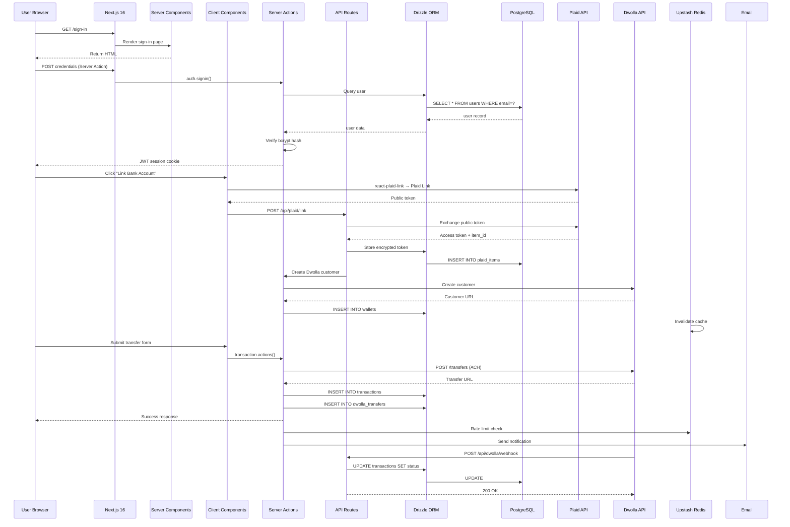
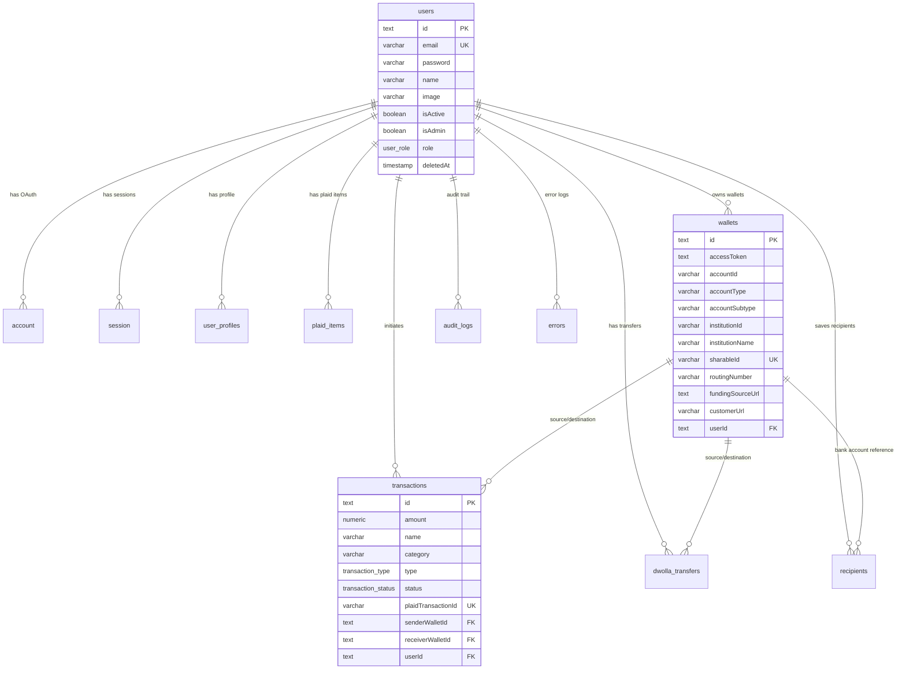
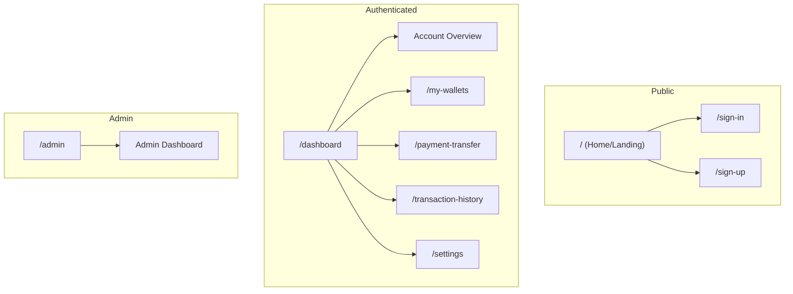
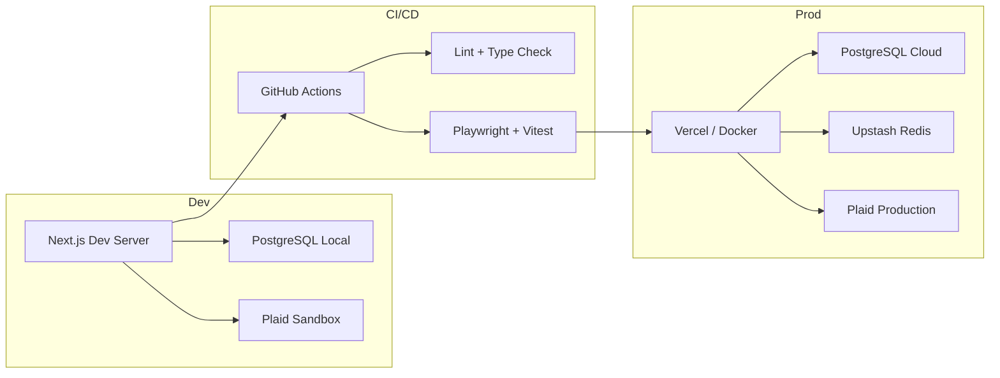

# Banking — Fintech App Architecture Blueprint

> **Generated:** 2026-07-24
> **Generator:** architecture-blueprint-generator
> **Project:** Banking (Next.js 16 Fintech App)

---

## Project Overview

- **Project Name:** Banking
- **Project Type:** Full-stack fintech web application (banking dashboard)
- **Architecture Pattern:** Next.js 16 App Router — full-stack, Server Components by default
- **License:** Private (no license specified)

---

## System Architecture Diagram


---

## Request Flow



---

## Architecture Patterns

### 1. App Router (Next.js 16)

| Pattern | Implementation |
| --- | --- |
| **Server Components** | Default rendering strategy for pages and layouts |
| **Client Components** | Interactive UI (`"use client"` in forms, charts, Plaid Link) |
| **Route Groups** | `(root)`, `(auth)`, `(admin)` for URL-free layout org |
| **Server Actions** | All mutations (login, register, create transfer, link bank) |
| **Route Handlers** | API routes for Plaid/Dwolla webhooks, NextAuth, health checks |

### 2. Data Access Layer (DAL)

```
Server Actions / Route Handlers
       │
       ▼
    DAL functions (src/dal/)
       │
       ▼
 Drizzle ORM (type-safe SQL)
       │
       ▼
    PostgreSQL
```

- All database queries go through `src/dal/` modules
- Schema in `src/database/schema.ts` — 10 tables, 4 enums
- Drizzle Adapter for NextAuth session → user mapping
- Migrations via `drizzle-kit`

### 3. Financial Integration Layer

| Service | Role | SDK | Webhook |
| --- | --- | --- | --- |
| **Plaid** | Bank account linking, transaction sync, identity verification | `plaid` + `react-plaid-link` | Plaid webhooks (item updates, transactions) |
| **Dwolla** | ACH transfer processing, customer creation, funding sources | `dwolla-v2` | Dwolla webhooks (transfer status changes) |

- Plaid access tokens encrypted with AES-256-GCM at rest
- Dwolla transfer idempotency via UUID keys
- Plaid sandbox mode for development

### 4. State Management

| Store | Purpose | Technology |
| --- | --- | --- |
| **UI Store** | Sidebar, theme, mobile nav | Zustand |
| **Transfer Store** | Transfer form state | Zustand |
| **Filter Store** | Transaction list filters | Zustand |
| **Toast Store** | Notification queue | Zustand |
| **Session Store** | Auth session (React context) | React Context |
| **Plaid Context** | Plaid Link lifecycle | React Context |

### 5. Authentication & Authorization

- **Framework:** NextAuth.js v4 with JWT strategy
- **Adapters:** `@auth/drizzle-adapter` for DB-backed sessions
- **Providers:** Credentials (email/password with bcrypt) + OAuth-ready
- **Roles:** `user`, `admin`, `moderator` via `user_role` enum
- **Password strength:** `@zxcvbn-ts/core` integration
- **Rate limiting:** Upstash Redis + `@upstash/ratelimit`

---

## Database Schema



### Tables (10 total)

| Table | Description | Key Columns |
| --- | --- | --- |
| `users` | Core user authentication & profile | email, password, isAdmin, role |
| `account` | NextAuth OAuth account links | provider, providerAccountId |
| `session` | NextAuth session storage (unused with JWT) | sessionToken |
| `verificationToken` | Email verification tokens | identifier, token |
| `authenticator` | WebAuthn passkey storage | credentialID, userId |
| `user_profiles` | KYC data (address, SSN encrypted, DOB) | userId |
| `plaid_items` | Plaid item registry | itemId, accessTokenEncrypted |
| `wallets` | Linked bank accounts + Dwolla integration | sharableId, fundingSourceUrl |
| `transactions` | Financial ledger (Plaid + internal ACH) | amount, status, plaidTransactionId |
| `dwolla_transfers` | Dwolla ACH transfer metadata | idempotencyKey, dwollaTransferId |
| `recipients` | Saved transfer recipients | email, name |
| `errors` | Application error logging | message, severity, stack |
| `audit_logs` | Append-only compliance audit trail | action, metadata, userId |

### Enums (4)

| Enum | Values |
| --- | --- |
| `user_role` | `user`, `admin`, `moderator` |
| `transaction_status` | `pending`, `processing`, `completed`, `failed`, `cancelled` |
| `transaction_type` | `credit`, `debit` |
| `transaction_channel` | `online`, `in_store`, `other` |

---

## Page Routes (App Router)



### Route Group Structure

| Route Group | Path | Layout | Description |
| --- | --- | --- | --- |
| `(root)` | `/dashboard`, `/my-wallets`, `/payment-transfer`, `/transaction-history`, `/settings` | RootLayoutWrapper | Authenticated pages |
| `(auth)` | `/sign-in`, `/sign-up` | AuthLayoutWrapper | Public auth pages |
| `(admin)` | `/admin` | AdminLayoutWrapper | Admin panel |

---

## API Routes

| Route | Method | Purpose |
| --- | --- | --- |
| `/api/auth/[...nextauth]` | ALL | NextAuth handler |
| `/api/auth/local-create` | POST | Register new user credentials |
| `/api/auth/local-validate` | POST | Validate sign-in credentials |
| `/api/dwolla/webhook` | POST | Dwolla transfer status updates |
| `/api/health` | GET | Health check endpoint |

---

## Security Architecture

```
┌─────────────────────────────────────────────┐
│              Security Layers                 │
├─────────────────────────────────────────────┤
│   1. NextAuth JWT (HTTP-only cookies)       │
│   2. Rate Limiting (Upstash Redis)          │
│   3. AES-256-GCM Encryption (tokens, SSN)   │
│   4. bcrypt Password Hashing                │
│   5. Zod Schema Validation (forms + API)    │
│   6. ESLint Security Plugins (no-secrets)   │
│   7. Audit Logs (append-only compliance)    │
│   8. Soft Delete (data preservation)        │
│   9. Idempotency Keys (Dwolla transfers)    │
│   10. Webhook HMAC Verification             │
└─────────────────────────────────────────────┘
```

---

## Deployment Architecture



### Deployment Options

| Platform | Config | Notes |
| --- | --- | --- |
| **Vercel** | `vercel.json` + `next.config.ts` | Primary production target |
| **Docker** | `docker-compose.yml` + `compose/prod/` | Self-hosted with Traefik, Grafana, Prometheus |
| **Railway** | `Railway.toml` | Alternative cloud deployment |

### Monitoring

| Tool | Purpose |
| --- | --- |
| **Grafana** | Dashboard visualization (`compose/prod/grafana/`) |
| **Prometheus** | Metrics collection + alerting (`compose/prod/prometheus/`) |
| **Upstash QStash** | Scheduled/async task execution |

---

## Key Architectural Decisions

1. **Server Components by default** — Minimizes client-side JavaScript for better performance on financial dashboards
2. **Drizzle ORM over Prisma** — Type-safe SQL with lower overhead, better migration DX, and Drizzle Studio
3. **Plaid + Dwolla dual API** — Plaid for bank linking/read, Dwolla for write operations (ACH transfers) — industry standard split
4. **Encrypted token storage** — AES-256-GCM for Plaid access tokens and SSNs; decrypted only at point of use
5. **Zustand over Redux** — Lightweight state management for UI state, filter stores, and toast notifications
6. **NextAuth with JWT strategy** — Stateless auth avoids DB lookups on every request; roles embedded in token
7. **Soft deletes everywhere** — All major entities (users, wallets, transactions) support soft delete for audit compliance
8. **Docker Compose for local prod parity** — Full monitoring stack (Grafana + Prometheus) in `compose/`

---

## Extensibility Points

- **New banking features** via App Router route groups in `src/app/(root)/`
- **New financial integrations** via `src/lib/` (add provider, schema, DAL)
- **New UI components** via `npx shadcn add` or `bun run generate:component`
- **New API endpoints** as Route Handlers under `src/app/api/`
- **New DAL modules** in `src/dal/` following the existing pattern
- **New code generators** in `scripts/generate/` (action, component, dal, feature)

---

*Generated by architecture-blueprint-generator — comprehensive analysis*
