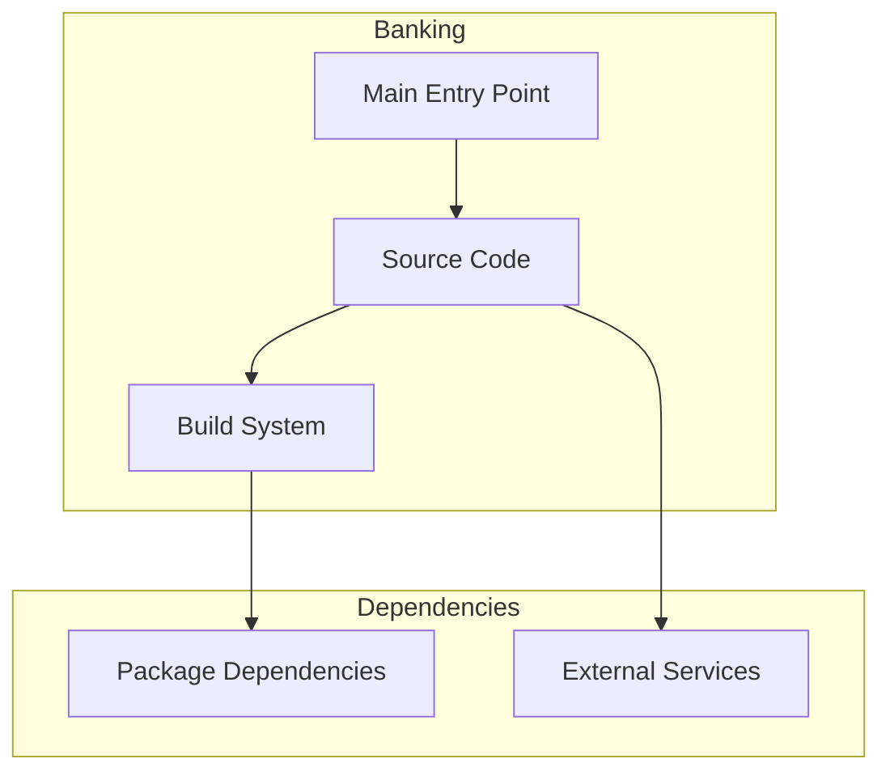

# Banking Architecture

**Generated:** 2026-07-28  
**Project Type:** TypeScript/Bun (Next.js)  
**Architecture Pattern:** Next.js App Router with Server Actions

## Overview

Full-stack fintech banking application with Plaid integration, transaction management, and admin dashboard.

## Technology Stack

Next.js 15, React 19, Bun 1.3, TypeScript strict, Tailwind CSS, shadcn/ui, Drizzle ORM, Clerk Auth, Plaid API

## Source Layout

src/app/, src/components/, src/actions/, src/lib/

## Architecture Diagram

## Key Patterns

- **Next.js App Router with Server Actions**
- Version control: Independent .git repository (nested)

## Cross-Cutting Concerns

- **Linting/Formatting:** Aligned with workspace root configs (ESLint, Prettier, Ruff)
- **Documentation:** AGENTS.md + standard doc files per project convention
- **Dependencies:** Managed via project-specific package manager

## Related Documents

- [Folder Structure](./Banking_folders.md)
- [Technology Stack](./Banking_techstack.md)
