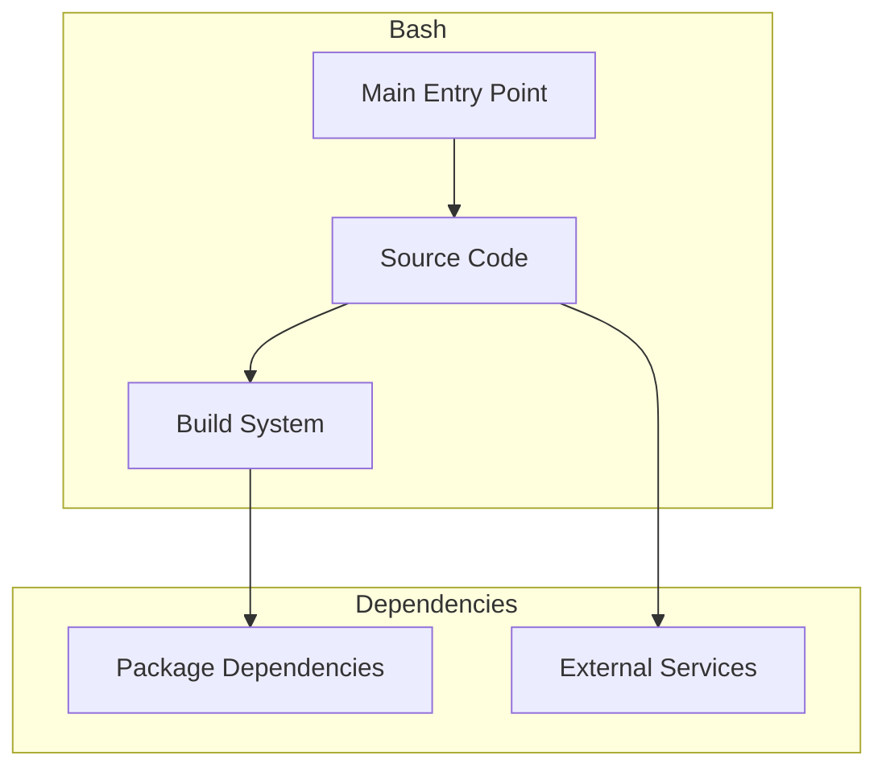

# Bash Architecture

**Generated:** 2026-07-28  
**Project Type:** TypeScript/Bun (Automation)  
**Architecture Pattern:** Modular TypeScript automation toolkit

## Overview

Cross-platform automation toolkit with modules for file operations, system administration, and CI workflows.

## Technology Stack

Bun 1.3, TypeScript strict, ESLint flat, Prettier, Vitest, Zod v4

## Source Layout

src/core/, src/lib/, src/migration/

## Architecture Diagram

## Key Patterns

- **Modular TypeScript automation toolkit**
- Version control: Shared monorepo git

## Cross-Cutting Concerns

- **Linting/Formatting:** Aligned with workspace root configs (ESLint, Prettier, Ruff)
- **Documentation:** AGENTS.md + standard doc files per project convention
- **Dependencies:** Managed via project-specific package manager

## Related Documents

- [Folder Structure](./Bash_folders.md)
- [Technology Stack](./Bash_techstack.md)
