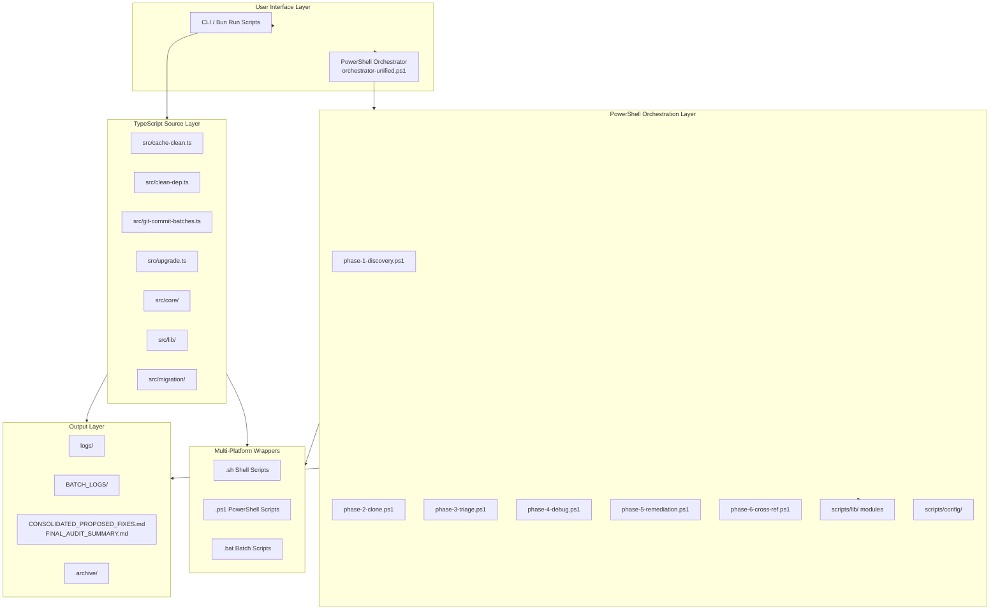
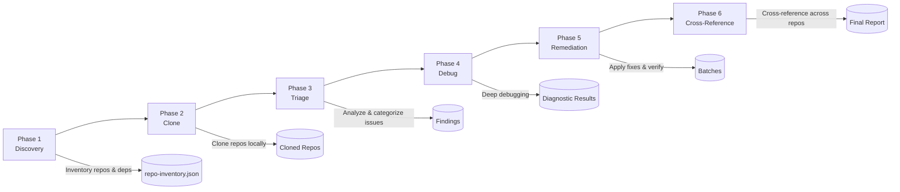
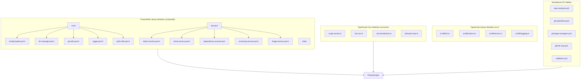
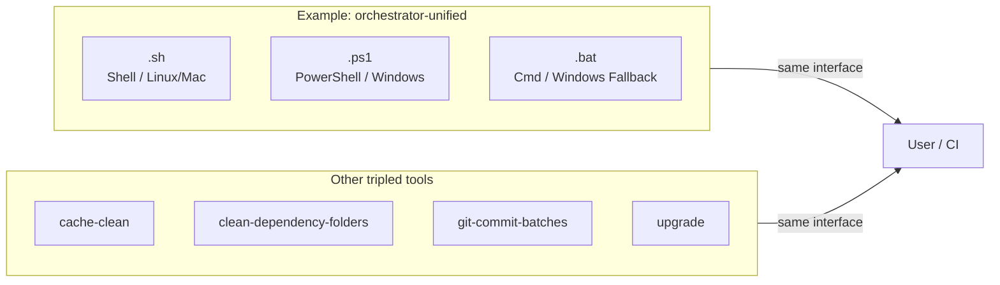
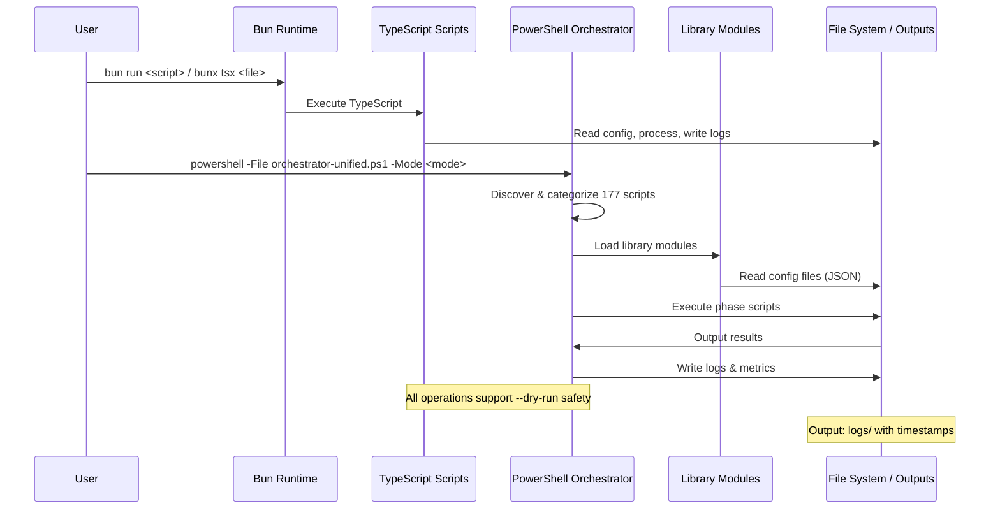

# Bash — Automation Toolkit Architecture Blueprint

> **Generated:** 2026-07-24
> **Generator:** architecture-blueprint-generator
> **Analysis Depth:** Comprehensive

---

## Project Overview

| Attribute | Value |
|---|---|
| **Project Name** | Bash (opencode) |
| **Type** | Multi-Phase Automation Toolkit |
| **Architecture Pattern** | Phase-Based Orchestration + Modular Library |
| **Runtime** | Bun 1.3.14+ |
| **Primary Language** | TypeScript (strict), PowerShell 5.1+, Bash |
| **Entry Points** | TypeScript scripts (`src/`), PowerShell orchestrator (`scripts/`), multi-wrapper (`.ps1`, `.sh`, `.bat`) |
| **Package Manager** | Bun 1.3.14+ |
| **CI/CD** | GitHub Actions (`.github/workflows/bash-scripts-ci.yml`) |

---

## Architecture Overview

The Bash toolkit is the **primary automation hub** for the SandBox workspace. It implements a **6-phase pipeline** for inventorying, cloning, triaging, debugging, remediating, and cross-referencing repositories across the workspace. All destructive operations support `--dry-run` for safe preview, and every tool ships as `.ps1`, `.sh`, and `.bat` wrappers for cross-platform compatibility.

### High-Level Architecture Diagram



---

## Phase-Based Orchestration Pattern

The 6-phase pipeline is the heart of the toolkit:



### Phase Detail

| Phase | Script(s) | Description | Key Input | Key Output |
|---|---|---|---|---|
| **1 — Discovery** | `phase-1-discovery.ps1`, `phase-1-deep-triage.ps1` | Inventory repositories and dependencies | Workspace scan | `repo-inventory.json`, `discovery-config.json` |
| **2 — Clone** | `phase-2-clone.ps1`, `phase-2-clone-local.ps1`, `phase-2-light-inventory.ps1` | Clone repositories locally, light inventory for MEDIUM/LOW repos | `clone-config.json` | Cloned repos, `clone-template.json` |
| **3 — Triage** | `phase-3-triage.ps1`, `phase-3-consolidation.js` | Analyze and categorize issues using `triage-utils.ps1` | `triage-config.json` | Findings, `triage-template.json` |
| **4 — Debug** | `phase-4-debug.ps1`, `phase-4-batch-executor.js` | Deep debugging of identified issues | Findings | Diagnostic output, batches |
| **5 — Remediation** | `phase-5-remediation.ps1`, `phase-5-verify-install.sh`, `phase-5-final-summary.js` | Apply fixes and remediations, verify with tests/lint/build | Batches | Verified fixes, summary report |
| **6 — Cross-Reference** | `phase-6-cross-ref.ps1`, `phase-6-cross-ref.sh` | Cross-reference across repos for consistency | All prior output | Final cross-reference report |

---

## Modular Library Pattern

PowerShell and TypeScript libraries provide reusable modules:



---

## Multi-Platform Wrapper Pattern

Every tool maintains **triple-wrappers** for cross-platform execution:



---

## Dry-Run Safety Pattern

All destructive operations follow a strict dry-run protocol:

```mermaid
flowchart LR
    subgraph DR["Dry-Run Execution Pattern"]
        START[Command] --> CHECK{--dry-run?}
        CHECK -->|Yes| DRYRUN[[DRY-RUN] Log operations<br/>Collect operations list<br/>No side effects]
        CHECK -->|No| EXEC[Execute for real]
        DRYRUN --> VERIFY[Verification: compare<br/>dry-run ops vs real ops]
        EXEC --> LOG[Log to logs/ with timestamp]
    end
```

Implemented via `DryRunExecutor` class in `src/core/dry-run.ts` with `verifyFidelity()` for testing dry-run vs real execution parity.

---

## Data Flow



---

## Key Architecture Decisions

| Decision | Rationale |
|---|---|
| **Bun-first runtime** | Faster execution than Node.js for TypeScript, built-in bundler, TypeScript support without tsx |
| **PowerShell for orchestration** | Complex multi-phase workflows benefit from PowerShell's object pipeline, error handling, and job system |
| **Triple-wrapper parity** | `.sh`/`.ps1`/`.bat` ensures the toolkit works on any OS without dependency on WSL or third-party tools |
| **Dry-run by default** | Safety-first approach for destructive operations; all scripts support `--dry-run`, `--help`, and `--verbose` |
| **Modular library** | PowerShell `.psm1` modules and TypeScript `core/`/`lib/` packages provide reusable, testable components |
| **Phase isolation** | Each phase is a standalone script with explicit inputs/outputs, enabling partial pipeline runs and debugging |
| **JSON configuration** | Config files in `scripts/config/` drive behavior without hardcoding; easy to extend for new repos |
| **Timestamps on logs** | Every run creates timestamped log files, enabling audit trail and debugging across sessions |

---

## Extensibility Points

1. **New phases** — Add `phase-N-<name>.ps1` + `.sh` wrappers, register in the orchestrator
2. **New library modules** — Add `.psm1` files to `scripts/lib/core/` or `scripts/lib/domain/`
3. **New TypeScript utilities** — Add `src/<name>.ts` and register in `package.json` scripts
4. **New CI workflows** — Add `.github/workflows/<name>.yml`
5. **New domain sub-projects** — Create `<project>/scripts/` directory with triple-wrappers
6. **New config schemas** — Add JSON config files to `scripts/config/`

---

## Related Documents

- [Bash Folder Structure Blueprint](Bash_folders.md)
- [Bash Technology Stack Blueprint](Bash_techstack.md)
- [Workflow Analysis](Workflow_Analysis.md)
- [Code Exemplars](exemplars.md)
- [Project Architecture Blueprint](Project_Architecture_Blueprint.md)

---

*Generated by architecture-blueprint-generator — comprehensive analysis of the Bash Automation Toolkit*
