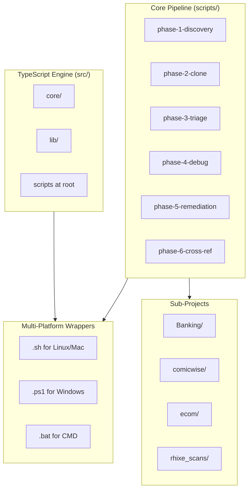

# Bash — Automation Toolkit Folder Structure Blueprint

> **Generated:** 2026-07-24
> **Generator:** folder-structure-blueprint-generator
> **Analysis Depth:** Comprehensive

---

## Project Identity

| Attribute | Value |
|---|---|
| **Project Name** | Bash (opencode) |
| **Type** | Multi-Phase Automation Toolkit |
| **Stack** | Bun/TypeScript + PowerShell + Shell |
| **Total Scripts** | ~177 across 11 directories |
| **Naming Convention** | kebab-case for files, directories |

---

## Directory Tree

```
Bash/
│
├── .github/                          # CI/CD workflows (shared across workspace)
│   └── workflows/
│       ├── bash-scripts-ci.yml       # Main CI pipeline
│       └── copilot-setup-steps.yml   # Copilot setup
│
├── .husky/                           # Git hooks (Husky 9.x)
│   └── _/
│       ├── pre-commit                # Pre-commit hook
│       ├── commit-msg                # Commit message hook
│       ├── pre-push                  # Pre-push hook
│       └── ...                       # Other hook templates
│
├── .vscode/                          # VS Code workspace configuration
│   ├── extensions.json               # Recommended extensions
│   ├── launch.json                   # Debug launch configs
│   ├── settings.json                 # Workspace settings
│   └── tasks.json                    # Build/test tasks
│
├── archive/                          # Historical artifacts & retired scripts
│   ├── artifacts/                    # Prior automation run outputs
│   │   ├── context-maps/             # Context maps for AI agents
│   │   └── *.ps1 / *.json            # Run results, branch data
│   └── skills-commit-batches/        # Retired batch commit scripts
│       └── retired/                  # ~26 retired batch scripts
│
├── Banking/                          # Banking sub-project
│   ├── install/                      # Installation scripts
│   │   └── lib/                      # Install library modules
│   │       ├── 00-config.sh
│   │       ├── 01-utils.sh
│   │       ├── 02-paths.sh
│   │       ├── 03-deps.sh
│   │       ├── 04-registry.sh
│   │       ├── 05-selection.sh
│   │       ├── 06-modes.sh
│   │       ├── 07-preview.sh
│   │       └── 08-install.sh
│   └── scripts/                      # Banking automation scripts
│       ├── orchestrator.bat/ps1/sh
│       ├── opencode-mcp.bat/ps1/sh
│       ├── opencode-plugin-repair.bat/ps1/sh
│       ├── opencode-plugin-verify.bat/ps1/sh
│       ├── plan-ensure.bat/ps1/sh
│       ├── diagnose-and-fix-git.ps1/sh
│       ├── branch-compare.sh
│       ├── delete-gone-branches.sh
│       ├── aggressive-capture.ps1
│       ├── verify-agents.ps1/sh
│       └── run-verify-and-validate.ps1
│
├── comicwise/                        # Comic/Media sub-project
│   ├── cleanup.ps1/sh
│   ├── dev.ps1/sh
│   ├── install-vscode-extensions.ps1/sh
│   ├── quality-gate.ps1/sh
│   └── setup-dev.ps1/sh
│
├── docs/                             # Documentation
│   ├── AGENTS.md                     # Agent routing config
│   ├── ARCHITECTURE.md               # Architecture overview
│   ├── CODE_STYLE.md                 # Coding conventions
│   ├── FINAL-SUMMARY.md              # Final audit summary
│   ├── MIGRATION-GUIDE.md            # Migration guide
│   ├── README.md                     # Doc index
│   └── Project_Architecture/         # Architecture blueprints
│       ├── Bash_architecture.md       # ← THIS FILE
│       ├── Bash_folders.md
│       ├── Bash_techstack.md
│       ├── Project_Architecture_Blueprint.md
│       ├── Project_Folder_Structure.md
│       ├── Technology_Stack_Blueprint.md
│       ├── Workflow_Analysis.md
│       └── exemplars.md
│
├── ecom/                             # E-commerce sub-project
│   └── install.sh
│
├── edits/                            # Applied patches
│   └── run-audit.sh.patch
│
├── lib/                              # Shared utility scripts
│   ├── log-rotate.ps1
│   └── log-rotate.sh
│
├── migrations/                       # Migration scripts per project
│   ├── banking/                      # → mirrors Banking/ structure
│   ├── comicwise/                    # → mirrors comicwise/ structure
│   ├── ecom/
│   ├── rhixe_scans/
│   └── root/
│
├── rhixe_scans/                      # Rhixe project resources
│   ├── docker-clean.sh
│   ├── git-setup.sh
│   ├── install_chrome.sh
│   ├── install_firefox.sh
│   ├── prod.sh
│   ├── prod-dev.sh
│   └── setup.sh
│
├── root/                             # Root-level utilities
│   ├── analyze-scripts.sh
│   └── sandbox-runtime-commands.ps1
│
├── scripts/                          # ⭐ Core orchestration pipeline
│   ├── BATCH_LOGS/                   # Batch execution logs (JSON)
│   ├── BATCHES.json                  # Machine-readable batch definitions
│   ├── CONSOLIDATED_PROPOSED_FIXES.md # Proposed fixes grouped by batch
│   ├── FINAL_AUDIT_SUMMARY.md        # Executive audit summary
│   ├── README.md                     # Scripts documentation
│   │
│   ├── config/                       # Configuration files (JSON)
│   │   ├── clone-config.json
│   │   ├── diagnostics-config.json
│   │   ├── discovery-config.json
│   │   ├── repo-inventory.json       # 17 repos with metadata
│   │   └── triage-config.json
│   │
│   ├── lib/                          # Library modules
│   │   ├── core/                     # ⚙️ Core infrastructure
│   │   │   ├── config-loader.psm1    # JSON config importer
│   │   │   ├── dir-manager.psm1      # Directory management
│   │   │   ├── git-utils.psm1        # Git operations
│   │   │   ├── logger.psm1           # Structured logging
│   │   │   └── path-utils.psm1       # Path resolution
│   │   ├── data/                     # Data templates
│   │   │   ├── batch-template.json
│   │   │   ├── catalog-template.md
│   │   │   ├── clone-template.json
│   │   │   ├── discovery-template.json
│   │   │   ├── report-schemas.json
│   │   │   └── triage-template.json
│   │   ├── domain/                   # Domain services
│   │   │   ├── batch-service.psm1
│   │   │   ├── clone-service.psm1
│   │   │   ├── discovery-service.psm1
│   │   │   ├── scanning-service.psm1
│   │   │   └── triage-service.psm1
│   │   ├── dependency-scanner.ps1    # Dependency scanning
│   │   ├── finding-parser.js         # Parse diagnostics → Findings
│   │   ├── github-mcp.ps1            # GitHub MCP integration
│   │   ├── git-operations.ps1        # Advanced git operations
│   │   ├── package-managers.ps1      # Multi-pm support
│   │   ├── package-manager-scanners.ps1
│   │   ├── repo-analyzer.ps1         # Repository analysis
│   │   ├── repo-scanner.js           # Stack detection + diagnostics
│   │   ├── triage-utils.ps1          # Triage helpers
│   │   └── validation.ps1            # Input validation
│   │
│   ├── orchestrator.ps1              # Pipeline orchestrator
│   │
│   ├── phase-1-deep-triage.ps1       # Phase 1: Deep diagnostics (CRITICAL+HIGH)
│   ├── phase-1-deep-triage.sh
│   ├── phase-1-discovery.ps1         # Phase 1: Discovery
│   ├── phase-2-clone.ps1             # Phase 2: Clone repos
│   ├── phase-2-clone-local.ps1
│   ├── phase-2-light-inventory.ps1   # Phase 2: Light snapshot (MEDIUM+LOW)
│   ├── phase-2-light-inventory.sh
│   ├── phase-3-consolidation.js      # Phase 3: Merge findings → batches
│   ├── phase-3-triage.ps1            # Phase 3: Triage
│   ├── phase-4-batch-executor.js     # Phase 4: Apply fixes with verification
│   ├── phase-4-debug.ps1             # Phase 4: Debug
│   ├── phase-5-final-summary.js      # Phase 5: Generate final report
│   ├── phase-5-remediation.ps1       # Phase 5: Remediation
│   ├── phase-5-verify-install.sh
│   ├── phase-6-cross-ref.ps1         # Phase 6: Cross-reference
│   ├── phase-6-cross-ref.sh
│   ├── run-audit.sh                  # Master audit runner
│   ├── score-docs.sh                 # Documentation scoring
│   ├── test-all-scanners.ps1         # Scanner tests
│   └── test-single-repo.ps1
│
├── src/                              # ⭐ TypeScript source code
│   ├── cache-clean.ts                # Cache cleaning utility
│   ├── clean-dep.ts                  # Dependency cleaning
│   ├── git-commit-batches.ts         # Batch git commits
│   ├── upgrade.ts                    # Upgrade utilities
│   ├── core/                         # Core infrastructure
│   │   ├── ast-transformer.ts        # AST transformation engine
│   │   ├── behavior-test.ts          # Behavior testing utilities
│   │   ├── dry-run.ts                # Dry-Run Executor class
│   │   └── script-runner.ts          # ScriptRunner orchestrator
│   ├── lib/                          # Library utilities
│   │   ├── cli.ts                    # CLI argument parsing
│   │   ├── colors.ts                 # Terminal color helpers
│   │   ├── errors.ts                 # Error types
│   │   ├── logging.ts               # Logging utilities
│   │   └── README.md
│   └── migration/                    # Code migration tools
│       ├── ts-morph-helper.ts        # TS-Morph migration helpers
│       ├── templates/
│       │   └── ts-module-template.ts
│       └── __tests__/
│           └── ts-module-template.test.ts
│
├── tests/                            # Test suite
│   ├── verify-dryrun.sh              # Dry-run verification test
│   └── test-all.sh                   # Full test runner
│
├── *.ps1 / *.sh / *.bat              # Root-level wrapper scripts
│   ├── orchestrator-unified.ps1      # 🎯 Unified orchestrator (177 scripts)
│   ├── orchestrator-unified.sh
│   ├── orchestrator-unified.bat
│   ├── cache-clean.ps1/sh/bat
│   ├── clean-dependency-folders.ps1/sh/bat
│   ├── clean_dependency_folders.sh
│   ├── git-commit-batches.ps1/sh
│   ├── upgrade.ps1/sh/bat
│   ├── upgrade-native.ps1
│   ├── create_skills.ps1
│   ├── disk-analysis.ps1
│   ├── verify_cleanup.ps1
│   └── execute-real.sh
│
├── config files
│   ├── package.json                  # Dependencies & scripts
│   ├── tsconfig.json                 # TypeScript strict config
│   ├── eslint.config.mts             # ESLint flat config
│   ├── .prettierrc.ts                # Prettier config
│   ├── .lintstagedrc.ts              # Lint-staged config
│   ├── .markdownlintrc.json          # Markdownlint config
│   ├── bunfig.toml                   # Bun config
│   └── types.d.ts                    # Global type declarations
│
├── AGENTS.md                         # Project context & agent routing
├── README.md                         # Project README
├── SPECS.md                          # Specifications
├── PLAN.md                           # Plan document
├── SUMMARY.md                        # Project summary
└── *.md                              # Documentation files
```

---

## Directory Role Summary

| Directory | Role | Size (approx.) |
|---|---|---|
| `src/` | **TypeScript source** — CLI utilities, core engine, migration tools | 18 `.ts` files |
| `scripts/` | **PowerShell orchestration pipeline** — 6-phase scripts + library modules + config | 50+ files |
| `scripts/lib/` | **Reusable PowerShell modules** — core infra, domain services, data templates, scanners | 20+ files |
| `scripts/config/` | **JSON configuration** — repo inventory, diagnostics, discovery, triage, clone | 5 files |
| `docs/` | **Documentation** — architecture blueprints, guides, reports | 15+ files |
| `archive/` | **Historical artifacts** — retired scripts, context maps, run results | 50+ files |
| `migrations/` | **Migration scripts per sub-project** — banking, comicwise, ecom, etc. | 50+ files |
| `Banking/` | **Banking sub-project** — install libs, automation scripts | 35+ files |
| `comicwise/` | **Comic/Media sub-project** — dev/setup/quality scripts | 10 files |
| `rhixe_scans/` | **Rhixe project resources** — Docker, Git, Chrome setup | 7 files |
| `.husky/` | **Git hooks** — pre-commit, commit-msg, pre-push templates | 15+ files |
| `.vscode/` | **VS Code config** — extensions, debug launchers, tasks, settings | 4 files |
| `tests/` | **Test suites** — shell tests, dry-run verification | 2 files |
| `root` | **Root-level utilities** — analysis scripts | 2 files |

---

## Naming Conventions

| Convention | Pattern | Examples |
|---|---|---|
| **Directories** | kebab-case / lowercase | `scripts/lib/core/`, `archive/artifacts/` |
| **TypeScript files** | kebab-case.ts | `cache-clean.ts`, `git-commit-batches.ts` |
| **PowerShell scripts** | kebab-case.ps1 | `orchestrator-unified.ps1`, `disk-analysis.ps1` |
| **PowerShell modules** | kebab-case.psm1 | `config-loader.psm1`, `logger.psm1` |
| **Shell scripts** | kebab-case.sh | `execute-real.sh`, `verify-dryrun.sh` |
| **Batch files** | kebab-case.bat | `cache-clean.bat`, `upgrade.bat` |
| **Config files** | dotted-prefix | `.lintstagedrc.ts`, `.prettierrc.ts` |
| **JSON config** | kebab-case.json | `clone-config.json`, `repo-inventory.json` |

---

## File Placement Patterns

| Content Type | Location |
|---|---|
| **TypeScript source** | `src/` with `core/`, `lib/`, `migration/` subdirectories |
| **Orchestration scripts** | `scripts/` with phase-prefixed naming (`phase-N-name.ps1`) |
| **Reusable library modules** | `scripts/lib/core/` (infrastructure), `scripts/lib/domain/` (business logic) |
| **Configuration** | `scripts/config/` as `.json` files |
| **Cross-platform wrappers** | Root level with `.ps1`, `.sh`, `.bat` variants |
| **Sub-project resources** | `<project>/scripts/` and `<project>/install/` |
| **Migration scripts** | `migrations/<project>/` |
| **Tests** | `tests/` and `src/migration/__tests__/` |
| **Documentation** | `docs/` with `Project_Architecture/` subdirectory |
| **Historical data** | `archive/artifacts/` and `archive/skills-commit-batches/retired/` |

---

## Architecture Highlights



---

*Generated by folder-structure-blueprint-generator — comprehensive directory analysis*
