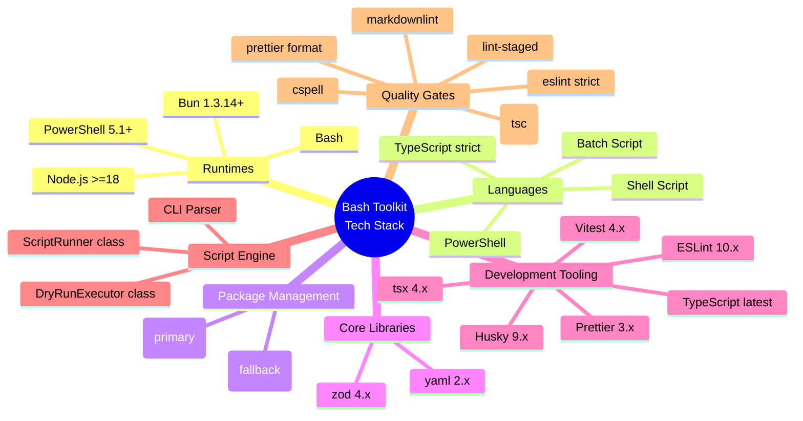
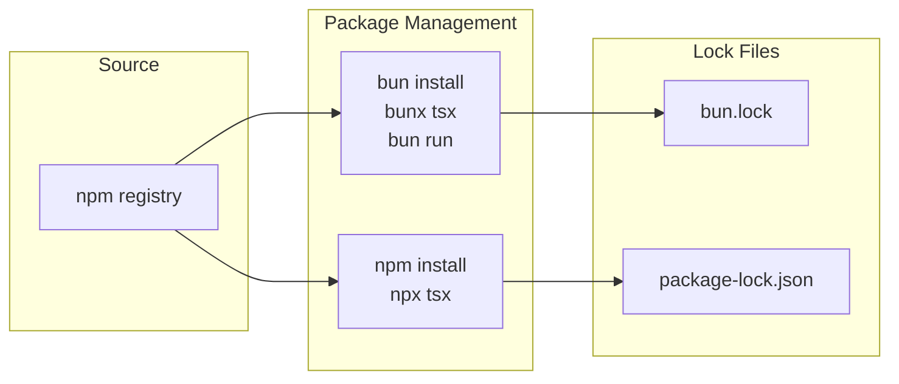
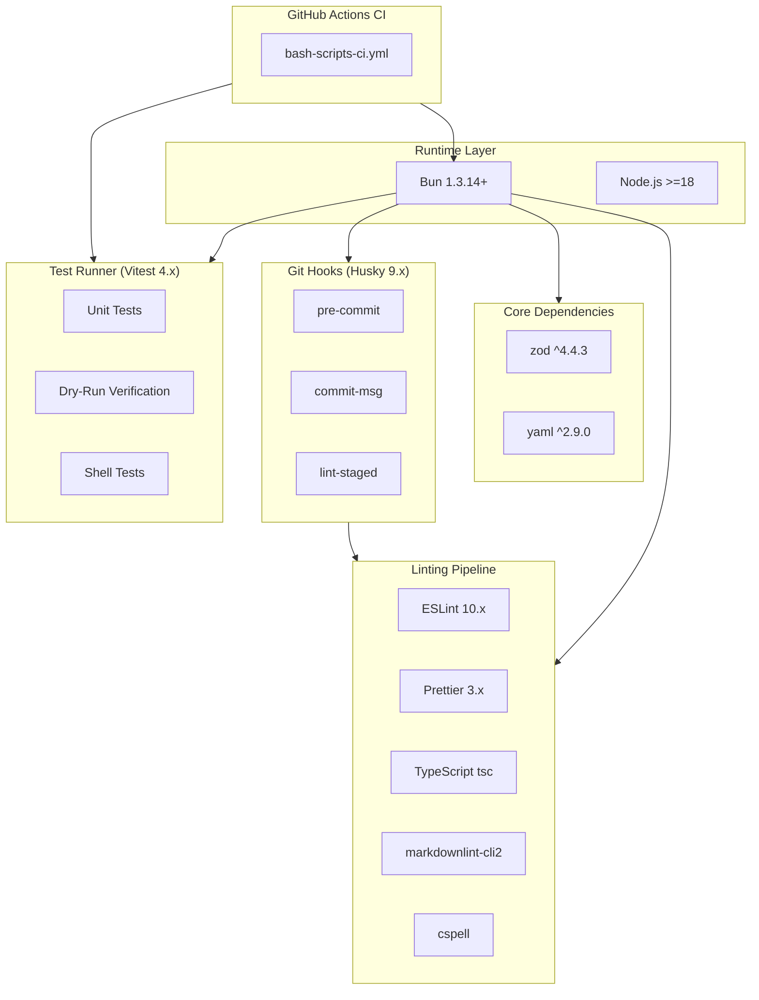
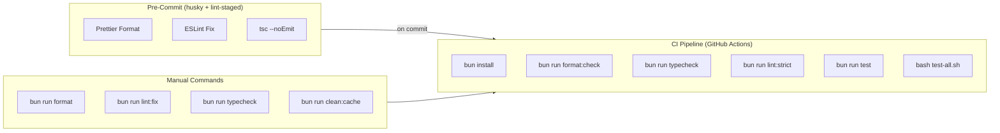

# Bash — Automation Toolkit Technology Stack Blueprint

> **Generated:** 2026-07-24
> **Generator:** technology-stack-blueprint-generator
> **Analysis Depth:** Comprehensive

---

## Project Identity

| Attribute | Value |
|---|---|
| **Project Name** | Bash (opencode) |
| **Type** | Multi-Phase Automation Toolkit |
| **Stack Type** | Bun/TypeScript + PowerShell + Shell |
| **License** | ISC |

---

## Technology Stack Overview

---

## Languages & Runtimes

| Technology | Version | Role | Scope |
|---|---|---|---|
| **Bun** | >=1.3.14 | Primary JavaScript/TypeScript runtime & package manager | All TypeScript execution |
| **TypeScript** | latest (strict mode) | Primary scripting language | `src/` — all utilities, core engine, migration tools |
| **Node.js** | >=18 | Fallback runtime | When Bun is unavailable |
| **PowerShell** | 5.1+ (Windows), 7.0+ (pwsh) | Windows orchestration & automation | `scripts/` — phase pipeline, library modules |
| **Bash** | 4+ | Shell scripting (Linux/Mac/CI) | `.sh` wrappers, CI scripts, `tests/` |
| **Batch (cmd.exe)** | — | Windows CMD fallback | `.bat` wrappers for legacy environments |

---

## Package Manager

| Tool | Version | Usage |
|---|---|---|
| **bun** | 1.3.14 | Primary: `bun install`, `bun run`, `bunx tsx` |
| **npm** | (bundled with Node) | Fallback when Bun unavailable |
| **PackageManager** | `bun@1.3.14` (in `package.json`) | Explicit engine pinning |

---

## Core Dependencies (Production)

| Package | Version | Purpose |
|---|---|---|
| **zod** | ^4.4.3 | Schema validation & type-safe parsing |
| **yaml** | ^2.9.0 | YAML file parsing |

Minimal production footprint — the toolkit is primarily a **script orchestration platform**, not a library-heavy application.

---

## Development Dependencies

### Code Quality & Linting

| Package | Version | Purpose |
|---|---|---|
| **typescript** | latest | Type checking (`tsc --noEmit --pretty`) |
| **eslint** | ^10.4.0 | Linting framework (flat config) |
| **@eslint/js** | ^10.0.1 | ESLint JavaScript rules |
| **@eslint/eslintrc** | ^3.3.5 | ESLint config compatibility |
| **typescript-eslint** | ^8.59.4 | TypeScript ESLint rules |
| **@typescript-eslint/parser** | ^8.59.4 | TypeScript parser for ESLint |
| **eslint-config-prettier** | ^10.1.8 | ESLint + Prettier compatibility |
| **eslint-plugin-import-x** | ^4.16.2 | Import rules |
| **eslint-plugin-unicorn** | ^64.0.0 | Opinionated unicorn rules |
| **eslint-plugin-perfectionist** | ^5.9.0 | Sort/organization rules |
| **eslint-plugin-sonarjs** | ^4.0.3 | Code quality detection |
| **eslint-plugin-security** | ^4.0.0 | Security vulnerability detection |
| **eslint-plugin-regexp** | ^3.1.0 | Regex best practices |
| **eslint-plugin-n** | ^17.24.0 | Node.js rules |
| **eslint-plugin-no-secrets** | ^2.3.3 | Secret detection |
| **eslint-plugin-zod** | ^3.12.1 | Zod validation rules |
| **eslint-plugin-jsdoc** | ^62.9.0 | JSDoc comment rules |
| **@eslint/markdown** | ^8.0.1 | Markdown linting |

### Formatting

| Package | Version | Purpose |
|---|---|---|
| **prettier** | ^3.8.3 | Code formatter |
| **prettier-plugin-organize-imports** | ^4.3.0 | Import organization |
| **prettier-plugin-packagejson** | ^3.0.2 | package.json sorting |
| **prettier-plugin-sort-json** | ^4.2.0 | JSON sorting |
| **pretty-quick** | ^4.2.2 | Quick formatting for staged files |

### Documentation Quality

| Package | Version | Purpose |
|---|---|---|
| **markdownlint-cli2** | ^0.22.1 | Markdown style & standards |
| **markdownlint** | ^0.40.0 | Markdown rules engine |
| **cspell** | ^10.0.0 | Spell checking |

### Testing

| Package | Version | Purpose |
|---|---|---|
| **vitest** | ^4.1.7 | Unit test framework (TypeScript) |
| **jsdom** | ^29.1.1 | DOM environment for tests |
| **tsx** | ^4.22.3 | TypeScript execution engine |

### Git Hooks & Workflow

| Package | Version | Purpose |
|---|---|---|
| **husky** | ^9.1.7 | Git hook management |
| **lint-staged** | ^16.4.0 | Staged file processing |
| **cross-env** | ^10.1.0 | Cross-platform environment variables |

### Utilities

| Package | Version | Purpose |
|---|---|---|
| **rimraf** | ^6.1.3 | Cross-platform file cleanup |
| **globby** | ^16.2.0 | Glob pattern matching |
| **glob** | ^13.0.6 | Legacy glob support |
| **dotenv** | ^17.4.2 | Environment variable loading |
| **dotenv-safe** | ^9.1.0 | Safe env loading with validation |
| **js-yaml** | ^4.1.1 | YAML manipulation |
| **ajv** | ^8.20.0 | JSON Schema validation |
| **ajv-formats** | ^3.0.1 | JSON Schema format validators |
| **ts-morph** | ^28.0.0 | TypeScript AST manipulation |
| **vfile** | ^6.0.3 | Virtual file system |
| **vfile-matter** | ^5.0.1 | Frontmatter parsing |
| **sharp** | ^0.34.5 | Image processing |
| **@types/bun** | latest | Bun type definitions |
| **@types/node** | latest | Node.js type definitions |
| **@types/fs-extra** | ^11.0.4 | fs-extra types |
| **@types/js-yaml** | ^4.0.9 | js-yaml types |
| **dts-gen** | ^0.10.9 | TypeScript definition generator |
| **all-contributors-cli** | ^6.26.1 | Contributors management |

---

## Dependency Dependency Graph

---

## TypeScript Configuration

```mermaid
flowchart LR
    subgraph TSConfig["tsconfig.json — Strict Mode"]
        MOD[module: nodenext]
        TGT[target: esnext]
        STR[strict: true]
        NOCI[noUncheckedIndexedAccess: true]
        NOPARAM[noUnusedParameters: true]
        NOLOCAL[noUnusedLocals: true]
        NOSWITCH[noFallthroughCasesInSwitch: true]
        OVERRIDE[noImplicitOverride: true]
        VERBATIM[verbatimModuleSyntax: true]
        ISO[isolatedModules: true]
        EXACT[exactOptionalPropertyTypes: true]
    end

    TSConfig --> ENFORCE[Type Safety Enforcement]
```

---

## Quality Pipeline

---

## Script Categories

The toolkit defines **177 scripts** across **11 directories**, organized into 6 categories by the unified orchestrator:

| Category | Script Count | Description |
|---|---|---|
| **Core** | 64 | TypeScript sources, phase scripts, root wrappers |
| **Banking** | 34 | Banking sub-project automation |
| **Archive** | 51 | Retired git-commit-batch scripts |
| **Comicwise** | 10 | Comic/media project utilities |
| **Bash** | 7 | Bash migration utilities |
| **Utilities** | 18 | Tests, lib, ecom, rhixe_scans, root |
| **TOTAL** | **177** | |

---

## Execution Modes

| Mode | Command | Behavior |
|---|---|---|
| **Auto** | `orchestrator-unified.ps1` (default) | Runs core production pipeline sequentially: disk-analysis → cache-clean → clean-dependency-folders |
| **Interactive** | `orchestrator-unified.ps1 -Mode interactive` | Menu-driven category/script selection |
| **Discover** | `orchestrator-unified.ps1 -Mode discover` | Lists all 177 scripts, exits |
| **Validate** | `orchestrator-unified.ps1 -Mode validate` | Syntax checks all scripts |
| **Direct Bun** | `bun run <script>` | Runs individual TypeScript/npm scripts |

---

## CI/CD Pipeline

| Pipeline | File | Trigger | Actions |
|---|---|---|---|
| Bash Scripts CI | `.github/workflows/bash-scripts-ci.yml` | Push/PR to main | install → format:check → typecheck → lint:strict → test → shell tests |
| Copilot Setup | `.github/workflows/copilot-setup-steps.yml` | Setup | Copilot configuration |

---

## Key Quality Standards

- **TypeScript strict mode** — All 12 strict flags enabled
- **ES Modules** — `"type": "module"` in package.json
- **Zero-warning linting** — `lint:strict` passes at `--max-warnings=0`
- **`--dry-run`** — Every destructive operation supports preview mode
- **Wrapper parity** — `.sh`, `.ps1`, `.bat` for every script
- **Timestamped logs** — All operations log to `logs/` with `yyyyMMdd-HHmmss` format

---

*Generated by technology-stack-blueprint-generator — comprehensive technology analysis*
