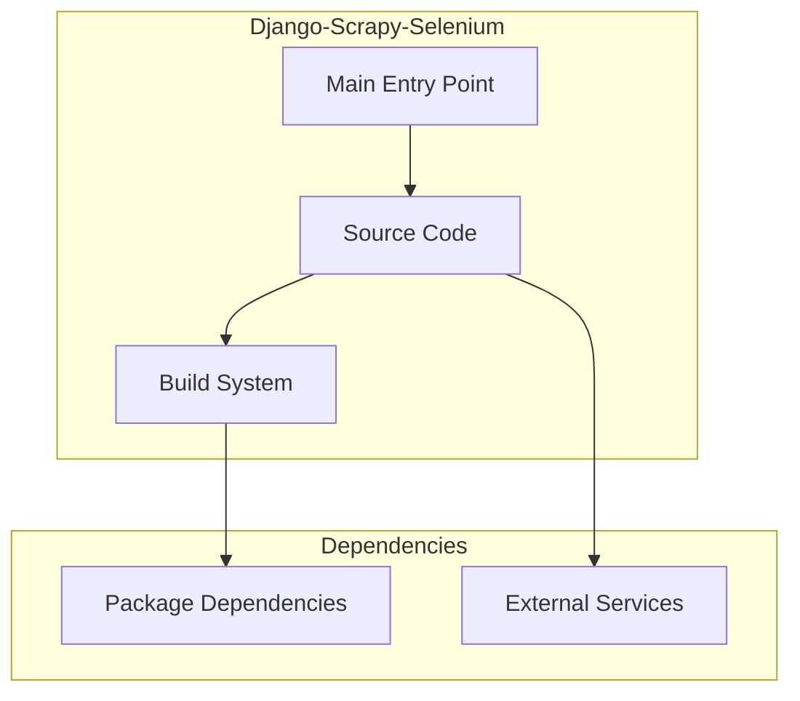

# Django-Scrapy-Selenium Architecture

**Generated:** 2026-07-28  
**Project Type:** Python/Django (Full Stack)  
**Architecture Pattern:** Django MVT + Scrapy + Selenium + Next.js frontend

## Overview

Full-stack web scraping platform with Django REST API, Scrapy spiders, Selenium JS rendering, and Next.js frontend.

## Technology Stack

Django 5, Python 3.11, Scrapy, Selenium, Next.js, TypeScript, PostgreSQL, Docker

## Source Layout

api/, config/, crawler/, compose/

## Architecture Diagram

## Key Patterns

- **Django MVT + Scrapy + Selenium + Next.js frontend**
- Version control: Shared monorepo git

## Cross-Cutting Concerns

- **Linting/Formatting:** Aligned with workspace root configs (ESLint, Prettier, Ruff)
- **Documentation:** AGENTS.md + standard doc files per project convention
- **Dependencies:** Managed via project-specific package manager

## Related Documents

- [Folder Structure](./Django-Scrapy-Selenium_folders.md)
- [Technology Stack](./Django-Scrapy-Selenium_techstack.md)
