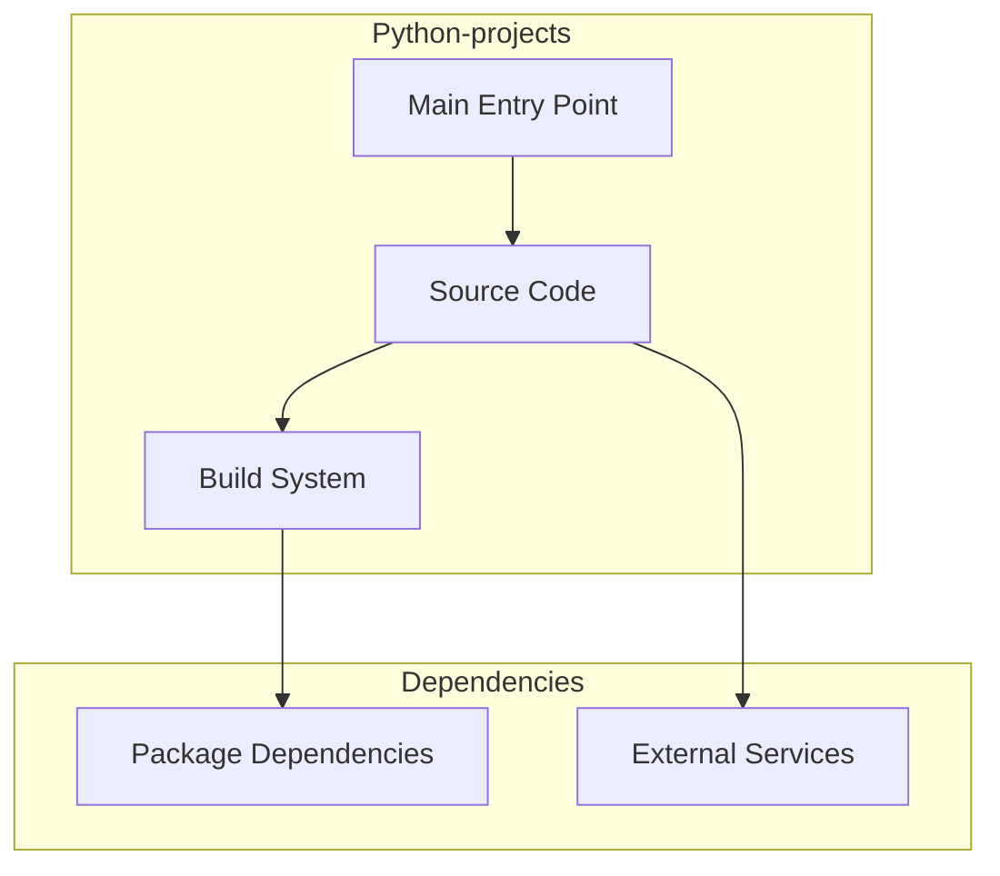

# Python-projects Architecture

**Generated:** 2026-07-28  
**Project Type:** Python (Scripts)  
**Architecture Pattern:** Educational Python utility scripts

## Overview

Collection of Python utility scripts and educational examples including calculators, games, and automation tools.

## Technology Stack

Python 3.11

## Source Layout

Root-level .py files

## Architecture Diagram

## Key Patterns

- **Educational Python utility scripts**
- Version control: Shared monorepo git

## Cross-Cutting Concerns

- **Linting/Formatting:** Aligned with workspace root configs (ESLint, Prettier, Ruff)
- **Documentation:** AGENTS.md + standard doc files per project convention
- **Dependencies:** Managed via project-specific package manager

## Related Documents

- [Folder Structure](./Python-projects_folders.md)
- [Technology Stack](./Python-projects_techstack.md)
