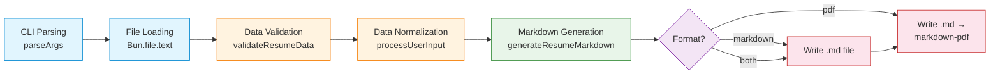
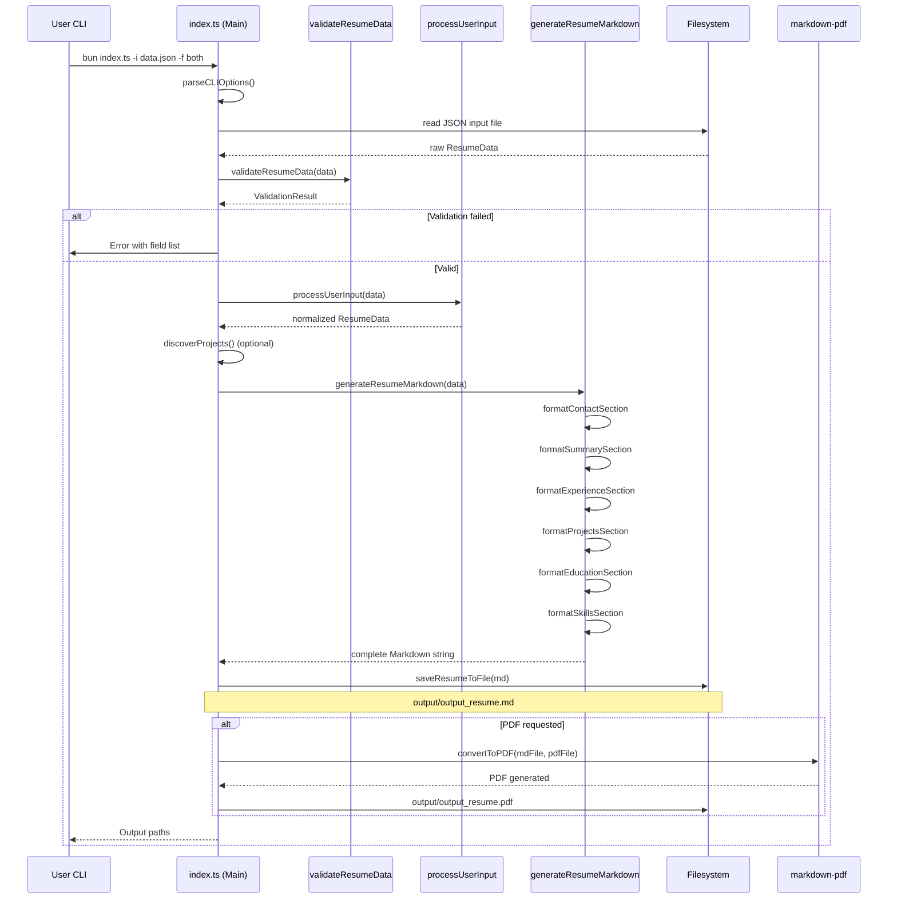
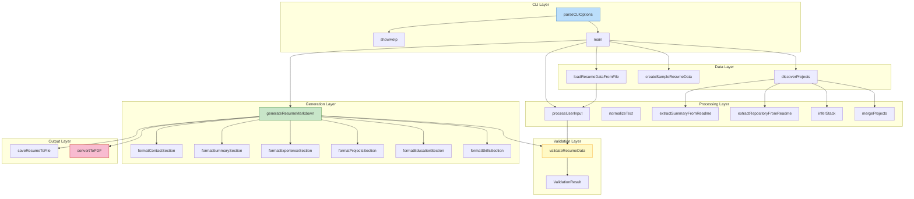
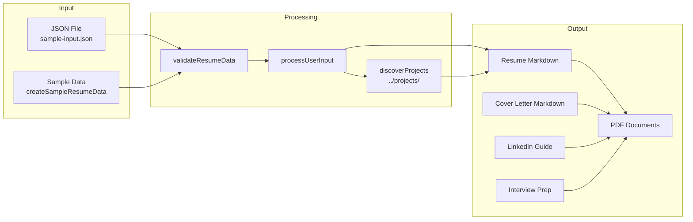
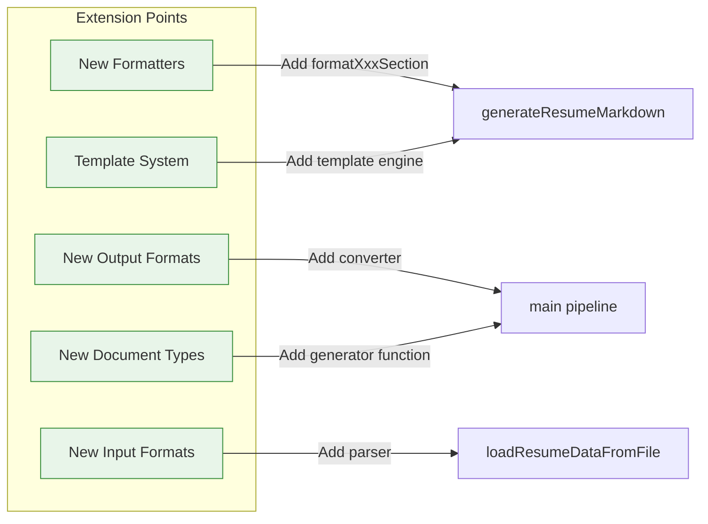

# Resume_maker Architecture Blueprint

> **Project:** Resume_maker  
> **Type:** CLI Document Generator  
> **Architecture Pattern:** Pipeline Processing  
> **Entry Point:** `index.ts`  
> **Generated:** 2026-07-24

---

## 1. Architectural Overview

Resume_maker is a **single-entry, pipeline-processing CLI application** that transforms structured JSON input into professional job-hunting documents (resume, cover letter, LinkedIn guide, interview prep). It follows a `parse → validate → normalize → generate → convert` pipeline with isolated per-document generation.

### Key Design Characteristics

| Aspect | Decision |
| --- | --- |
| **Deployment** | Single-file CLI tool (no server, no daemon) |
| **Entry Strategy** | Single entry point (`index.ts`) — Bun-native execution |
| **Processing Model** | Synchronous pipeline with async I/O for file ops |
| **Isolation Model** | Per-document generation failures don't block other docs |
| **Extensibility** | Add new formatters for new document types |
| **Portability** | Bun runtime handles TS transpilation — no separate build step |

---

## 2. Pipeline Architecture

```
┌─────────────────────────────────────────────────────────────────────────────┐
│                           Pipeline Processing                               │
│  ┌──────────┐  ┌──────────┐  ┌──────────┐  ┌────────────┐  ┌─────────────┐ │
│  │  PARSE   │→ │ VALIDATE │→ │NORMALIZE  │→ │  GENERATE  │→ │  CONVERT    │ │
│  │ CLI args │  │ Resume   │  │ process-  │  │ Markdown   │  │ Markdown →  │ │
│  │ + JSON   │  │ Data     │  │ UserInput │  │ Formatters │  │ PDF (opt.)  │ │
│  └──────────┘  └──────────┘  └──────────┘  └────────────┘  └─────────────┘ │
└─────────────────────────────────────────────────────────────────────────────┘
```

### Step-by-Step Pipeline



### Detailed Processing Flow



---

## 3. Component Architecture



### Component Responsibilities

| Component | Responsibility |
| --- | --- |
| `parseCLIOptions` | Parse `--input`, `--output`, `--format`, `--projectsDir`, `--skipProjects`, `--verbose`, `--help` flags via Node.js `util.parseArgs` |
| `validateResumeData` | Check required fields (name, title, summary, experience, education, skills, contact). Returns `{isValid, errors}` |
| `processUserInput` | Normalize input: trim whitespace, set defaults for missing optional fields |
| `generateResumeMarkdown` | Orchestrate section formatters into a complete Markdown document. Validates before generation |
| `format{Section}Section` | Six standalone formatting functions, each producing a Markdown subsection |
| `discoverProjects` | Walk sibling directories, read README.md, infer tech stack, extract repo URLs, apply curated descriptions |
| `convertToPDF` | Shell out to `bunx markdown-pdf` for PDF conversion |
| `saveResumeToFile` | Write UTF-8 Markdown to `output/` directory using `Bun.write` |

---

## 4. Data Model

```typescript
// Core domain types — all exported for external use
interface ContactInfo {
    email: string;
    phone: string;
    linkedin?: string;
    github?: string;
    website?: string;
}

interface Experience {
    title: string;
    company: string;
    location?: string;
    startDate: string;
    endDate?: string;
    isCurrentRole?: boolean;
    highlights: string[];
}

interface Education {
    degree: string;
    institution: string;
    graduationYear: string;
    gpa?: string;
    specialization?: string;
    relevantCoursework?: string[];
}

interface Project {
    name: string;
    summary: string;
    stack?: string[];
    repository?: string;
    highlights?: string[];
}

interface ResumeData {
    name: string;
    title: string;
    contact: ContactInfo;
    summary: string;
    experience: Experience[];
    education: Education[];
    skills: string[];
    projects?: Project[];
}
```

### Data Flow Diagram



---

## 5. Cross-Cutting Concerns

### Error Handling Strategy

| Scenario | Handling |
| --- | --- |
| Missing required field | `validateResumeData` returns error → `throw Error` with field list |
| Invalid JSON input | `JSON.parse` throws → caught in `main()` `try/catch` → `process.exit(1)` |
| PDF conversion failure | `convertToPDF` rejects promise → Markdown file **still saved** |
| Missing input file | `Bun.file` I/O error → caught in `main()` → error message |
| Project discovery failure | `discoverProjects` error → silently skipped with optional warning |

### Resilience

- **Graceful degradation**: PDF failure still delivers Markdown
- **Optional project discovery**: `--skipProjects` flag avoids filesystem traversal
- **Input fallback**: No `--input` flag → uses built-in sample data
- **Per-document isolation**: Each document type generated independently

### Configuration Surface

| Config File | Purpose |
| --- | --- |
| `tsconfig.json` | TypeScript strict mode, ESNext target, Bun bundler mode |
| `eslint.config.js` | TypeScript lint rules, Prettier integration |
| `.markdownlint.json` / `.markdownlintrc.json` | Markdown formatting rules |
| `.cspell.json` | Spell-check word list |
| `.vscode/settings.json` | Editor defaults |
| `.vscode/launch.json` | Debug configurations |

---

## 6. Extensibility Points



1. **New Document Types** — Add a generator function and corresponding formatters (e.g., portfolio page, bio)
2. **New Output Formats** — Add a converter module (e.g., `convertToDOCX`, `convertToHTML`)
3. **New Input Formats** — Add a parser for YAML, TOML, or CSV input
4. **Template System** — Replace hardcoded Markdown templates with EJS/Handlebars
5. **Additional CLI Flags** — Extend `CLIOptions` interface and `parseCLIOptions` switch

---

## 7. Architectural Decisions

| Decision | Rationale |
| --- | --- |
| **Bun-native, no build step** | Bun runs TypeScript directly; `tsconfig.json` has `noEmit: true` |
| **Single-file entry point** | ~933 lines manageable for a focused CLI tool; avoids premature module splitting |
| **TypeScript strict** | Catches data-shape mismatches at compile time for a data-driven generator |
| **Curated project descriptions** | Hardcoded `CURATED_PROJECTS` map provides resume-optimized text vs raw README |
| **markdown-pdf via bunx** | No npm package bundling; pulled on-demand at runtime |
| **output/ directory** | Simple convention; avoids polluting project root |

---

*Generated by architecture-blueprint-generator — comprehensive analysis*
