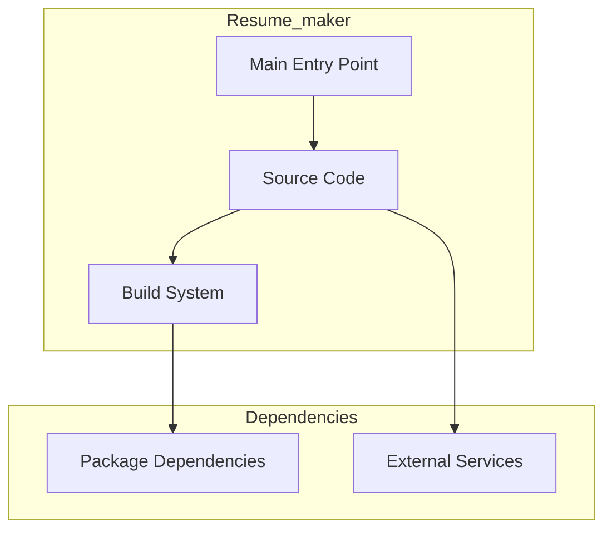

# Resume_maker Architecture

**Generated:** 2026-07-28  
**Project Type:** TypeScript/Bun (Utility)  
**Architecture Pattern:** PDF generation from structured JSON input

## Overview

PDF resume generator that transforms structured JSON input into formatted resume documents.

## Technology Stack

Bun, TypeScript, ESLint

## Source Layout

index.ts, scripts/, output/

## Architecture Diagram

## Key Patterns

- **PDF generation from structured JSON input**
- Version control: Shared monorepo git

## Cross-Cutting Concerns

- **Linting/Formatting:** Aligned with workspace root configs (ESLint, Prettier, Ruff)
- **Documentation:** AGENTS.md + standard doc files per project convention
- **Dependencies:** Managed via project-specific package manager

## Related Documents

- [Folder Structure](./Resume_maker_folders.md)
- [Technology Stack](./Resume_maker_techstack.md)
