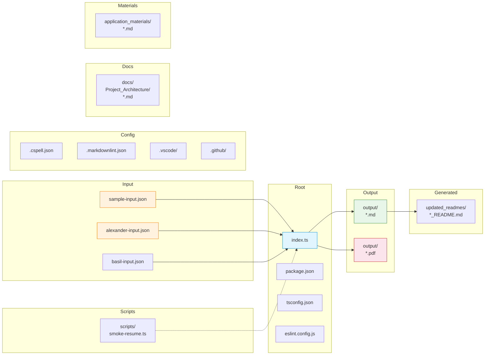

# Resume_maker Folder Structure Blueprint

> **Project:** Resume_maker  
> **Type:** Bun/TypeScript CLI Application  
> **Generated:** 2026-07-24  
> **Auto-detected:** Yes — `package.json`, `bun.lock`, `tsconfig.json`, `eslint.config.js`

---

## 1. Full Directory Tree

```
Resume_maker/
│
├── 📄 index.ts                          # Main entry point (~933 lines)
├── 📄 package.json                      # Dependencies & npm scripts
├── 📄 tsconfig.json                     # TypeScript strict config
├── 📄 eslint.config.js                  # ESLint flat config
├── 📄 bun.lock                          # Bun lockfile
│
├── 📄 AGENTS.md                         # Project context for AI agents
├── 📄 README.md                         # Project documentation
├── 📄 LICENSE                          # MIT license
├── 📄 architecture.md                   # Earlier architecture doc
├── 📄 tech-stack.md                     # Earlier tech stack doc
│
├── 📄 .gitignore
├── 📄 .cspell.json                      # Spell-check dictionary
├── 📄 .markdownlint.json                # Markdown lint rules
├── 📄 .markdownlintrc.json              # Markdown lint rules (alt)
│
├── 📁 .github/
│   └── 📄 copilot-instructions.md       # AI coding guidelines
│
├── 📁 .vscode/
│   ├── 📄 extensions.json               # Recommended extensions
│   ├── 📄 launch.json                   # Debug configurations
│   ├── 📄 settings.json                 # Editor settings
│   └── 📄 tasks.json                    # Build tasks
│
├── 📁 scripts/
│   └── 📄 smoke-resume.ts               # E2E smoke test script
│
├── 📁 docs/
│   └── 📁 Project_Architecture/
│       ├── 📄 Project_Architecture_Blueprint.md
│       ├── 📄 Project_Folder_Structure.md
│       ├── 📄 Technology_Stack_Blueprint.md
│       ├── 📄 Workflow_Analysis.md
│       ├── 📄 exemplars.md
│       └── 📄 Resume_maker_architecture.md   ← this document
│   └── 📄 sample-artifacts.md
│
├── 📁 output/                           # Generated documents
│   ├── 📄 resume.md / resume.pdf
│   ├── 📄 alexander-resume.md / alexander-resume.pdf
│   ├── 📄 basil-resume.md / basil-resume.pdf
│   ├── 📄 output_resume.md
│   ├── 📄 cover-letter.md / cover-letter.pdf
│   ├── 📄 interview-qa.md
│   ├── 📄 linkedin-about-draft.md
│   ├── 📄 linkedin-guide.md
│   ├── 📄 job-recommendations.md
│   ├── 📄 project-walkthrough.md
│   ├── 📄 search-keywords.md
│   ├── 📄 Senior_React_Developer_Resume.md
│   └── 📄 smoke-resume.md / smoke-resume.pdf
│
├── 📁 application_materials/            # Pre-generated applications
│   ├── 📄 COVER_LETTER.md
│   └── 📄 JOB_RECOMMENDATIONS.md
│
├── 📁 updated_readmes/                  # Auto-generated README updates
│   ├── 📄 ecom_README.md
│   ├── 📄 rhixecompany_README.md
│   ├── 📄 rhixe_scans_README.md
│   ├── 📄 selenium_webdriver_README.md
│   ├── 📄 university-libary-jsm_README.md
│   └── 📄 xamehitv_README.md
│
├── 📄 sample-input.json                 # Sample resume data
├── 📄 alexander-input.json              # Author's resume data
├── 📄 basil-input.json                  # Secondary sample data
│
├── 📄 grok_summary_prompt.md
├── 📄 grok_summary_prompt.txt
├── 📄 web-research-resume-maker.md
├── 📄 copilot-instructions.md
├── 📄 AUDIT_Resume_maker.md
├── 📄 RESEARCH_REPORT.md
├── 📄 REPOSITORY_SUMMARY.md
├── 📄 THE_STORY_OF_THIS_REPO.md
├── 📄 folder-structure.html
├── 📄 folder-structure.md
├── 📄 README.html
├── 📄 LICENSE.html
│
└── 📁 node_modules/                     # Dependencies (gitignored)
```

---

## 2. Organizational Principle

The project follows a **flat-by-convention, layered-by-purpose** organization:

| Layer | Directory | Purpose |
| --- | --- | --- |
| **Entry** | Root (`/`) | Single entry point, all config, all data inputs |
| **Source** | `index.ts` | Entire application logic (no module splitting) |
| **Config** | Root dotfiles + `.vscode/` | Linting, formatting, spell-check, IDE |
| **Input Data** | Root (`*.json`) | Structured resume data in JSON format |
| **Output** | `output/` | All generated Markdown and PDF documents |
| **Scripts** | `scripts/` | Testing and automation scripts |
| **Docs** | `docs/` | Architecture documentation, sample outputs |
| **Materials** | `application_materials/` | Pre-generated application documents |
| **Generated** | `updated_readmes/` | Auto-generated README content |

### Decision: Flat Source Layout

The project deliberately avoids subdirectory modules or `src/` layout. This works because:

- The entire application is a single ~933-line TypeScript file
- No build step, no module bundling
- No shared library; everything is self-contained in `index.ts`

---

## 3. Key Directory Analysis

### `output/` — Generated Documents

The primary output directory. Contains both Markdown and PDF variants. Files are named by the `--output` CLI flag or auto-named.

| Pattern | Example |
| --- | --- |
| `{name}-resume.md` | `alexander-resume.md` |
| `{name}-resume.pdf` | `alexander-resume.pdf` |
| `{document-type}.md` | `cover-letter.md`, `interview-qa.md` |
| `output_resume.md` | Default filename when no `-o` flag |

### `scripts/` — Automation

Currently contains a single smoke test script (`smoke-resume.ts`) that:

1. Spawns `bun index.ts` with test arguments
2. Verifies both `.md` and `.pdf` output files exist
3. Exits non-zero on failure

### `docs/Project_Architecture/` — Blueprint Documents

Houses all generated documentation including architecture, folder structure, tech stack, workflow analysis, and code exemplars.

### `application_materials/` — Prepared Content

Contains pre-written cover letters and job recommendation documents — static content used during the job application process.

### `updated_readmes/` — Generated README Artifacts

Stores auto-generated or updated README files for sibling projects discovered via the `discoverProjects()` function.

---

## 4. Naming Conventions

| Category | Convention | Examples |
| --- | --- | --- |
| **Source files** | `kebab-case.ts` | `index.ts`, `smoke-resume.ts` |
| **Config files** | `.prefix` (dotfiles) | `.cspell.json`, `.markdownlint.json` |
| **Input data** | `kebab-case.json` | `sample-input.json`, `alexander-input.json` |
| **Output documents** | `{kebab-case}.md` / `.pdf` | `cover-letter.md`, `alexander-resume.pdf` |
| **Directories** | `kebab-case` | `application_materials/`, `updated_readmes/` |
| **Documentation** | `UPPER_CASE.md` | `README.md`, `AGENTS.md`, `LICENSE` |
| **Architecture docs** | `PascalCase_*.md` | `Project_Folder_Structure.md`, `Technology_Stack_Blueprint.md` |

---

## 5. File Placement Patterns



### Rule Summary

| File Type | Location | Rationale |
| --- | --- | --- |
| Entry point | Root | Single file, no subdirectory needed |
| Config files | Root (dotfiles) | Standard Node/Bun convention |
| Input data | Root | User-facing; easy to find and edit |
| Generated output | `output/` | Keeps generated artifacts separate |
| Scripts | `scripts/` | Standard pattern for automation |
| Documentation | `docs/` | Standard project convention |
| Generated content | `updated_readmes/` | Separate from source README |

---

## 6. Project Type Indicators

| Indicator | Present? | Evidence |
| --- | --- | --- |
| Node.js / Bun project | ✅ | `package.json` + `bun.lock` |
| TypeScript | ✅ | `tsconfig.json` + `.ts` source |
| ESLint | ✅ | `eslint.config.js` (flat config) |
| Prettier | ✅ | Referenced in `eslint.config.js` |
| Markdownlint | ✅ | `.markdownlint.json`, `.markdownlintrc.json` |
| CSpell | ✅ | `.cspell.json` |
| CLI application | ✅ | Single `index.ts` entry, `parseArgs` usage |
| Testing | ✅ | `scripts/smoke-resume.ts` (integration test) |

---

*Generated by folder-structure-blueprint-generator*
