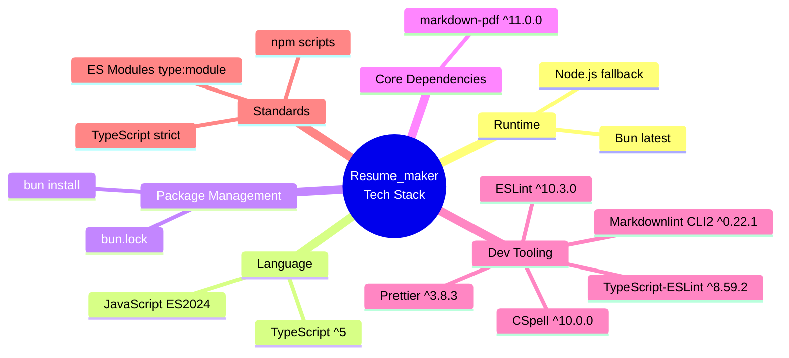
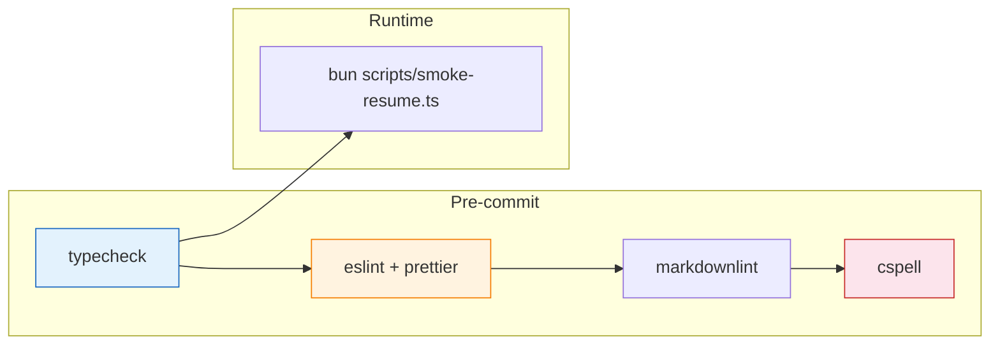
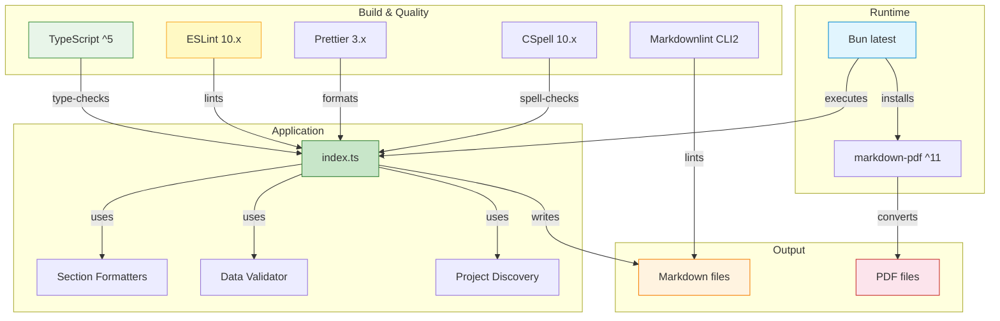

# Resume_maker Technology Stack Blueprint

> **Project:** Resume_maker  
> **Type:** CLI Document Generator  
> **Stack Type:** Bun/TypeScript  
> **Generated:** 2026-07-24  

---

## 1. Technology Stack Overview



---

## 2. Language & Runtime

| Technology | Version | Usage | Role |
| --- | --- | --- | --- |
| **TypeScript** | ^5 (peer) | Primary development language | Type safety, interfaces, strict mode |
| **Bun** | latest | Runtime & package manager | Execute `.ts` directly, install deps, run scripts |
| **Node.js** | (fallback) | Compatibility | Used only if Bun unavailable |
| **ES Module** | `"type": "module"` | Module system | ESM imports throughout |

### TypeScript Configuration (from `tsconfig.json`)

**Mode:** Strict (`"strict": true`)

| Setting | Value | Purpose |
| --- | --- | --- |
| `target` | `ESNext` | Latest JS features |
| `module` | `Preserve` | Keep ESM imports as-is |
| `moduleResolution` | `bundler` | Bun-compatible resolution |
| `lib` | `ESNext` | Latest type definitions |
| `jsx` | `react-jsx` | Prepared for JSX if needed |
| `strict` | `true` | Full type checking |
| `noUncheckedIndexedAccess` | `true` | Prevent undefined access |
| `noImplicitOverride` | `true` | Explicit override keyword |
| `allowImportingTsExtensions` | `true` | Import `.ts` directly (Bun) |
| `verbatimModuleSyntax` | `true` | No elision in imports |
| `noEmit` | `true` | Bun runs source directly |

---

## 3. Core Dependencies

```mermaid
flowchart LR
    subgraph Production
        MP[markdown-pdf ^11.0.0]
    end

    subgraph Development
        ESL[eslint ^10.3.0]
        PRET[prettier ^3.8.3]
        TSESL[@typescript-eslint/eslint-plugin ^8.59.2]
        TSP[@typescript-eslint/parser ^8.59.2]
        ECP[eslint-config-prettier ^10.1.8]
        EPP[eslint-plugin-prettier ^5.5.5]
        CSP[cspell ^10.0.0]
        MDL[markdownlint-cli2 ^0.22.1]
        BT[@types/bun latest]
    end

    MP -->|PDF conversion| APP[Resume_maker]
    ESL -->|lint rules| APP
    TSESL --> ESL
    TSP --> ESL
    ECP --> ESL
    EPP --> ESL
    PRET -->|formatting| APP
    CSP -->|spell check| APP
    MDL -->|markdown lint| APP

    style MP fill:#e8f5e9,stroke:#388e3c
    style ESL fill:#fff9c4,stroke:#f9a825
    style PRET fill:#fff9c4,stroke:#f9a825
    style CSP fill:#fff9c4,stroke:#f9a825
    style MDL fill:#fff9c4,stroke:#f9a825
```

### Production Dependencies

| Package | Version | Purpose | License |
|---|---|---|---|
| `markdown-pdf` | ^11.0.0 | Convert Markdown files to PDF via CLI | MIT |

The single production dependency is minimal — the application uses only Node.js/Bun built-ins for everything else:

- `util.parseArgs` — CLI argument parsing (built-in)
- `fs/promises`, `fs` — File I/O (built-in)
- `path` — Path resolution (built-in)
- `child_process` — PDF conversion spawn (built-in)
- `Bun.file`, `Bun.write` — Bun-native file operations (built-in)

### Development Dependencies

| Package | Version | Purpose |
| --- | --- | --- |
| `@types/bun` | latest | TypeScript types for Bun runtime |
| `@typescript-eslint/eslint-plugin` | ^8.59.2 | TypeScript-specific ESLint rules |
| `@typescript-eslint/parser` | ^8.59.2 | TypeScript AST parser for ESLint |
| `cspell` | ^10.0.0 | Spell checking for source and docs |
| `eslint` | ^10.3.0 | Linting framework (flat config) |
| `eslint-config-prettier` | ^10.1.8 | Disables ESLint rules conflicting with Prettier |
| `eslint-plugin-prettier` | ^5.5.5 | Runs Prettier as an ESLint rule |
| `markdownlint-cli2` | ^0.22.1 | Linting for Markdown files |
| `prettier` | ^3.8.3 | Code formatter |

---

## 4. Scripts & Automation

| Script | Command | Description |
| --- | --- | --- |
| `build` / `start` | `bun index.ts` | Run generator with default (sample) data |
| `help` | `bun index.ts --help` | Display CLI help |
| `typecheck` | `bun tsc --noEmit` | TypeScript type checking |
| `lint` | `eslint + prettier --check` | ESLint + Prettier validation |
| `lint:fix` | `eslint + prettier --write` | Auto-fix lint and formatting |
| `lint:md` | `markdownlint-cli2` | Markdown formatting rules |
| `lint:spell` | `cspell` | Spell check all source files |

### Quality Pipeline



---

## 5. ESLint Configuration

**Format:** Flat config (`eslint.config.js`)

| Rule | Severity | Purpose |
| --- | --- | --- |
| `prettier/prettier` | `error` | Enforce Prettier formatting |
| `@typescript-eslint/no-unused-vars` | `warn` | Catch unused variables (ignore `_` prefix) |
| `@typescript-eslint/no-explicit-any` | `warn` | Discourage `any` type usage |

**Ignores:** `node_modules/`, `*.lock`, `*.pdf`, `bun.lock`, `opencode/`

---

## 6. CLI Interface

### Command-Line Options (`CLIOptions`)

| Flag | Short | Type | Default | Description |
| --- | --- | --- | --- | --- |
| `--input` | `-i` | `string` | — | Input JSON file path |
| `--output` | `-o` | `string` | `output_resume` | Output filename (no extension) |
| `--format` | `-f` | `string` | `markdown` | Output format: `markdown`, `pdf`, or `both` |
| `--projectsDir` | `-p` | `string` | `..` | Directory to auto-discover portfolio projects |
| `--skipProjects` | — | `boolean` | `false` | Disable project auto-discovery |
| `--verbose` | `-v` | `boolean` | `false` | Enable verbose logging |
| `--help` | `-h` | `boolean` | — | Show help message |

### CLI Usage Examples

```bash
# Generate from sample data (default)
bun index.ts

# Generate from specific JSON input
bun index.ts --input alexander-input.json

# Generate PDF only
bun index.ts -i data.json -f pdf

# Generate both Markdown and PDF with custom name
bun index.ts -i data.json -o my-resume -f both

# Auto-discover sibling projects for portfolio section
bun index.ts -i data.json -o resume -f both -p ../projects

# Skip project discovery
bun index.ts --input sample-input.json --skipProjects

# Full quality check
bun run typecheck && bun run lint
```

---

## 7. Technology Relationship Diagram



---

## 8. Coding Conventions

| Convention | Standard |
| --- | --- |
| **Module System** | ES Modules (`"type": "module"`) |
| **Type Safety** | TypeScript strict mode (`"strict": true`) |
| **Entry Point** | `index.ts` (single file, no `src/` dir) |
| **Exports** | All types and functions exported for external use |
| **Error Handling** | Throw on validation failure, try/catch in main |
| **File I/O** | Bun-native (`Bun.file`, `Bun.write`) |
| **Output Path** | Always `output/{name}.md` / `output/{name}.pdf` |
| **Formatting** | Prettier defaults |
| **Markdown** | Strict rules via `markdownlint-cli2` |
| **Spelling** | Custom dictionary via `.cspell.json` |

---

## 9. Licensing

| Component | License |
| --- | --- |
| Resume_maker application | MIT |
| Author | Alexander Iseghohi |
| `markdown-pdf` | MIT |
| ESLint, Prettier, CSpell, TypeScript-ESLint | MIT / Apache 2.0 |

---

*Generated by technology-stack-blueprint-generator*
