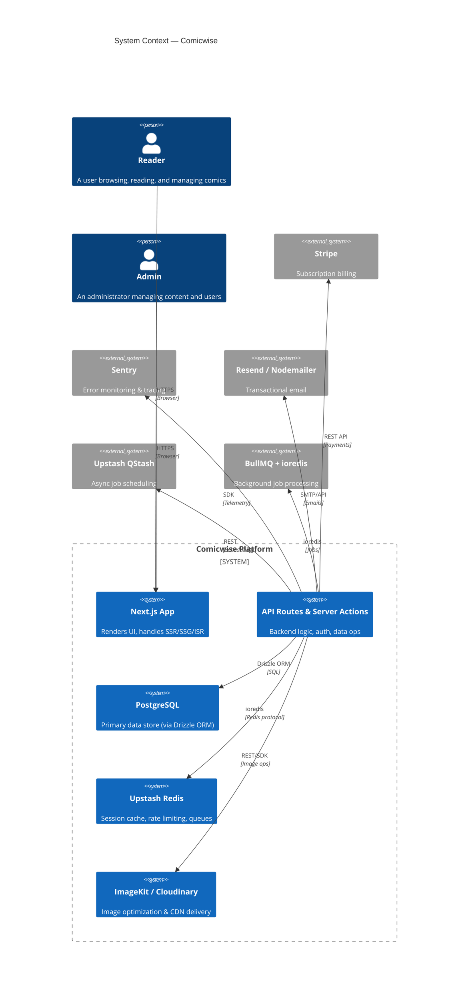
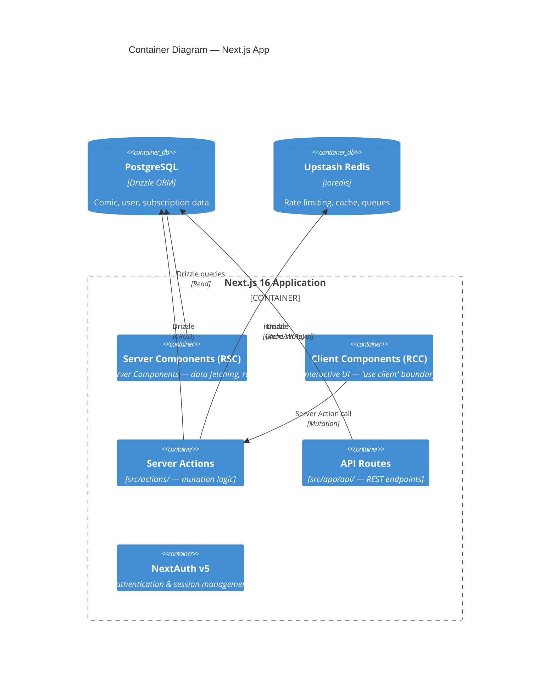
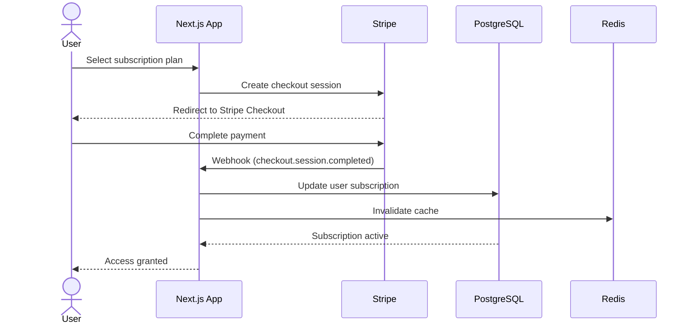

# Comicwise — Architecture Blueprint

## Overview

- **Project Name:** Comicwise (package: `comicbook`)
- **Project Type:** Full-stack digital comic/manga streaming platform
- **Architecture Pattern:** Next.js 16 App Router (full-stack RSC + RCC hybrid)
- **Package Manager:** pnpm 9.12.3 (monorepo-capable)
- **Target:** Vercel (primary), Docker (secondary)

## Architecture Diagram

## Architectural Patterns

### Rendering Strategy

| Strategy      | Pages                                                   |
|---------------|---------------------------------------------------------|
| **SSR**       | Auth pages, user profile, admin panel                   |
| **SSG + ISR** | Public comic listing, genre pages, author pages         |
| **CSR**       | Comic reader (client-heavy), search, interactive charts |

### Route Groups

| Group       | Layout          | Routes                                                     |
|-------------|-----------------|------------------------------------------------------------|
| `(auth)`    | Minimal         | `/sign-in`, `/sign-up`                                     |
| `(root)`    | Nav + Footer    | Home, browse, comics, authors, genres, profile, search, etc |
| `admin`     | Admin sidebar   | Users, comics, chapters, roles, permissions, audit-logs     |

### Data Access Layer

- **Server Actions** (`src/actions/`) — Primary mutation path; Drizzle queries inside exported async functions called from Client Components
- **API Routes** (`src/app/api/`) — Auth callback handlers and seed endpoints
- **Drizzle ORM** — Direct SQL query building via `drizzle-orm`; schema defined in `src/database/schema.ts`
- **TanStack React Query** — Client-side data fetching with query key factory (`src/lib/query-client.ts`)

### State Management

| Type            | Tool              | Usage                                    |
|-----------------|-------------------|------------------------------------------|
| **Server state** | TanStack Query    | Comics, chapters, users, bookmarks       |
| **Client state** | Zustand           | UI preferences, reader state, notifications |

### Subscription & Payment Flow

## Key Architecture Decisions

1. **Dual ORM (Prisma legacy → Drizzle)** — Migration underway from Prisma to Drizzle for better type safety, smaller bundle, and direct SQL control
2. **pnpm workspaces** — Disk-efficient monorepo management with strict dependency isolation
3. **RSC-first (App Router)** — Server Components as default, Client Components only for interactivity
4. **NextAuth v5 beta** — Modern auth with edge runtime support, Drizzle adapter for DB-backed sessions
5. **ImageKit + Cloudinary dual CDN** — Redundant image optimization pipeline; ImageKit primary, Cloudinary fallback
6. **BullMQ + Upstash QStash** — Redis-backed background jobs via BullMQ for heavy tasks; QStash for lightweight serverless scheduling
7. **React Compiler (experimental)** — Automatic memoization via `babel-plugin-react-compiler`
8. **Full-text search** — PostgreSQL `tsvector` columns for in-DB comic/manga search

## Security

- **Headers**: HSTS, X-Frame-Options, X-Content-Type-Options, CSP, Permissions-Policy (configured in `next.config.ts`)
- **Auth**: NextAuth with credentials, OAuth (Google, GitHub), and WebAuthn/passkey support
- **Rate limiting**: Upstash Ratelimit (Redis-backed)
- **Input validation**: Zod schemas validated server-side and client-side
- **Password strength**: zxcvbn-ts
- **RBAC**: User roles (`user`, `admin`, `moderator`) with granular permission system

## Monitoring & Observability

- **Sentry**: Error tracking, performance traces, release health
- **Logging**: Next.js fetch logging (full URL), environment-aware log levels
- **Health checks**: `/api/health` — checks DB, Redis, system status (via `src/scripts/unified-project-health.ts`)

## Extensibility

- Add new Route Groups in `src/app/(group)/`
- New Server Actions in `src/actions/`
- New entities via Drizzle schema additions and `drizzle-kit generate`
- New subscription tiers via Stripe product configuration
- New UI components via `pnpm dlx shadcn@latest add <component>`
