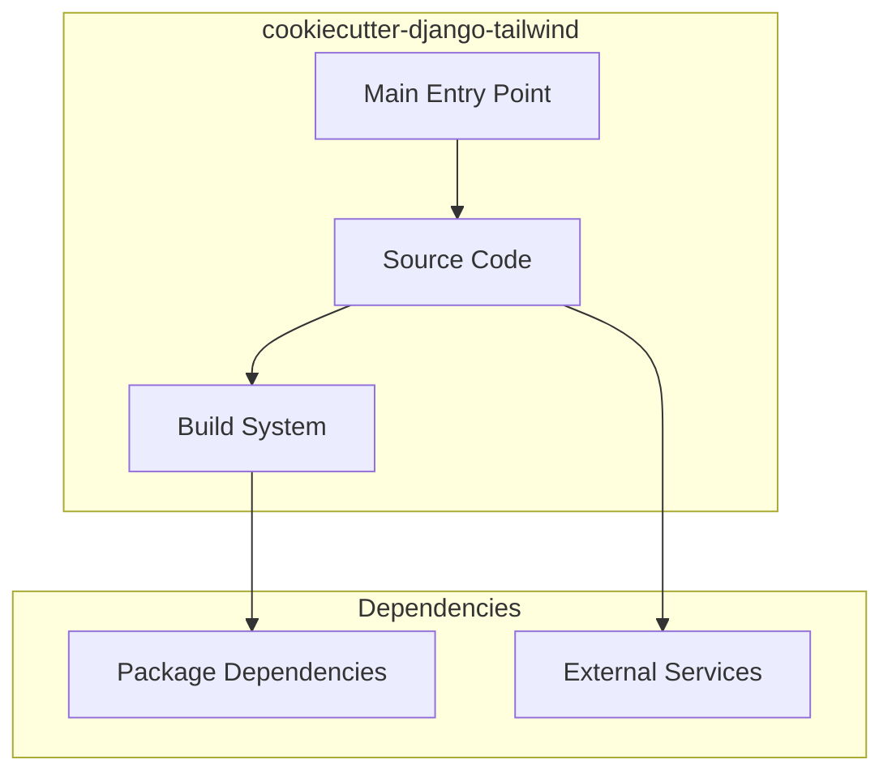

# cookiecutter-django-tailwind Architecture

**Generated:** 2026-07-28  
**Project Type:** Python/Django (Template)  
**Architecture Pattern:** Cookiecutter project template with Docker

## Overview

Cookiecutter template for bootstrapping production-grade Django projects with Tailwind CSS integration.

## Technology Stack

Django 5, Python 3.11, Tailwind CSS, Docker Compose, PostgreSQL

## Source Layout

{{cookiecutter.project_slug}}/, hooks/, tests/

## Architecture Diagram

## Key Patterns

- **Cookiecutter project template with Docker**
- Version control: Shared monorepo git

## Cross-Cutting Concerns

- **Linting/Formatting:** Aligned with workspace root configs (ESLint, Prettier, Ruff)
- **Documentation:** AGENTS.md + standard doc files per project convention
- **Dependencies:** Managed via project-specific package manager

## Related Documents

- [Folder Structure](./cookiecutter-django-tailwind_folders.md)
- [Technology Stack](./cookiecutter-django-tailwind_techstack.md)
