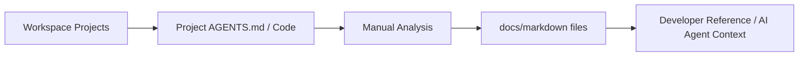

# docs — Documentation Repository (Architecture Blueprint)

## Overview

- **Project**: docs
- **Path**: projects/docs
- **Type**: Documentation-only repository
- **Pattern**: Static Documentation — Markdown files with YAML/JSON/CI metadata

## Purpose

Central documentation resource for the SandBox workspace. Contains architecture overviews, folder structure maps, technology stack references, research appendices, and dependency audits. Serves as a reference hub for other projects.

## Contents

| Resource | Description |
| ---------- | ------------- |
| `architecture.md` | Workspace-level architecture overview |
| `tech-stack.md` | Cross-project technology index |
| `folder-structure.md` | Top-level directory map |
| `README.md` | Entry point and navigation |
| `RESEARCH_APPENDIX.md` | Research campaign supplementary material |
| `DEPENDENCY_AUDIT.md` | Cross-project dependency analysis |

## Data Flow

## Key Design Decisions

- **Format:** Markdown for universal readability (renders on GitHub, VS Code, any editor)
- **Agent-first:** Content written for both humans and AI agents (structured tables, clean markdown)
- **Versioned alongside code:** Lives in the same repo as the projects it documents
