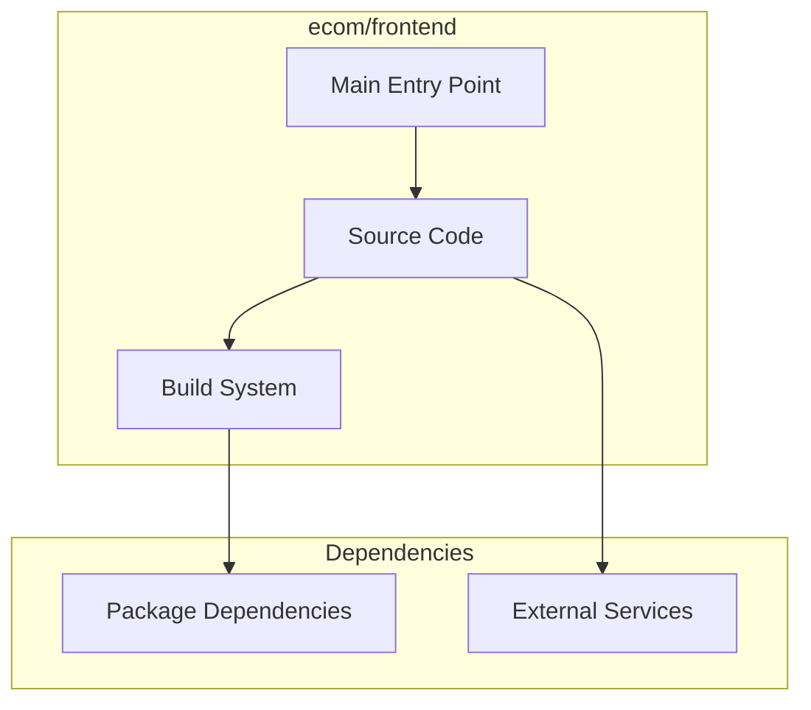

# ecom/frontend Architecture

**Generated:** 2026-07-28  
**Project Type:** React/Bun (Frontend)  
**Architecture Pattern:** React frontend for ecom Django backend

## Overview

React frontend application for the ecom Django e-commerce backend.

## Technology Stack

React, Bun

## Source Layout

src/

## Architecture Diagram

## Key Patterns

- **React frontend for ecom Django backend**
- Version control: Shared ecom git

## Cross-Cutting Concerns

- **Linting/Formatting:** Aligned with workspace root configs (ESLint, Prettier, Ruff)
- **Documentation:** AGENTS.md + standard doc files per project convention
- **Dependencies:** Managed via project-specific package manager

## Related Documents

- [Folder Structure](./ecom-frontend_folders.md)
- [Technology Stack](./ecom-frontend_techstack.md)
