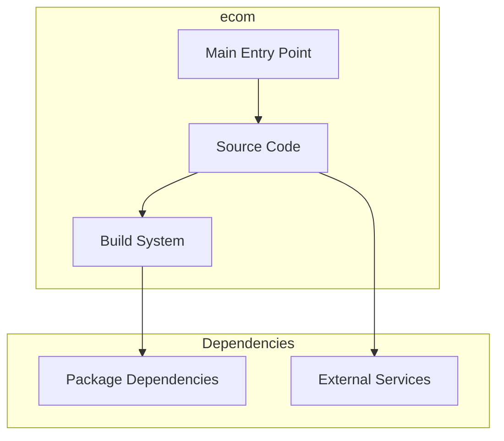

# ecom Architecture

**Generated:** 2026-07-28  
**Project Type:** Python/Django (Backend)  
**Architecture Pattern:** Django REST Framework + React frontend

## Overview

E-commerce backend with Django REST API, product management, orders, and separate React frontend.

## Technology Stack

Django, Python 3, DRF, SQLite, Gunicorn, React frontend

## Source Layout

base/, ecom/, frontend/src/

## Architecture Diagram

## Key Patterns

- **Django REST Framework + React frontend**
- Version control: Shared monorepo git

## Cross-Cutting Concerns

- **Linting/Formatting:** Aligned with workspace root configs (ESLint, Prettier, Ruff)
- **Documentation:** AGENTS.md + standard doc files per project convention
- **Dependencies:** Managed via project-specific package manager

## Related Documents

- [Folder Structure](./ecom_folders.md)
- [Technology Stack](./ecom_techstack.md)
