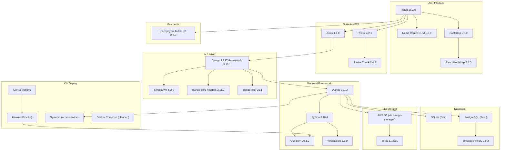
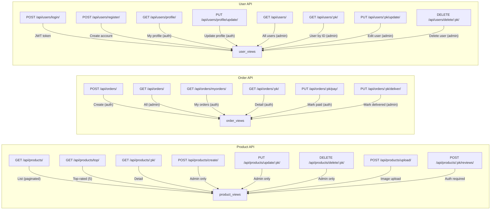

# Ecom — Technology Stack Blueprint

> **Project:** ecom — Django + React Ecommerce Platform  
> **Generated:** 2026-07-24  
> **Source:** Code analysis of `requirements.txt`, `Pipfile`, `frontend/package.json`, `Procfile`, `runtime.txt`, and source code imports

---

## 1. Stack Overview

---

## 2. Languages & Runtimes

| Technology | Version | Usage | Evidence |
|-----------|---------|-------|----------|
| **Python** | 3.10.4 | Backend runtime | `runtime.txt`, `Pipfile` |
| **JavaScript (ES6+)** | — | Frontend application code | `frontend/src/` |
| **Node.js** | — | JS runtime for React build | `frontend/package.json` |
| **HTML5** | — | SPA entry template | `frontend/public/index.html` |
| **CSS3** | — | Styling (Bootstrap + custom) | `frontend/src/index.css` |

---

## 3. Backend Stack

### 3.1 Web Framework

| Technology | Version | Purpose | Source |
|-----------|---------|---------|--------|
| **Django** | 3.1.14 | Web framework (MTV pattern) | `requirements.txt`, `ecom/settings.py` |
| **Django REST Framework** | 3.13.1 | REST API framework | `requirements.txt`, view imports |
| **Gunicorn** | 20.1.0 | Production WSGI server | `Procfile` |
| **WhiteNoise** | 5.1.0 | Static file serving in production | `ecom/settings.py` middleware |
| **django-cors-headers** | 3.11.0 | CORS for SPA ↔ API | `requirements.txt`, `settings.py` |
| **django-filter** | 21.1 | Query parameter filtering | `requirements.txt` |
| **django-crispy-forms** | 1.14.0 | Form rendering (admin) | `requirements.txt` |
| **django-ckeditor** | 6.3.2 | Rich text editor (admin) | `requirements.txt` |
| **django-storages** | 1.12.3 | S3/GCS file storage backend | `requirements.txt`, `settings.py` |

### 3.2 Authentication

| Technology | Version | Purpose |
|-----------|---------|---------|
| **djangorestframework-simplejwt** | 5.2.0 | JWT access + refresh tokens |
| **PyJWT** | 2.3.0 | JWT encoding/decoding |

### 3.3 Database

| Technology | Version | Purpose |
|-----------|---------|---------|
| **SQLite** (dev) | — | Development database (default in `settings.py`) |
| **PostgreSQL** (prod) | — | Production database (commented out in `settings.py`) |
| **psycopg2-binary** | 2.9.3 | PostgreSQL adapter |
| **SQLAlchemy** | 1.4.37 | ORM (present in deps, not used by Django directly) |

### 3.4 File Storage (Optional)

| Technology | Version | Purpose |
|-----------|---------|---------|
| **boto3** | 1.14.31 | AWS SDK (S3 storage) |
| **django-storages** | 1.12.3 | S3/GCS storage backend |

### 3.5 Development & Quality

| Technology | Version | Purpose |
|-----------|---------|---------|
| **autopep8** | 1.5.4 | Python code formatter |
| **pylint** | 2.6.2 | Python linter |
| **isort** | 5.6.4 | Import sorting |
| **python-dotenv** | 0.20.0 | `.env` file loading |
| **Pipenv** | — | Python dependency management (`Pipfile`) |

---

## 4. Frontend Stack

### 4.1 Core Libraries

| Technology | Version | Purpose |
|-----------|---------|---------|
| **React** | 18.2.0 | UI component library |
| **React DOM** | 18.2.0 | DOM renderer for React |
| **React Scripts** | 5.0.1 | Build tooling (Create React App) |

### 4.2 State Management

| Technology | Version | Purpose |
|-----------|---------|---------|
| **Redux** | 4.2.1 | Global state management |
| **Redux Thunk** | 2.4.2 | Async action middleware |
| **@redux-devtools/extension** | 3.2.5 | Redux DevTools integration |

### 4.3 Routing

| Technology | Version | Purpose |
|-----------|---------|---------|
| **React Router DOM** | 5.2.0 | Client-side routing (HashRouter) |
| **react-router-bootstrap** | 0.25.0 | Bootstrap-styled nav links |

### 4.4 UI Components

| Technology | Version | Purpose |
|-----------|---------|---------|
| **Bootstrap** | 5.3.0 | CSS framework |
| **React Bootstrap** | 2.8.0 | React-native Bootstrap components |
| **@fortawesome/fontawesome-free** | 6.4.0 | Icon library |

### 4.5 HTTP & Payments

| Technology | Version | Purpose |
|-----------|---------|---------|
| **Axios** | 1.4.0 | HTTP client for API calls |
| **react-paypal-button-v2** | 2.6.3 | PayPal Smart Button integration |

### 4.6 Testing

| Technology | Version | Purpose |
|-----------|---------|---------|
| **@testing-library/react** | 13.4.0 | React component testing |
| **@testing-library/jest-dom** | 5.16.5 | DOM matchers for Jest |
| **@testing-library/user-event** | 13.5.0 | User interaction simulation |

---

## 5. Infrastructure & DevOps

| Technology | Version | Purpose | Evidence |
|-----------|---------|---------|----------|
| **GitHub Actions** | — | CI pipeline | `.github/workflows/ci.yml` |
| **Heroku** | — | PaaS deployment | `Procfile`, `runtime.txt` |
| **Systemd** | — | Linux service management | `ecom.service`, `ecom.socket` |
| **Docker Compose** | — | Container orchestration (documented) | `AGENTS.md` |

---

## 6. API Layer Detail

---

## 7. Dependency Summary

### Python Dependencies (requirements.txt)

| Category | Packages |
|----------|----------|
| **Core Web** | `django==3.1.14`, `djangorestframework==3.13.1`, `gunicorn==20.1.0`, `whitenoise==5.1.0`, `flask==1.1.4` |
| **Auth** | `djangorestframework-simplejwt==5.2.0`, `pyjwt==2.3.0` |
| **Database** | `psycopg2-binary==2.9.3`, `sqlalchemy==1.4.37` |
| **Storage** | `boto3==1.14.31`, `django-storages==1.12.3`, `s3transfer==0.3.7` |
| **API/Forms** | `django-cors-headers==3.11.0`, `django-filter==21.1`, `django-crispy-forms==1.14.0`, `django-ckeditor==6.3.2` |
| **Dev** | `pylint==2.6.2`, `autopep8==1.5.4`, `isort==5.6.4`, `python-dotenv==0.20.0` |
| **Infra** | `pillow==9.0.1`, `sqlparse==0.3.1`, `requests==2.25.1`, `cs50==5.0.4` |

### JavaScript Dependencies (package.json)

| Category | Packages |
|----------|----------|
| **Framework** | `react@^18.2.0`, `react-dom@^18.2.0` |
| **State** | `redux@^4.2.1`, `react-redux@^8.1.1`, `redux-thunk@^2.4.2` |
| **Routing** | `react-router-dom@^5.2.0`, `react-router-bootstrap@^0.25.0` |
| **UI** | `bootstrap@^5.3.0`, `react-bootstrap@^2.8.0`, `@fortawesome/fontawesome-free@^6.4.0` |
| **HTTP** | `axios@^1.4.0` |
| **Payments** | `react-paypal-button-v2@^2.6.3` |
| **Testing** | `@testing-library/react@^13.4.0`, `@testing-library/jest-dom@^5.16.5`, `@testing-library/user-event@^13.5.0` |
| **Tooling** | `react-scripts@5.0.1`, `@redux-devtools/extension@^3.2.5`, `web-vitals@^2.1.4` |

---

## 8. Environment Configuration

| Variable | Purpose | Source |
|----------|---------|--------|
| `DJANGO_SECRET_KEY` | Django secret key | `.env.example` |
| `DATABASE_URL` | Production DB connection string | `.env.example` |
| `PAYPAL_CLIENT_ID` | PayPal client-side integration ID | `.env.example`, `OrderScreen.js` |
| `PAYPAL_CLIENT_SECRET` | PayPal server-side secret | `.env.example` |
| `STRIPE_API_KEY` | Stripe key (future use) | `.env.example` |
| `AWS_ACCESS_KEY_ID` | S3 access key | `settings.py` (commented) |
| `AWS_SECRET_ACCESS_KEY` | S3 secret key | `settings.py` (commented) |

---

## 9. Version Compatibility Matrix

| Component | Version | Notes |
|-----------|---------|-------|
| Python | 3.10.4 | Required by `runtime.txt` |
| Django | 3.1.14 | Compatible with Python 3.10 |
| PostgreSQL | 9.6+ | `psycopg2-binary` driver version |
| Node.js | 14+ | Required by `react-scripts@5` |
| React | 18.x | Created with CRA, compatible with React Router 5 |
| React Router | 5.x | Uses HashRouter (v5 API) — **not** v6 |
| Redux | 4.x | Classic Redux, not Redux Toolkit |
