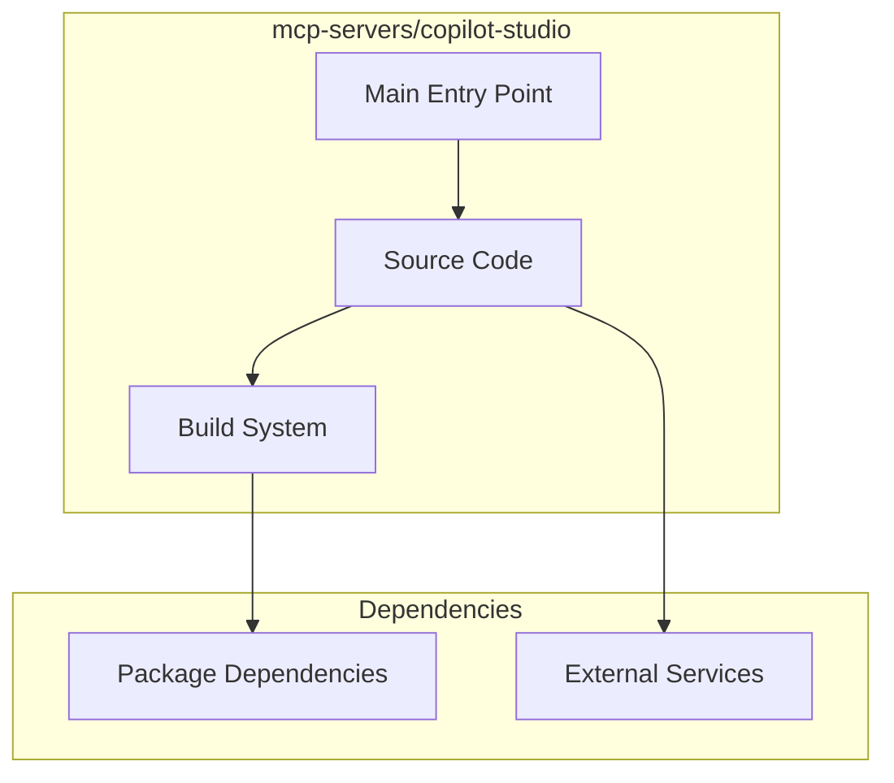

# mcp-servers/copilot-studio Architecture

**Generated:** 2026-07-28  
**Project Type:** TypeScript/Bun (MCP)  
**Architecture Pattern:** MCP server with tool registration

## Overview

MCP server implementation for Copilot Studio integration with customer search and management tools.

## Technology Stack

Bun, TypeScript

## Source Layout

server.ts, tools/

## Architecture Diagram

## Key Patterns

- **MCP server with tool registration**
- Version control: Shared mcp-servers git

## Cross-Cutting Concerns

- **Linting/Formatting:** Aligned with workspace root configs (ESLint, Prettier, Ruff)
- **Documentation:** AGENTS.md + standard doc files per project convention
- **Dependencies:** Managed via project-specific package manager

## Related Documents

- [Folder Structure](./mcp-servers-copilot-studio_folders.md)
- [Technology Stack](./mcp-servers-copilot-studio_techstack.md)
