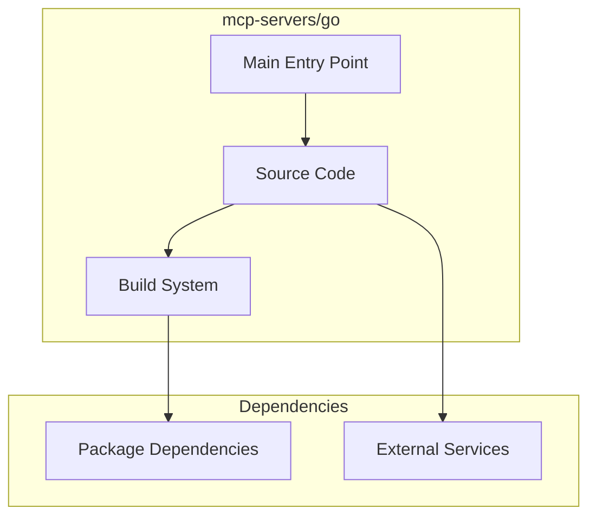

# mcp-servers/go Architecture

**Generated:** 2026-07-28  
**Project Type:** Go (MCP)  
**Architecture Pattern:** Go MCP server with tool registry

## Overview

Go language MCP server reference implementation with tool registry pattern.

## Technology Stack

Go modules

## Source Layout

main.go, tools/, config/

## Architecture Diagram

## Key Patterns

- **Go MCP server with tool registry**
- Version control: Shared mcp-servers git

## Cross-Cutting Concerns

- **Linting/Formatting:** Aligned with workspace root configs (ESLint, Prettier, Ruff)
- **Documentation:** AGENTS.md + standard doc files per project convention
- **Dependencies:** Managed via project-specific package manager

## Related Documents

- [Folder Structure](./mcp-servers-go_folders.md)
- [Technology Stack](./mcp-servers-go_techstack.md)
