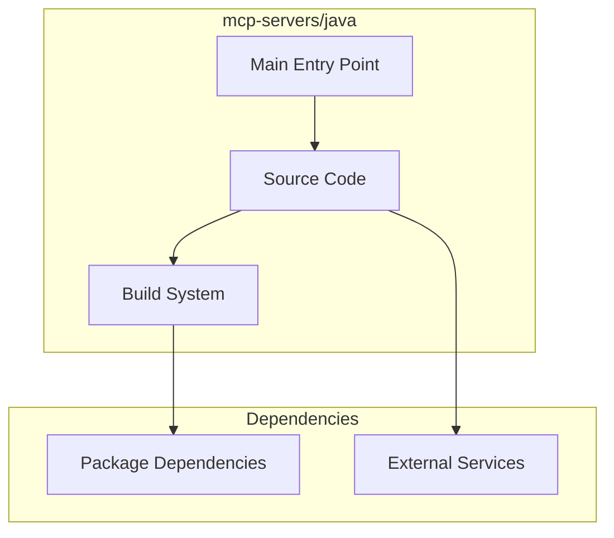

# mcp-servers/java Architecture

**Generated:** 2026-07-28  
**Project Type:** Java/Maven (MCP)  
**Architecture Pattern:** Java MCP server with Maven build

## Overview

Java MCP server reference implementation built with Maven.

## Technology Stack

Java, Maven

## Source Layout

Maven project structure

## Architecture Diagram

## Key Patterns

- **Java MCP server with Maven build**
- Version control: Shared mcp-servers git

## Cross-Cutting Concerns

- **Linting/Formatting:** Aligned with workspace root configs (ESLint, Prettier, Ruff)
- **Documentation:** AGENTS.md + standard doc files per project convention
- **Dependencies:** Managed via project-specific package manager

## Related Documents

- [Folder Structure](./mcp-servers-java_folders.md)
- [Technology Stack](./mcp-servers-java_techstack.md)
