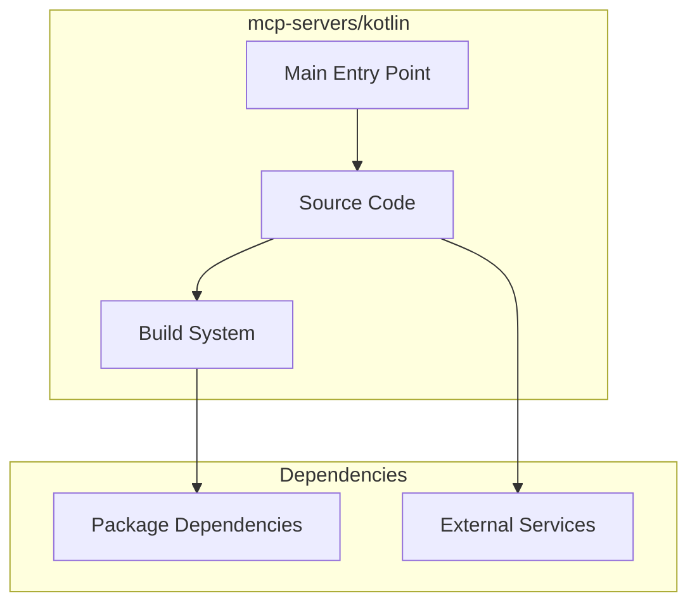

# mcp-servers/kotlin Architecture

**Generated:** 2026-07-28  
**Project Type:** Kotlin/Gradle (MCP)  
**Architecture Pattern:** Kotlin MCP server with Gradle build

## Overview

Kotlin MCP server reference implementation built with Gradle.

## Technology Stack

Kotlin, Gradle

## Source Layout

Gradle project structure

## Architecture Diagram

## Key Patterns

- **Kotlin MCP server with Gradle build**
- Version control: Shared mcp-servers git

## Cross-Cutting Concerns

- **Linting/Formatting:** Aligned with workspace root configs (ESLint, Prettier, Ruff)
- **Documentation:** AGENTS.md + standard doc files per project convention
- **Dependencies:** Managed via project-specific package manager

## Related Documents

- [Folder Structure](./mcp-servers-kotlin_folders.md)
- [Technology Stack](./mcp-servers-kotlin_techstack.md)
