# mcp-servers/php Architecture

**Generated:** 2026-07-28  
**Project Type:** PHP/Composer (MCP)  
**Architecture Pattern:** PHP MCP server with Composer

## Overview

PHP MCP server reference implementation with Composer dependency management.

## Technology Stack

PHP, Composer

## Source Layout

server.php, composer.json

## Architecture Diagram

```mermaid
graph TD
    subgraph "mcp-servers/php"
        MAIN[Main Entry Point]
        SRC[Source Code]
        BUILD[Build System]
    end
    subgraph "Dependencies"
        DEPS[Package Dependencies]
        EXT[External Services]
    end
    MAIN --> SRC
    SRC --> BUILD
    BUILD --> DEPS
    SRC --> EXT
```

## Key Patterns

- **PHP MCP server with Composer**
- Version control: Shared mcp-servers git

## Cross-Cutting Concerns

- **Linting/Formatting:** Aligned with workspace root configs (ESLint, Prettier, Ruff)
- **Documentation:** AGENTS.md + standard doc files per project convention
- **Dependencies:** Managed via project-specific package manager

## Related Documents

- [Folder Structure](./mcp-servers-php_folders.md)
- [Technology Stack](./mcp-servers-php_techstack.md)
