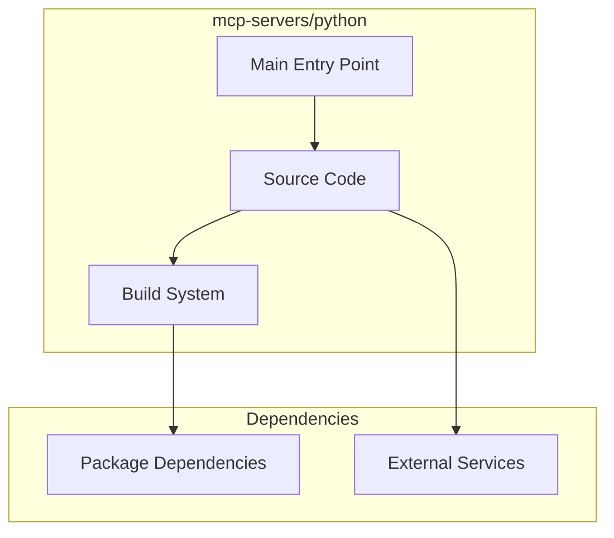

# mcp-servers/python Architecture

**Generated:** 2026-07-28  
**Project Type:** Python (MCP)  
**Architecture Pattern:** Python MCP server

## Overview

Python MCP server reference implementation.

## Technology Stack

Python 3

## Source Layout

main.py

## Architecture Diagram

## Key Patterns

- **Python MCP server**
- Version control: Shared mcp-servers git

## Cross-Cutting Concerns

- **Linting/Formatting:** Aligned with workspace root configs (ESLint, Prettier, Ruff)
- **Documentation:** AGENTS.md + standard doc files per project convention
- **Dependencies:** Managed via project-specific package manager

## Related Documents

- [Folder Structure](./mcp-servers-python_folders.md)
- [Technology Stack](./mcp-servers-python_techstack.md)
