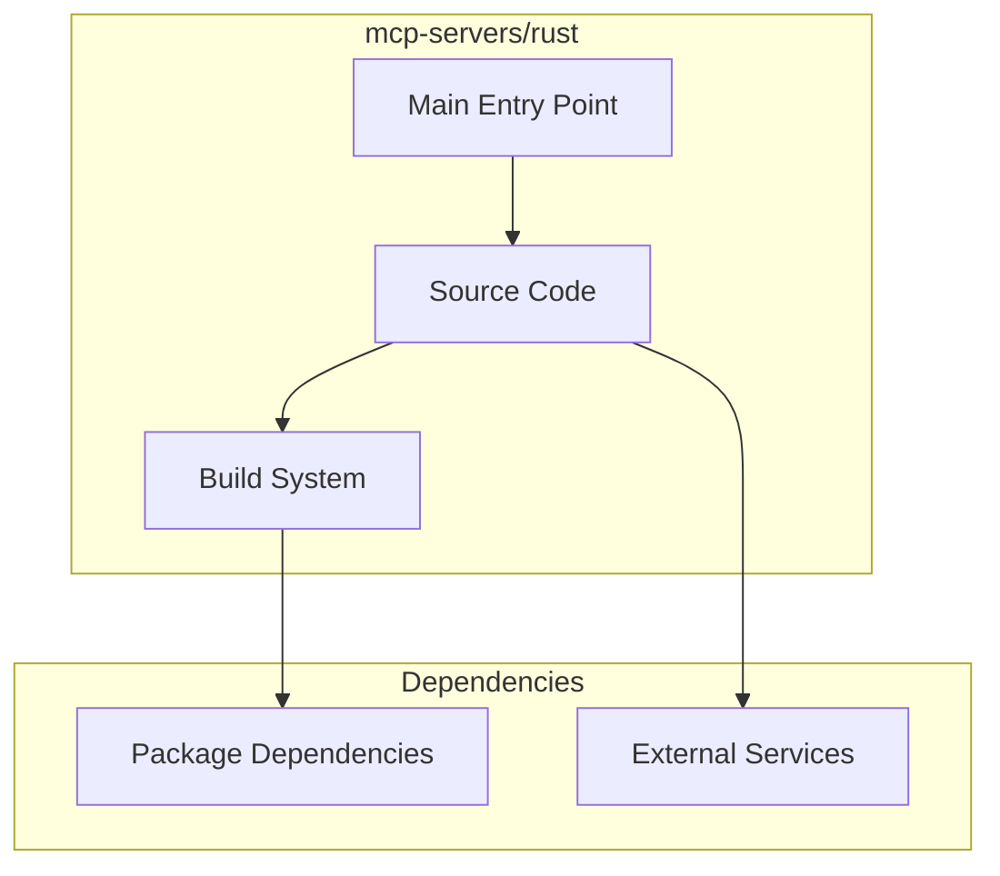

# mcp-servers/rust Architecture

**Generated:** 2026-07-28  
**Project Type:** Rust (MCP)  
**Architecture Pattern:** Rust MCP server with Cargo

## Overview

Rust MCP server reference implementation with state management pattern.

## Technology Stack

Rust, Cargo

## Source Layout

src/main.rs, src/state.rs

## Architecture Diagram

## Key Patterns

- **Rust MCP server with Cargo**
- Version control: Shared mcp-servers git

## Cross-Cutting Concerns

- **Linting/Formatting:** Aligned with workspace root configs (ESLint, Prettier, Ruff)
- **Documentation:** AGENTS.md + standard doc files per project convention
- **Dependencies:** Managed via project-specific package manager

## Related Documents

- [Folder Structure](./mcp-servers-rust_folders.md)
- [Technology Stack](./mcp-servers-rust_techstack.md)
