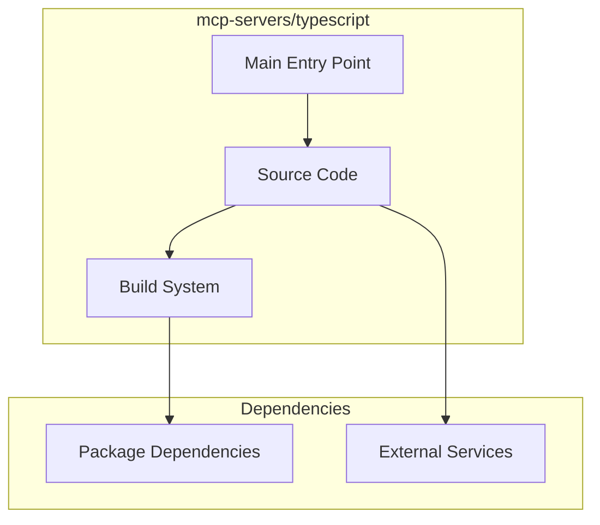

# mcp-servers/typescript Architecture

**Generated:** 2026-07-28  
**Project Type:** TypeScript/Bun (MCP)  
**Architecture Pattern:** TypeScript MCP server with Bun

## Overview

TypeScript MCP server reference implementation using Bun runtime.

## Technology Stack

Bun, TypeScript

## Source Layout

src/index.ts

## Architecture Diagram

## Key Patterns

- **TypeScript MCP server with Bun**
- Version control: Shared mcp-servers git

## Cross-Cutting Concerns

- **Linting/Formatting:** Aligned with workspace root configs (ESLint, Prettier, Ruff)
- **Documentation:** AGENTS.md + standard doc files per project convention
- **Dependencies:** Managed via project-specific package manager

## Related Documents

- [Folder Structure](./mcp-servers-typescript_folders.md)
- [Technology Stack](./mcp-servers-typescript_techstack.md)
