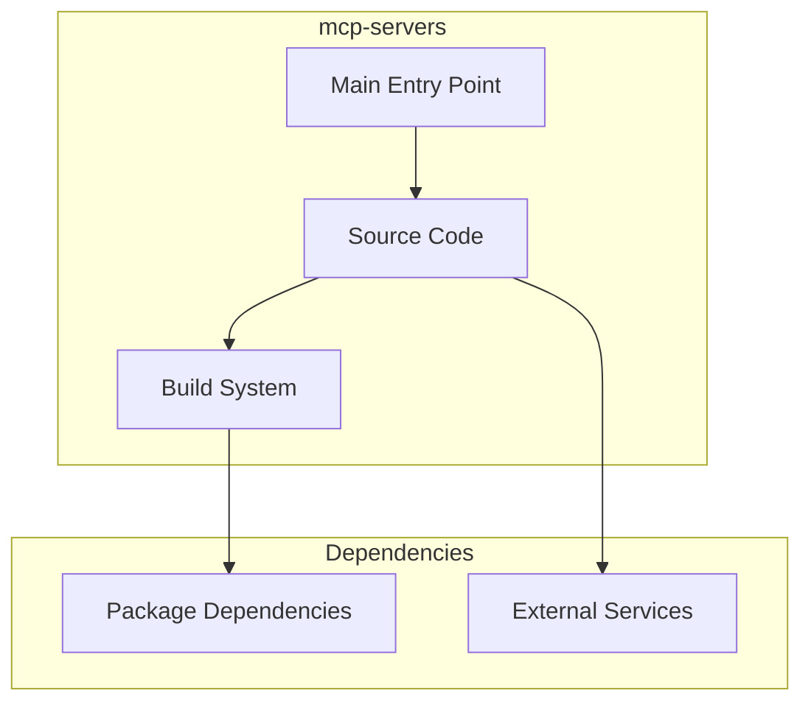

# mcp-servers Architecture

**Generated:** 2026-07-28  
**Project Type:** Multi-Language (MCP)  
**Architecture Pattern:** MCP Protocol reference implementations

## Overview

Reference implementations of MCP (Model Context Protocol) servers across 10 programming languages.

## Technology Stack

Go, Rust, Java/Maven, Kotlin/Gradle, PHP/Composer, Python, TypeScript/Bun, C#, Ruby, Swift

## Source Layout

go/, rust/src/, java/, kotlin/, php/, python/, typescript/src/, csharp/, ruby/, swift/

## Architecture Diagram

## Key Patterns

- **MCP Protocol reference implementations**
- Version control: Shared monorepo git

## Cross-Cutting Concerns

- **Linting/Formatting:** Aligned with workspace root configs (ESLint, Prettier, Ruff)
- **Documentation:** AGENTS.md + standard doc files per project convention
- **Dependencies:** Managed via project-specific package manager

## Related Documents

- [Folder Structure](./mcp-servers_folders.md)
- [Technology Stack](./mcp-servers_techstack.md)
