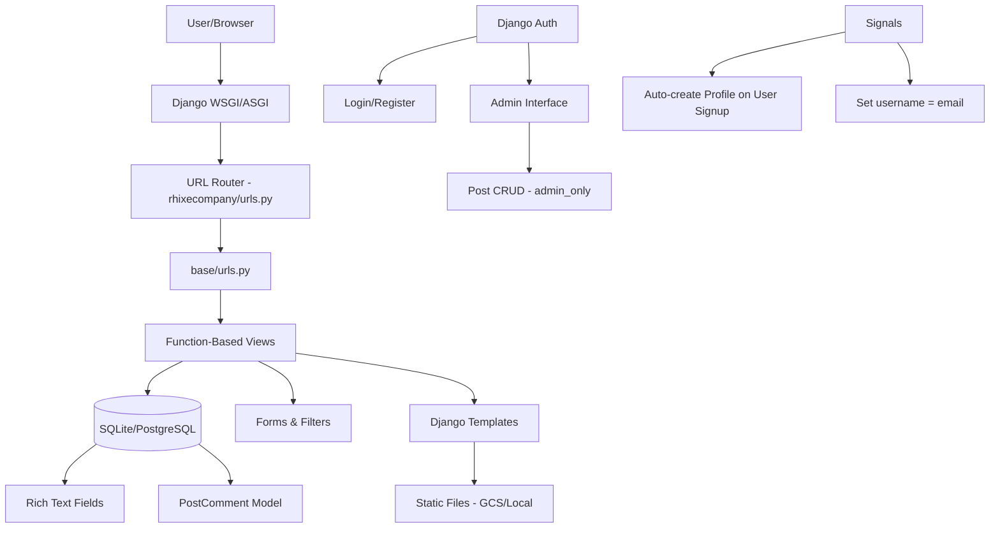

# Profile — Architecture Blueprint

> **Project:** RhixeCompany Profile — Django Blog/CMS Portfolio Website
> **Type:** Standard Django Monolith with Cloud Media Storage
> **Pattern:** Function-Based Views (FBVs) + Django Admin + GCS for media
> **Tagline:** A personal-brand CMS that doubles as a blog, portfolio, and contact gateway.

---

## 1. High-Level Architecture

```
┌─────────────────────────────────────────────────────────────┐
│                        Users / Visitors                      │
└────────────┬───────────────────────────┬────────────────────┘
             │                           │
             ▼                           ▼
┌───────────────────────┐   ┌───────────────────────────────┐
│   Public User (HTTP)   │   │   Admin / Author (HTTP)       │
│   Browse, comment,     │   │   CRUD posts, manage site     │
│   contact              │   │                                │
└───────────┬───────────┘   └───────────────┬───────────────┘
            │                               │
            ▼                               ▼
┌────────────────────────────────────────────────────────────┐
│                      Django WSGI/ASGI                       │
│              rhixecompany.settings (dev)                    │
│              rhixecompany.setting  (prod)                   │
├────────────────────────────────────────────────────────────┤
│                                                             │
│  ┌────────────────────────────────────────────────────┐   │
│  │                   base App                          │   │
│  │  Models  │  Views  │  Forms  │  Admin  │  Signals  │   │
│  │  Filters │  URLs   │  Tests                         │   │
│  └────────────────────────────────────────────────────┘   │
│                                                             │
│  ┌────────────────────────────────────────────────────┐   │
│  │           Third-Party Integrations                  │   │
│  │  CKEditor  │  django-filter  │  crispy-forms       │   │
│  │  django-storages[google]  │  whitenoise            │   │
│  └────────────────────────────────────────────────────┘   │
│                                                             │
└────────────────────────────────────────────────────────────┘
            │                               │
            ▼                               ▼
┌───────────────────────┐   ┌───────────────────────────────┐
│   SQLite (dev)         │   │   PostgreSQL + GCS (prod)    │
│   Local file storage   │   │   Cloud SQL + GCS Bucket     │
└───────────────────────┘   └───────────────────────────────┘
```

---

## 2. Request Lifecycle

```
  User Request
       │
       ▼
  ┌─────────────┐
  │  Nginx /     │  ← whitenoice serves static files
  │  Gunicorn    │
  └──────┬──────┘
         │
         ▼
  ┌────────────────┐
  │  Django        │
  │  Middleware    │  (Security, Session, CSRF, Auth, Messages)
  └──────┬─────────┘
         │
         ▼
  ┌────────────────┐
  │  URL Router    │  rhixecompany/urls.py → base/urls.py
  └──────┬─────────┘
         │
         ▼
  ┌────────────────┐
  │  Views (FBVs)  │  home, posts, post, login, register, etc.
  └──────┬─────────┘
         │
         ▼
  ┌──────────────────────┐
  │  Models / ORM        │  Profile, Post, Tag, PostComment
  │  Forms / Filters     │  PostFilter, PostForm, ProfileForm
  └──────┬───────────────┘
         │
         ▼
  ┌────────────────┐
  │  Templates      │  Django Template Language + Bootstrap 4
  │  (templates/)   │
  └──────┬─────────┘
         │
         ▼
  ┌────────────────┐
  │  HTTP Response  │  Rendered HTML or redirect
  └────────────────┘
```

---

## 3. Component Layers

### 3.1 Data Layer (Models)

```
User (Django auth)
  │
  └── Profile (OneToOne)  ──  first_name, last_name, email,
  │                             profile_pic, bio, twitter
  │
Tag ──────────────────────┐
                          │
Post ─────────────────────┤  headline, sub_headline, thumbnail,
      │                    │  body (RichTextUploadingField),
      │                    │  created, active, featured,
      │                    │  tags (M2M→Tag), slug
      │
      └── PostComment      │  author (→Profile), post (→Post),
                           │  body, created
```

### 3.2 View Layer (FBVs)

| View | Route | Auth Required | Description |
|---|---|---|---|
| `home` | `/` | No | 3 featured posts landing |
| `posts` | `/posts/` | No | Paginated list + filter |
| `post` | `/post/<slug>/` | No | Detail + comment form |
| `profile` | `/profile/` | No | Static profile page |
| `createPost` | `/create_post/` | Admin | Post creation |
| `updatePost` | `/update_post/<slug>/` | Admin | Post edit |
| `deletePost` | `/delete_post/<slug>/` | Admin | Post delete |
| `sendEmail` | `/send_email/` | No | Contact form → SMTP |
| `loginPage` | `/login/` | No | Authentication |
| `registerPage` | `/register/` | No | Registration |
| `logoutUser` | `/logout/` | No | Logout |
| `userAccount` | `/account/` | User | Profile view |
| `updateProfile` | `/update_profile/` | User | Profile edit |

### 3.3 Authentication Flow

```
                    ┌──────────────┐
                    │  Register    │──→ CustomUserCreationForm
                    │              │    → User + Profile (via signal)
                    └──────┬───────┘
                           │ auto-login
                           ▼
                    ┌──────────────┐
                    │   Login      │──→ Email-based lookup
                    │              │    → Authenticate(username)
                    └──────┬───────┘
                           │
                           ▼
         ┌─────────────────────────────────┐
         │  admin_only @decorator          │──→ Blocks non-superuser
         │  @login_required                │
         └─────────────────────────────────┘
```

### 3.4 Signal Wiring

| Signal | Trigger | Action |
|---|---|---|
| `post_save` (User) | User created | Auto-create Profile |
| `post_save` (User) | User updated | Auto-sync Profile fields |
| `pre_save` (User) | User saving | Set username = email |

---

## 4. Deployment Architecture

```
┌──────────────────────────────────────────────────────┐
│                   Google Cloud Build                   │
│  migrate.yaml → Build image → Push to GCR             │
│  → Run migrations via Cloud SQL Auth Proxy            │
└──────────────────────────┬───────────────────────────┘
                           │
                           ▼
┌──────────────────────────────────────────────────────┐
│                  Cloud Run (serverless)                │
│  Container: gunicorn rhixecompany.wsgi:application    │
│  Env vars via Google Secret Manager                   │
└──────────────────────────┬───────────────────────────┘
                           │
                           ▼
┌──────────────────┐    ┌──────────────────────────────┐
│  Cloud SQL        │    │  Google Cloud Storage (GCS)   │
│  PostgreSQL       │    │  Static + Media files         │
│  Private network  │    │  publicRead ACL               │
└──────────────────┘    └──────────────────────────────┘
```

### Production Overrides (`rhixecompany/setting.py`)

- `SECRET_KEY` → loaded via `django-environ` + Secret Manager
- `DATABASES` → Cloud SQL PostgreSQL (connection via Cloud SQL Auth Proxy)
- `STATICFILES_STORAGE` → `GoogleCloudStorage`
- `DEFAULT_FILE_STORAGE` → `GoogleCloudStorage`
- `GS_BUCKET_NAME` → env-configured bucket
- `GS_DEFAULT_ACL` → `publicRead`
- `ALLOWED_HOSTS` → derived from `CLOUDRUN_SERVICE_URL`

---

## 5. Security Boundaries

- **Admin area:** `/admin/` protected by Django admin auth
- **CRUD operations:** Protected by `@admin_only` decorator (superuser check)
- **Account management:** Protected by `@login_required`
- **Email SMTP:** Gmail credentials via `.env`
- **GCS credentials:** Not committed — expected in `.env`
- **Django SECRET_KEY:** Dev version in settings.py; production via Secret Manager
- **PostgreSQL connection:** Via Cloud SQL Auth Proxy (private networking)

---

## 6. Data Flow: Post Creation

```
  Admin User                     Django                         DB / GCS
     │                             │                               │
     │── POST /create_post/ ──────►│                               │
     │   (form data + files)       │                               │
     │                             ├── @admin_only (check superuser)│
     │                             ├── PostForm validation          │
     │                             ├── Post.save()                  │
     │                             │     ├── slug auto-generation   │
     │                             │     ├── thumbnail → GCS       │
     │                             │     └── body (CKEditor HTML)  │
     │                             ├───► INSERT Post ──────────────►│
     │                             │                               │
     │◄─── redirect /posts/ ──────┤                               │
```

---

## 7. Key Design Decisions

| Decision | Choice | Rationale |
|---|---|---|
| View pattern | Function-Based Views | Simpler for CRUD-heavy portfolio; CBVs preferred per AGENTS.md but FBVs used in practice |
| Rich text | CKEditor 4 (static) | Mature, self-hosted, no external dependency |
| Media storage | GCS (prod) / local (dev) | Scalable, cost-effective for blog images |
| Database | PostgreSQL (prod) / SQLite (dev) | Zero-config dev, production-grade prod |
| Deployment | Cloud Run | Serverless, pay-per-request, auto-scaling |
| Static serving | Whitenoise (dev) / GCS (prod) | Minimal config, CDN-like in production |
| Auth | Django built-in + email-as-username | Avoids custom User model complexity |
| Frontend | Bootstrap 4 + crispy-forms | Fast prototyping, responsive out of the box |

---

## 8. Mermaid Overview



---

*Generated from codebase inspection. Last updated: 2026-07-24.*
