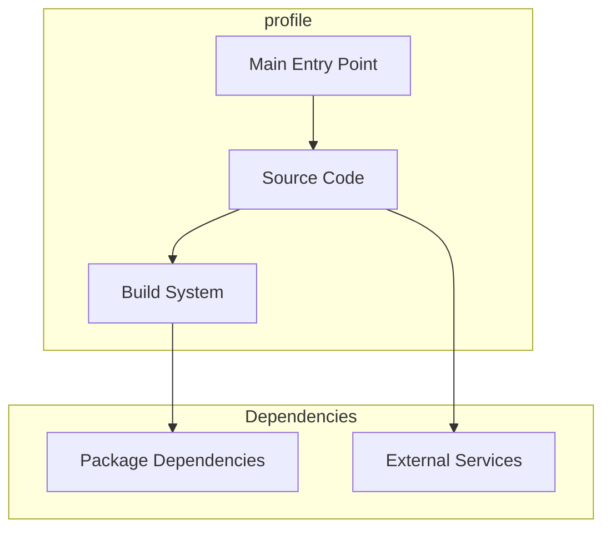

# profile Architecture

**Generated:** 2026-07-28  
**Project Type:** Python/Django (Backend)  
**Architecture Pattern:** Django REST API with user profiles

## Overview

User profile management service with Django admin, authentication, and profile CRUD operations.

## Technology Stack

Django, Python 3, DRF, Gunicorn, SQLite

## Source Layout

base/, templates/

## Architecture Diagram

## Key Patterns

- **Django REST API with user profiles**
- Version control: Shared monorepo git

## Cross-Cutting Concerns

- **Linting/Formatting:** Aligned with workspace root configs (ESLint, Prettier, Ruff)
- **Documentation:** AGENTS.md + standard doc files per project convention
- **Dependencies:** Managed via project-specific package manager

## Related Documents

- [Folder Structure](./profile_folders.md)
- [Technology Stack](./profile_techstack.md)
