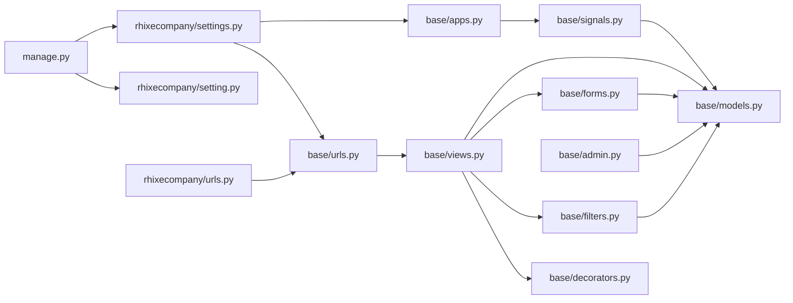

# Profile — Directory Structure Blueprint

> **Project root:** `C:\Users\Alexa\Desktop\SandBox\projects\profile`
> **Django project name:** `rhixecompany`
> **Django app name:** `base`

---

## 1. Visual Directory Tree

```
profile/
├── AGENTS.md                         # Project overview & conventions
├── THE_STORY_OF_THIS_REPO.md         # Git narrative analysis
├── AUDIT_profile.md                  # Project audit report
├── web-research-profile.md           # Web research findings
│
├── manage.py                         # Django CLI entry point (Python 3.11+)
├── requirements.txt                  # Python dependencies (Django, GCS, CKEditor, etc.)
├── migrate.yaml                      # Cloud Build migration config
├── .gcloudignore                     # Files excluded from GCP uploads
├── .gitignore                        # Git ignore rules
│
├── rhixecompany/                     # Django project configuration package
│   ├── __init__.py
│   ├── settings.py                   # Development settings (SQLite, local files)
│   ├── setting.py                    # Production settings override (Cloud SQL, GCS)
│   ├── urls.py                       # Root URL configuration
│   ├── asgi.py                       # ASGI entry point
│   ├── wsgi.py                       # WSGI entry point (gunicorn target)
│   └── ...
│
├── base/                             # Main Django application
│   ├── __init__.py
│   ├── admin.py                      # Django Admin registration (Post, Profile, etc.)
│   ├── apps.py                       # App config + signal import
│   ├── models.py                     # Data models (4 models)
│   ├── views.py                      # All views (FBVs, 13 views)
│   ├── urls.py                       # App-level URL routes
│   ├── forms.py                      # Form classes (PostForm, ProfileForm, etc.)
│   ├── filters.py                    # django-filter FilterSet (PostFilter)
│   ├── decorators.py                 # Custom decorators (admin_only)
│   ├── signals.py                    # Signal handlers (profile auto-creation)
│   ├── tests.py                      # Unit tests (stub)
│   │
│   ├── migrations/                   # Database migrations (15 migrations)
│   │   ├── __init__.py
│   │   ├── 0001_initial.py
│   │   ├── 0002_post_thumbnail.py
│   │   ├── ...
│   │   └── 0015_auto_20220627_2211.py
│   │
│   ├── static/                       # App-level static assets
│   │   ├── admin/                    # Admin CSS overrides
│   │   │   └── css/
│   │   └── ckeditor/                 # CKEditor 4 static distribution
│   │       └── ckeditor/
│   │
│   └── templates/base/               # Django HTML templates
│       ├── index.html                # Home page (featured posts)
│       ├── posts.html                # Post listing (paginated + filter)
│       ├── post.html                 # Post detail + comments
│       ├── post_form.html            # Post create/edit form
│       ├── delete.html               # Post delete confirmation
│       ├── profile.html              # Static profile page
│       ├── account.html              # User account page
│       ├── profile_form.html         # Profile edit form
│       ├── login.html                # Login page
│       ├── register.html             # Registration page
│       ├── navbar.html               # Navigation bar (partial)
│       ├── main.html                 # Base layout shell
│       ├── email_template.html       # Contact email HTML
│       └── email_sent.html           # Email sent confirmation
│
├── static/                           # Project-level static files (collectstatic target)
│   ├── css/                          # Theme CSS (blue, green, purple, default)
│   ├── images/                       # Uploaded + static images
│   │   ├── uploads/                  # User-uploaded media
│   │   └── ...
│   ├── js/script.js                  # Global JavaScript
│   └── resume.pdf                    # Downloadable resume
│
├── templates/                        # Project-level templates (password reset)
│   ├── password_reset.html
│   ├── email_sent.html
│   ├── reset.html
│   └── reset_complete.html
│
├── docs/                             # Documentation (auto-generated)
│   └── Project_Architecture/         # Blueprint files
│       ├── profile_architecture.md
│       ├── profile_folders.md
│       ├── profile_techstack.md
│       └── projects/profile/         # Mirror copies for cross-ref
│           ├── profile_architecture.md
│           ├── profile_folders.md
│           └── profile_techstack.md
│
└── .vscode/                          # VS Code workspace configuration
    ├── extensions.json               # Recommended extensions
    ├── settings.json                 # Editor settings (formatter, linting)
    ├── launch.json                   # Debug configuration (runserver)
    └── tasks.json                    # Build tasks (runserver)
```

---

## 2. Directory Purpose Summary

| Directory | Purpose | Key Contents |
|---|---|---|
| `rhixecompany/` | Django project config | `settings.py`, `setting.py` (prod), `urls.py`, `wsgi.py`, `asgi.py` |
| `base/` | Main application — all business logic | Models, views, forms, filters, signals, admin, templates |
| `base/migrations/` | Database migration history | 15 auto-generated migration files |
| `base/static/admin/css/` | Admin CSS overrides | Custom styling for Django admin |
| `base/static/ckeditor/` | CKEditor 4 distribution | JS, CSS, lang files, plugins, skins |
| `base/templates/base/` | Django HTML templates | 14 template files for the app |
| `static/css/` | Theme stylesheets | blue.css, green.css, purple.css, default.css |
| `static/images/` | Image assets | Logos, uploads, placeholders, icons |
| `static/js/` | Client-side JavaScript | Global scripts |
| `templates/` | Project-level templates | Password reset flow (4 templates) |
| `.vscode/` | IDE configuration | Settings, debug, tasks, extensions |
| `docs/Project_Architecture/` | Architecture documentation | Blueprint markdown files |

---

## 3. Key File Roles

| File | Role |
|---|---|
| `manage.py` | Django CLI — runserver, migrate, makemigrations, collectstatic, test |
| `rhixecompany/settings.py` | Dev config: SQLite DB, local storage, DEBUG=True, CKEditor config |
| `rhixecompany/setting.py` | Prod config override: Cloud SQL PG, GCS storage, Secret Manager |
| `rhixecompany/urls.py` | Root routes: admin, CKEditor uploads, password reset, app includes |
| `base/models.py` | 4 models: Profile, Tag, Post, PostComment |
| `base/views.py` | 13 function-based views covering all site features |
| `base/signals.py` | Auto-create/update Profile on User lifecycle events |
| `base/admin.py` | Admin registration with custom site header "RhixeCompany Admin" |
| `migrate.yaml` | Cloud Build pipeline: build image → proxy → migrate |
| `requirements.txt` | 20 dependencies for Django 3.x, GCP, CKEditor, etc. |

---

## 4. Architectural Layers

```
┌────────────────────────────────────────────────────────────┐
│                    Configuration Layer                       │
│  rhixecompany/settings.py  ├──  rhixecompany/setting.py    │
│  manage.py                 ├──  .env (not committed)       │
│  migrate.yaml                                                │
├────────────────────────────────────────────────────────────┤
│                    Application Layer                         │
│  base/models.py    ├──  base/views.py                       │
│  base/forms.py     ├──  base/filters.py                     │
│  base/admin.py     ├──  base/signals.py                     │
│  base/urls.py      ├──  base/decorators.py                  │
├────────────────────────────────────────────────────────────┤
│                    Presentation Layer                        │
│  base/templates/base/*.html  ├──  static/css/*.css         │
│  templates/*.html             ├──  static/js/script.js     │
│  static/images/**                                          │
├────────────────────────────────────────────────────────────┤
│                    Infrastructure Layer                      │
│  migrate.yaml (GCP Cloud Build)                             │
│  .gcloudignore (GCP deploy rules)                           │
│  requirements.txt (Python deps)                             │
│  .vscode/ (Dev tooling config)                              │
├────────────────────────────────────────────────────────────┤
│                    Documentation Layer                       │
│  AGENTS.md                    ├──  THE_STORY_OF_THIS_REPO  │
│  AUDIT_profile.md             ├──  docs/Project_Architecture│
│  web-research-profile.md                                   │
└────────────────────────────────────────────────────────────┘
```

---

## 5. File Count by Category

| Category | File Count | Notes |
|---|---|---|
| Python source | ~15 | manage.py, settings, models, views, forms, etc. |
| Migrations | 16 | 15 auto-generated + `__init__.py` |
| HTML templates | 18 | 14 app templates + 4 project-level |
| CSS | 4+ | Theme CSS + admin overrides |
| JavaScript | 1 | Custom script.js (CKEditor is vendored) |
| Images | ~15 | Logos, uploads, placeholders, favicon |
| Config/YAML | 6 | .gcloudignore, .gitignore, migrate.yaml, vscode/* |
| Docs | 4 | AGENTS, AUDIT, THE_STORY, web-research |
| Blueprint docs | 6 | Architecture, folders, techstack (×2 locations) |

---

## 6. Mermaid: File Dependency Graph



---

*Generated from codebase inspection. Last updated: 2026-07-24.*
