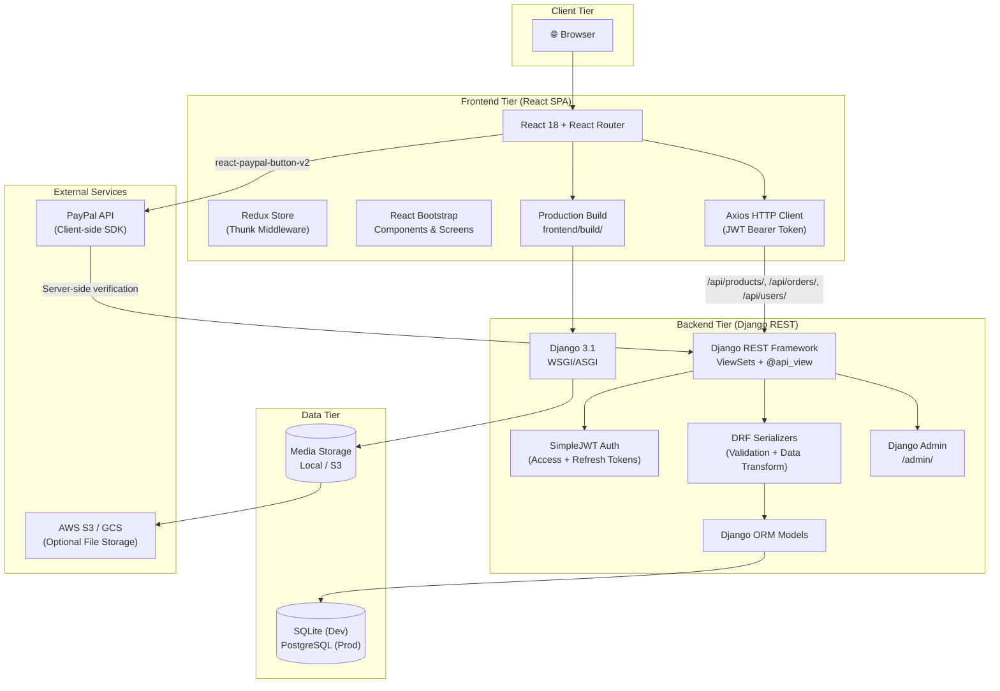
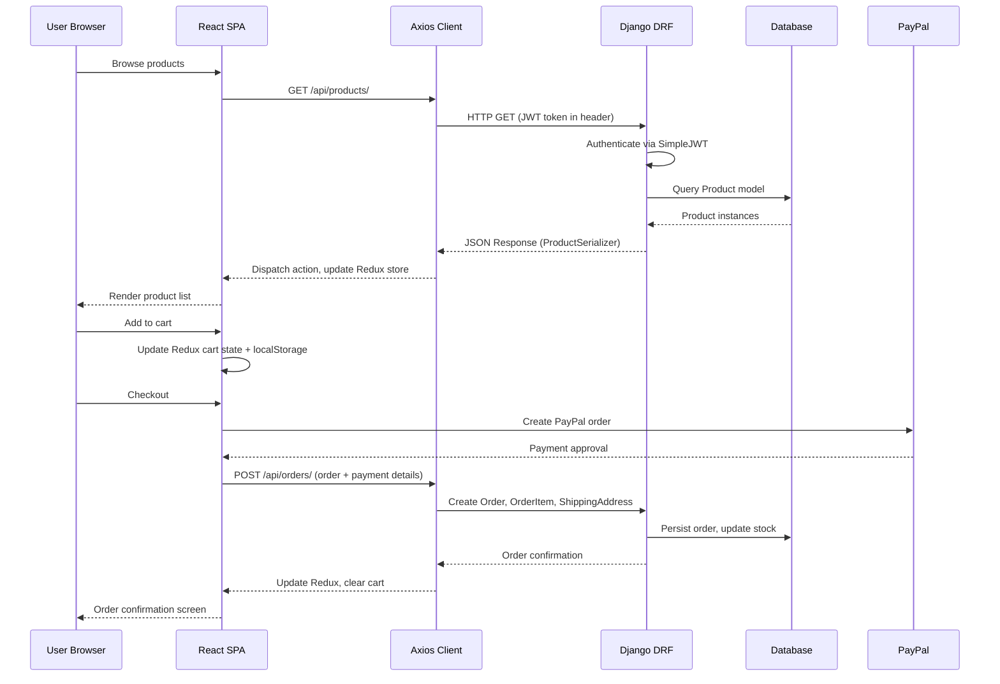
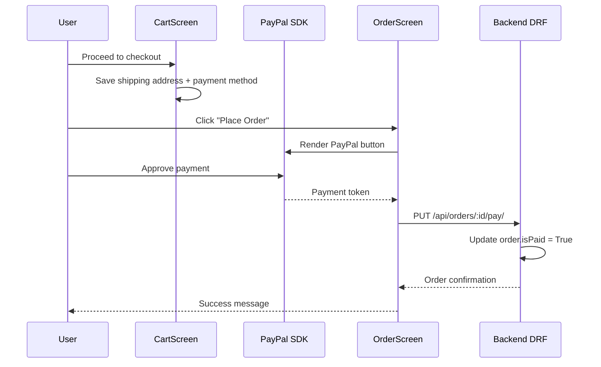
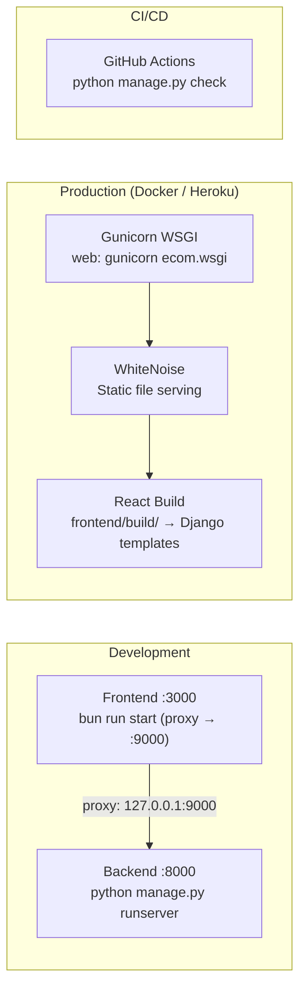

# Ecom — System Architecture Blueprint

> **Project:** ecom — Django + React Ecommerce Platform  
> **Generated:** 2026-07-24  
> **Source:** Code analysis of `base/`, `ecom/`, `frontend/`

---

## 1. High-Level Architecture

Ecom is a **dual-stack** ecommerce platform: a Django REST Framework backend serves a React SPA frontend via RESTful JSON APIs. The two tiers run on separate dev servers (`:8000` backend, `:3000` frontend) and are composed via Docker Compose for production.



---

## 2. Request Lifecycle



---

## 3. Backend Architecture

### 3.1 Django Project Structure

| Module | Path | Purpose |
| -------- | ------ | --------- |
| **Project Config** | `ecom/` | `settings.py`, `urls.py`, `wsgi.py`, `asgi.py` |
| **Core App** | `base/` | All models, views, serializers, admin config |
| **Management** | `manage.py` | Django CLI entry point |

### 3.2 Django App: `base/`

**Models** (`base/models.py`):

```
┌─────────────┐     ┌─────────────┐
│   Product   │────→│   Review    │
├─────────────┤     ├─────────────┤
│ _id (PK)    │     │ _id (PK)    │
│ name        │     │ product (FK)│
│ image       │     │ user (FK)   │
│ brand       │     │ name        │
│ category    │     │ rating      │
│ description │     │ comment     │
│ rating      │     │ createdAt   │
│ numReviews  │     └─────────────┘
│ price       │
│ countInStock│     ┌─────────────┐
│ createdAt   │     │    Order    │
│ user (FK)   │────→├─────────────┤
└─────────────┘     │ _id (PK)    │
       │            │ paymentMethod│
       │            │ taxPrice    │
       ▼            │ shippingPrice│
┌────────────────┐  │ totalPrice  │
│  OrderItem     │  │ isPaid      │
├────────────────┤  │ paidAt      │
│ _id (PK)       │  │ isDelivered │
│ product (FK)   │  │ deliveredAt │
│ order (FK)     │  │ createdAt   │
│ name, qty      │  │ user (FK)   │
│ price, image   │  └──────┬──────┘
└────────────────┘         │
                           ▼
                  ┌──────────────────┐
                  │ ShippingAddress  │
                  ├──────────────────┤
                  │ _id (PK)         │
                  │ order (OneToOne) │
                  │ address, city    │
                  │ postalCode, cntry│
                  └──────────────────┘
```

**API Views** — Function-based `@api_view` decorators (not ViewSets):

| View Module | Endpoints |
| ------------- | ----------- |
| `product_views.py` | `getProducts`, `getProduct`, `createProduct`, `updateProduct`, `deleteProduct`, `uploadImage`, `createProductReview`, `getTopProducts` |
| `order_views.py` | `addOrderItems`, `getMyOrders`, `getOrders`, `getOrderById`, `updateOrderToPaid`, `updateOrderToDelivered` |
| `user_views.py` | `registerUser`, `updateUserProfile`, `getUserProfile`, `getUsers`, `getUserById`, `updateUser`, `deleteUser` + `MyTokenObtainPairView` |

**Serializers** (`base/serializers.py`):

- `UserSerializer` — Serializes Django `auth.User` with computed fields (`_id`, `isAdmin`, `name`)
- `UserSerializerWithToken` — Extends UserSerializer with JWT access token
- `ProductSerializer` — Product with nested reviews
- `ReviewSerializer` — Review model
- `OrderSerializer` — Order with nested orderItems, shippingAddress, user
- `OrderItemSerializer` — OrderItem model
- `ShippingAddressSerializer` — ShippingAddress model

### 3.3 URL Routing

```
ecom/urls.py
├── /                          → TemplateView (serves index.html)
├── /api/users/                → base.urls.user_urls
├── /api/products/             → base.urls.product_urls
├── /api/orders/               → base.urls.order_urls
└── /admin/                    → Django Admin
```

### 3.4 Authentication

- **Mechanism:** JWT (SimpleJWT) — access tokens with 30-day lifetime
- **Endpoints:** `/api/users/login/` (token obtain), `/api/users/register/`
- **Header:** `Authorization: Bearer <token>`
- **Admin detection:** `user.is_staff` field (mapped to `isAdmin` in serializer)

---

## 4. Frontend Architecture

### 4.1 Component Tree

```mermaid
graph TD
    App["App.js (HashRouter)"]
    Header["Header.js<br/>(Navbar, SearchBox, Cart link)"]
    Footer["Footer.js"]
    
    App --> Header
    App --> Footer
    
    subgraph "Screens (Page-level)"
        HomeScreen["HomeScreen<br/>(ProductCarousel + Product grid)"]
        ProductScreen["ProductScreen<br/>(Rating, Add to Cart, Reviews)"]
        CartScreen["CartScreen<br/>(Items, Qty, Remove, Checkout)"]
        LoginScreen["LoginScreen"]
        RegisterScreen["RegisterScreen"]
        ProfileScreen["ProfileScreen"]
        ShippingScreen["ShippingScreen"]
        PaymentScreen["PaymentScreen"]
        PlaceOrderScreen["PlaceOrderScreen"]
        OrderScreen["OrderScreen<br/>(PayPal button, Deliver status)"]
        UserListScreen["UserListScreen (Admin)"]
        UserEditScreen["UserEditScreen (Admin)"]
        ProductListScreen["ProductListScreen (Admin)"]
        ProductEditScreen["ProductEditScreen (Admin)"]
        OrderListScreen["OrderListScreen (Admin)"]
    end
    
    subgraph "Reusable Components"
        Product["Product.js<br/>(Card)"]
        Rating["Rating.js<br/>(Star display)"]
        Loader["Loader.js<br/>(Spinner)"]
        Message["Message.js<br/>(Alert)"]
        FormContainer["FormContainer.js"]
        CheckoutSteps["CheckoutSteps.js"]
        Paginate["Paginate.js"]
        ProductCarousel["ProductCarousel.js<br/>(Top-rated)"]
        SearchBox["SearchBox.js"]
    end
    
    HomeScreen --> Product
    HomeScreen --> ProductCarousel
    HomeScreen --> Paginate
    ProductScreen --> Rating
    CartScreen --> Message
    OrderScreen --> Loader
```



### 4.2 Redux State Shape

```javascript
{
  productList:       { loading, error, products, page, pages },
  productDetails:    { loading, error, product },
  productDelete:     { loading, success, error },
  productCreate:     { loading, success, product, error },
  productUpdate:     { loading, success, error },
  productReviewCreate: { loading, success, error },
  productTopRated:   { loading, error, products },
  cart:              { cartItems[], shippingAddress{}, paymentMethod },
  userLogin:         { loading, error, userInfo },
  userRegister:      { loading, error, userInfo },
  userDetails:       { loading, error, user },
  userUpdateProfile: { loading, success, error },
  userList:          { loading, error, users },
  userDelete:        { loading, success, error },
  userUpdate:        { loading, success, error },
  orderCreate:       { loading, success, order, error },
  orderDetails:      { loading, error, order },
  orderPay:          { loading, success, error },
  orderListMy:       { loading, error, orders },
  orderList:         { loading, error, orders },
  orderDeliver:      { loading, success, error }
}
```

### 4.3 Routing Table

| Route | Screen | Auth | Admin |
| ------- | -------- | ------ | ------- |
| `/` | HomeScreen | — | — |
| `/login` | LoginScreen | — | — |
| `/register` | RegisterScreen | — | — |
| `/profile` | ProfileScreen | ✅ | — |
| `/shipping` | ShippingScreen | ✅ | — |
| `/payment` | PaymentScreen | ✅ | — |
| `/placeorder` | PlaceOrderScreen | ✅ | — |
| `/order/:id` | OrderScreen | ✅ | — |
| `/product/:id` | ProductScreen | — | — |
| `/cart/:id?` | CartScreen | — | — |
| `/admin/userlist` | UserListScreen | ✅ | ✅ |
| `/admin/user/:id/edit` | UserEditScreen | ✅ | ✅ |
| `/admin/productlist` | ProductListScreen | ✅ | ✅ |
| `/admin/product/:id/edit` | ProductEditScreen | ✅ | ✅ |
| `/admin/orderlist` | OrderListScreen | ✅ | ✅ |

---

## 5. Payment Flow



---

## 6. Deployment Architecture



---

## 7. Key Architectural Decisions

| Decision | Rationale |
| ---------- | ----------- |
| **Separate frontend/backend** | Independent dev cycles, clear API contract, deployable separately |
| **Function-based DRF views** | Simpler to reason about than ViewSets for this scale |
| **Redux + Thunk (not Toolkit)** | Original CRA scaffold — mature, well-understood pattern |
| **HashRouter** | Avoids server-side URL handling for SPA routing |
| **SimpleJWT with 30d tokens** | Pragmatic for ecommerce — users stay logged in without frequent re-auth |
| **SQLite dev → PostgreSQL prod** | Zero-config dev, production-grade persistence in prod |
| **Django Admin for CMS** | Built-in admin interface for product/order/user management |
| **PayPal client-side SDK** | Tokenization handled by PayPal; backend verifies payment |

---

## 8. Extensibility Points

- **Add payment providers:** Integrate Stripe, Square alongside or instead of PayPal
- **GraphQL API:** Add Graphene-Django for flexible frontend queries
- **Search:** Elasticsearch or MeiliSearch for full-text product search
- **Caching:** Redis for product listings, session caching
- **Event-driven:** Celery + Redis for async order processing, email notifications
- **Admin enhancements:** Custom Django admin views for dashboards/reports
- **API versioning:** Move to `/api/v1/` prefix for backward-compatible API evolution
