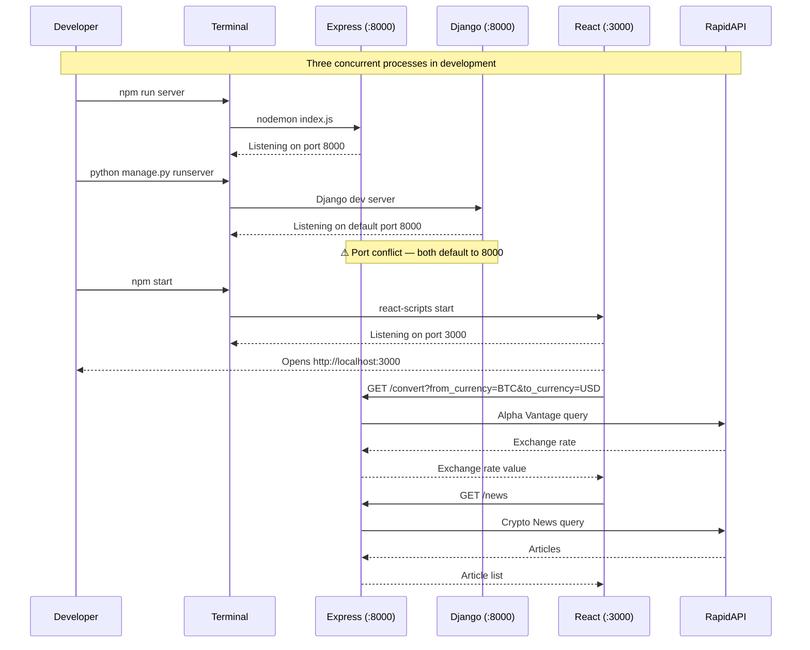
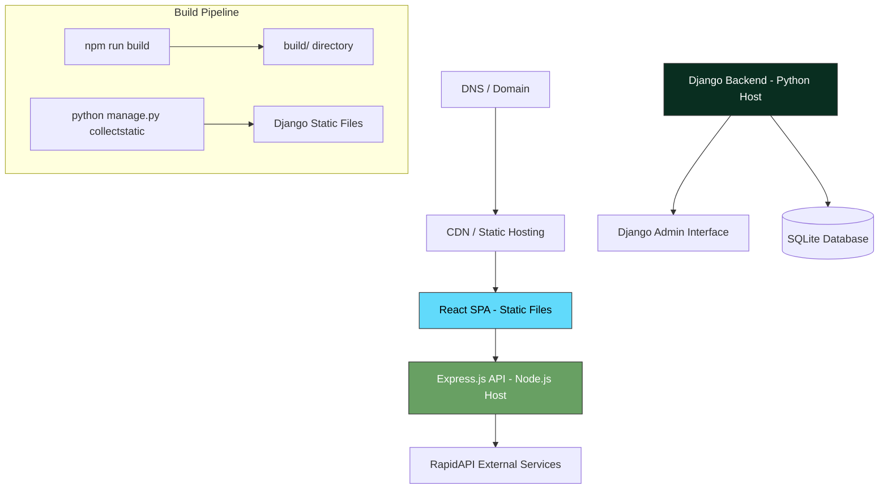

# xamehi — System Architecture Blueprint

> **Project:** xamehi — Crypto Currency Dashboard  
> **Type:** Hybrid Dual-Backend Web Application  
> **Status:** Legacy — Active Development  
> **Created:** 2024-07-24  
> **Author:** Hermes Agent — Architecture Analysis

---

## 1. High-Level Architecture

xamehi follows a **tri-service architecture** with two independent backend services (Django + Express) and a single-page application (SPA) React frontend. The frontend communicates exclusively with the Express backend via HTTP/Axios; the Django backend provides administrative interfaces and is a candidate for future API expansion.

```
┌──────────────────────────────────────────────────────────────────┐
│                        Client Browser                            │
│                                                                  │
│  ┌──────────────────────────────────────────────────────────┐   │
│  │              React 18 SPA (Create React App)             │   │
│  │                                                          │   │
│  │  ┌──────────────┐  ┌──────────────┐  ┌───────────────┐  │   │
│  │  │   Converter   │  │   Exchange   │  │   Newsfeed    │  │   │
│  │  │  (Component)  │  │ (Component)  │  │ (Component)   │  │   │
│  │  └──────┬───────┘  └──────┬───────┘  └──────┬───────┘  │   │
│  │         │                 │                 │           │   │
│  │  ┌──────┴─────────────────┴─────────────────┴───────┐   │   │
│  │  │              Axios HTTP Client                     │   │   │
│  │  └──────────────────────┬───────────────────────────┘   │   │
│  └─────────────────────────┼───────────────────────────────┘   │
│                            │ HTTP GET requests                  │
│                            │ localhost:8000                     │
└────────────────────────────┼───────────────────────────────────┘
                             │
              ┌──────────────┴──────────────┐
              ▼                              ▼
┌─────────────────────────┐    ┌─────────────────────────────┐
│   Express.js Backend    │    │    Django Backend (4.0.6)    │
│   Port: 8000            │    │    Port: 8000*              │
│                         │    │                             │
│   ┌─────────────────┐   │    │   ┌─────────────────────┐   │
│   │  /convert        │   │    │   │  /admin/            │   │
│   │  → Alpha Vantage │   │    │   │  (Django Admin UI)  │   │
│   │  API (RapidAPI)  │   │    │   └─────────────────────┘   │
│   ├─────────────────┤   │    │                             │
│   │  /news           │   │    │   ┌─────────────────────┐   │
│   │  → Crypto News   │   │    │   │  ASGI/WSGI Servers  │   │
│   │  API (RapidAPI)  │   │    │   └─────────────────────┘   │
│   ├─────────────────┤   │    │                             │
│   │  CORS Middleware  │   │    │   ┌─────────────────────┐   │
│   │  Nodemon (dev)    │   │    │   │  SQLite Database    │   │
│   └─────────────────┘   │    │   │  (db.sqlite3)        │   │
│                         │    │   └─────────────────────┘   │
└─────────────────────────┘    └─────────────────────────────┘
         │
         ▼
┌─────────────────────────────────────────────────────────────┐
│                 External APIs (RapidAPI)                     │
│                                                             │
│  ┌─────────────────────────┐  ┌───────────────────────────┐ │
│  │  Alpha Vantage API       │  │  Crypto News Live 3 API   │ │
│  │  (Currency Exchange      │  │  (Crypto News Headlines)  │ │
│  │   Rate Conversion)       │  │                           │ │
│  └─────────────────────────┘  └───────────────────────────┘ │
└─────────────────────────────────────────────────────────────┘
```

> **\*Note:** AGENTS.md documents Express on port **5000** and Django on port **8000**, but the `index.js` file hardcodes `const PORT = 8000`. This port conflict means only one backend can run at a time without manual reconfiguration. The Express port should be changed to 5000 (or Django to a different port) in production.

---

## 2. Component Architecture

### 2.1 React Frontend (SPA)

```
┌─────────────────────────────────────────────────────────────┐
│                    React Application                         │
│                                                             │
│  src/index.js          ← Entry Point (ReactDOM.createRoot)  │
│       │                                                     │
│  src/App.js            ← Root Component                     │
│    ├── title: "Xamehi Crypto Dashboard"                     │
│    └── children: [Converter, Newsfeed]                      │
│                                                             │
│  src/components/                                             │
│    ├── Converter.js     ← Currency Converter Panel           │
│    │   ├── State: amount, chosenPrimaryCurrency,             │
│    │   │        chosenSecondaryCurrency, result,             │
│    │   │        exchangedData                                │
│    │   ├── Currencies: BTC, BNB, XMR, LTC, ETH, USD, NGN   │
│    │   └── Children: [Exchange]                              │
│    │                                                         │
│    ├── Exchange.js      ← Exchange Rate Display              │
│    │   └── Props: exchangedData                              │
│    │                                                         │
│    └── Newsfeed.js      ← Crypto News Feed                   │
│        ├── Fetches top 7 articles on mount                   │
│        └── Renders linked article titles                     │
│                                                             │
│  src/index.css          ← Application Styles                 │
│  src/reportWebVitals.js ← CRA Performance Monitoring         │
└─────────────────────────────────────────────────────────────┘
```

### 2.2 Express.js Backend

```
┌─────────────────────────────────────────────────────────────┐
│                   Express.js Server                          │
│                                                             │
│  index.js  ← Entry Point                                    │
│                                                             │
│  Middleware:                                                 │
│    cors() — Enables CORS for frontend requests              │
│    dotenv — Loads environment variables                     │
│                                                             │
│  Routes:                                                     │
│    GET  /           → Returns "h1" (health-check)            │
│    GET  /convert    → Currency exchange rate proxy           │
│      Query: from_currency, to_currency                       │
│      Source: Alpha Vantage (RapidAPI)                        │
│      Returns: "Realtime Currency Exchange Rate" value        │
│                                                             │
│    GET  /news       → Crypto news headline proxy            │
│      Source: Crypto News Live 3 (RapidAPI)                   │
│      Returns: Array of articles with title, url, etc.       │
│                                                             │
│  External Dependency: process.env.REACT_APP_RAPID_API_KEY    │
└─────────────────────────────────────────────────────────────┘
```

### 2.3 Django Backend

```
┌─────────────────────────────────────────────────────────────┐
│                   Django 4.0.6 Backend                       │
│                                                             │
│  Project Package: xamehi/                                   │
│    manage.py       ← CLI entry point                         │
│    xamehi/                                                   │
│    ├── __init__.py                                           │
│    ├── settings.py   ← Django configuration                  │
│    │   - DEBUG=True                                          │
│    │   - Database: SQLite (db.sqlite3)                       │
│    │   - INSTALLED_APPS: admin, auth, contenttypes,          │
│    │     sessions, messages, staticfiles                     │
│    │   - No DRF or third-party apps added yet               │
│    ├── urls.py       ← URL configuration                     │
│    │   Only route: /admin/ → admin.site.urls                │
│    ├── asgi.py       ← ASGI entry point                      │
│    └── wsgi.py       ← WSGI entry point                      │
│                                                             │
│  No custom Django apps exist.                                │
│  No DRF API endpoints defined.                               │
│  Database schema is the default Django auth schema only.     │
└─────────────────────────────────────────────────────────────┘
```

---

## 3. Data Flow

### 3.1 Currency Conversion Flow

```
User selects currencies + amount
        │
        ▼
Converter component (React)
        │
        │ GET http://localhost:8000/convert?from_currency=X&to_currency=Y
        ▼
Express /convert route
        │
        │ GET https://alpha-vantage.p.rapidapi.com/query
        │   params: { function: "CURRENCY_EXCHANGE_RATE",
        │             from_currency, to_currency }
        │   headers: { X-RapidAPI-Key }
        ▼
Alpha Vantage API (RapidAPI)
        │
        │ Response: { "Realtime Currency Exchange Rate": {
        │   "5. Exchange Rate": "12345.67" } }
        ▼
Express extracts exchange rate value
        │
        │ Response: "12345.67" (plain numeric string)
        ▼
Converter receives response → result = rate * amount
        │
        ▼
Exchange component displays exchange rate
```

### 3.2 News Feed Flow

```
App mounts
        │
        ▼
Newsfeed useEffect (componentDidMount)
        │
        │ GET http://localhost:8000/news
        ▼
Express /news route
        │
        │ GET https://crypto-news-live3.p.rapidapi.com/news
        │   headers: { X-RapidAPI-Key }
        ▼
Crypto News Live 3 API (RapidAPI)
        │
        │ Response: Array of article objects
        ▼
Express forwards response as-is
        │
        ▼
Newsfeed receives articles → slices top 7 → renders links
```

---

## 4. Development Workflow



---

## 5. Production Architecture



---

## 6. Architectural Observations & Recommendations

| Area | Current State | Recommendation |
| ------ | -------------- | ---------------- |
| **Dual Backend** | Django + Express with no clear separation of concerns | Consolidate to single backend (either Django DRF or Express); remove the other |
| **Port Conflict** | Express and Django both default to port 8000 | Change Express to port 5000 (per docs intent) or use environment-based port config |
| **Django Usage** | Admin-only, no custom apps, no DRF endpoints | Either flesh out Django with DRF APIs, or remove it entirely |
| **No Custom Django Apps** | Zero apps beyond default `django.contrib` | Add apps when Django has domain logic, or spin down if unused |
| **React CRA** | Create React App (outdated build tool) | Migrate to Vite for faster builds, or Next.js for SSR/SSG |
| **External API Key** | Single RapidAPI key shared across /convert and /news | Add key rotation, rate-limiting middleware |
| **Error Handling** | .catch() logs to console, no user-facing errors | Add proper error boundaries, toast notifications |
| **Database** | SQLite (dev default), AGENTS.md says PostgreSQL | Switch to PostgreSQL for production per documented intent |
| **Environment Config** | .env.example exists, dotenv loaded in Express | Add python-dotenv for Django as well |

---

## 7. Architecture Decision Records

### ADR-001: Dual-Backend Pattern

- **Context:** Application originally built with both Django and Express
- **Decision:** Retain both for now; Express handles external API proxying, Django provides admin
- **Consequence:** Two separate deployment pipelines, port management needed

### ADR-002: Express as API Gateway

- **Context:** Frontend needs CORS-safe access to third-party APIs
- **Decision:** Express acts as a BFF (Backend For Frontend), proxying RapidAPI calls
- **Consequence:** Single point to manage API keys, rate limiting, and caching

### ADR-003: SQLite vs PostgreSQL

- **Context:** AGENTS.md documents PostgreSQL; settings.py configures SQLite
- **Decision:** Dev uses SQLite for simplicity; PostgreSQL intended for production
- **Consequence:** Migration needed before production deployment; different DATABASES config
