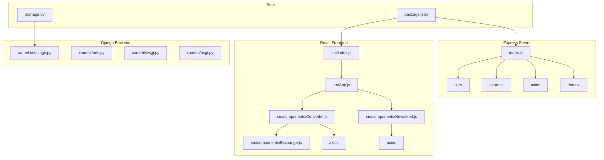

# xamehi — Folder Structure Blueprint

> **Project:** xamehi — Crypto Currency Dashboard  
> **Type:** Hybrid Dual-Backend Web Application  
> **Generated:** 2024-07-24

---

## 1. Complete Directory Tree

```
xamehi/
├── .env.example                       # Environment variable template
├── .git/                              # Git repository data
├── .github/
│   └── copilot-instructions.md        # GitHub Copilot configuration
├── .gitignore                         # Git ignore rules
├── .vscode/                           # VS Code workspace configuration
│   ├── extensions.json                # Recommended extensions
│   ├── launch.json                    # Debug launch configurations
│   ├── settings.json                  # Editor settings
│   └── tasks.json                     # Build/run tasks
│
├── AGENTS.md                          # Agent summary (stack, commands, conventions)
├── ARCHITECTURE.md                    # High-level architecture overview
├── AUDIT_xamehi.md                    # Audit report
├── CONTRIBUTING.md                    # Contribution guidelines
├── DEVELOPER_GUIDE.md                 # Developer onboarding guide
├── README.md                          # Project README
├── REPOSITORY_SUMMARY.md              # Repository summary
├── RESEARCH_REPORT.md                 # Research findings
├── THE_STORY_OF_THIS_REPO.md          # Project history narrative
├── USER_GUIDE.md                      # End-user guide
├── web-research-xamehi.md             # Web research notes
│
├── docs/                              # Documentation
│   ├── CODE_DOCS.md                   # Code documentation index
│   ├── PROJECT_DOCS.docx              # Project documentation (Word)
│   ├── PROJECT_DOCS.md                # Project documentation (Markdown)
│   ├── audit-report.md                # Audit report
│   └── Project_Architecture/          # Architecture blueprints (this directory)
│       ├── xamehi_architecture.md     # Architecture blueprint
│       ├── xamehi_folders.md          # Folder structure blueprint
│       ├── xamehi_techstack.md        # Technology stack blueprint
│       └── projects/
│           └── xamehi/
│               ├── xamehi_architecture.md
│               ├── xamehi_folders.md
│               └── xamehi_techstack.md
│
├── public/                            # React static assets
│   ├── favicon.ico                    # Browser tab icon
│   ├── index.html                     # HTML entry point
│   ├── logo192.png                    # PWA icon (192×192)
│   ├── logo512.png                    # PWA icon (512×512)
│   ├── manifest.json                  # PWA manifest
│   └── robots.txt                     # Web crawler rules
│
├── src/                               # React source code
│   ├── App.js                         # Root React component
│   ├── index.js                       # React entry point (ReactDOM)
│   ├── index.css                      # Global styles
│   ├── reportWebVitals.js             # Performance monitoring
│   └── components/                    # React components
│       ├── Converter.js               # Currency converter widget
│       ├── Exchange.js                # Exchange rate display
│       └── Newsfeed.js                # Crypto news feed widget
│
├── xamehi/                            # Django project package
│   ├── __init__.py                    # Python package marker
│   ├── asgi.py                        # ASGI server config
│   ├── settings.py                    # Django settings
│   ├── urls.py                        # URL configuration
│   └── wsgi.py                        # WSGI server config
│
├── index.js                           # Express.js server entry point
├── manage.py                          # Django CLI management tool
├── package.json                       # npm config (React + Express)
└── node_modules/                      # npm dependencies (not committed)
```

---

## 2. Directory Purpose Overview

| Directory / File | Purpose |
|-----------------|---------|
| `public/` | Static assets served by React development server; includes PWA manifest, icons, HTML template |
| `src/` | React application source code — components, styles, entry point |
| `src/components/` | Presentational React components for the crypto dashboard |
| `xamehi/` | Django project package — settings, URL routing, WSGI/ASGI config |
| `docs/` | Project documentation and architecture blueprints |
| `docs/Project_Architecture/` | System architecture, folder structure, and tech stack documentation |
| `.vscode/` | Editor/debugger configuration for VS Code |
| `.github/` | GitHub-specific configuration (Copilot instructions) |
| `node_modules/` | Auto-generated npm dependency tree (gitignored) |
| `index.js` | Express.js server — API proxy for external crypto services |
| `manage.py` | Django entry point — migrations, dev server, management commands |
| `package.json` | Node.js project manifest with React + Express dependencies |

---

## 3. File Count by Layer

```
Layer               Files    Description
──────────────────────────────────────────────────────
Root config         11       AGENTS.md, ARCHITECTURE.md, README.md, etc.
Documentation        9       docs/*.md, *.docx
React public         6       public/* (assets, icons, manifest)
React source         6       src/**/*.js, src/**/*.css
Django project       5       xamehi/*.py (settings, urls, asgi, wsgi)
Express server       1       index.js
Django CLI           1       manage.js → manage.py
Node config          1       package.json
VS Code config       4       .vscode/*.json
GitHub config        1       .github/copilot-instructions.md
──────────────────────────────────────────────────────
Total (source)       ~45     (excluding node_modules/)
```

---

## 4. Dependency Tree (Import Map)



---

## 5. Service Layout at a Glance

```
┌─────────────────────────────────────────────────────────────┐
│                    Project Root                              │
│                   ~/projects/xamehi/                         │
│                                                             │
│  ┌─────────────────────────┐  ┌──────────────────────────┐  │
│  │    Express Backend       │  │    Django Backend         │  │
│  │                          │  │                          │  │
│  │  index.js                │  │  manage.py               │  │
│  │  package.json            │  │  xamehi/                 │  │
│  │  node_modules/           │  │    ├── settings.py       │  │
│  │                          │  │    ├── urls.py           │  │
│  │  PORT: 8000 (dev)        │  │    ├── wsgi.py           │  │
│  │  Proxy: RapidAPI APIs   │  │    └── asgi.py           │  │
│  │                          │  │                          │  │
│  └─────────────────────────┘  │  PORT: 8000 (default)     │  │
│                                │  DB: SQLite (db.sqlite3)  │  │
│  ┌─────────────────────────┐  └──────────────────────────┘  │
│  │    React Frontend        │                                │
│  │                          │                                │
│  │  public/                 │                                │
│  │  src/                    │                                │
│  │    ├── App.js            │                                │
│  │    ├── components/       │                                │
│  │    └── index.js          │                                │
│  │                          │                                │
│  │  PORT: 3000 (dev)        │                                │
│  │  Build: CRA (react-     │                                │
│  │         scripts)         │                                │
│  └─────────────────────────┘                                │
└─────────────────────────────────────────────────────────────┘
```

---

## 6. File Naming Conventions

| Layer | Convention | Examples |
|-------|-----------|---------|
| **React** | PascalCase for components | `Converter.js`, `Newsfeed.js` |
| **React** | camelCase for utilities | `reportWebVitals.js` |
| **Django** | snake_case for Python files | `settings.py`, `urls.py` |
| **Express** | kebab-case / lowercase | `index.js` |
| **Config** | UPPER_CASE or dot-case | `.env.example`, `AGENTS.md` |
| **Docs** | UPPER_CASE descriptive | `ARCHITECTURE.md`, `DEVELOPER_GUIDE.md` |

---

## 7. What's Missing (Notable Gaps)

| Missing Element | Impact |
|----------------|--------|
| `requirements.txt` | Django Python dependencies not pinned |
| `Dockerfile` / `docker-compose.yml` | No containerized development environment |
| `tests/` directory | No test files for any layer |
| `components/` subdirectories | All components flat in one folder — scales poorly |
| Django custom apps | No `crypto/` or `api/` app directories |
| CI/CD config | No `.github/workflows/` for automated testing/deployment |
| Static assets build output | `build/` directory (produced by `npm run build`) not present |
| Environment variable loader for Django | Django has no `python-dotenv`; settings reads from OS env only |
