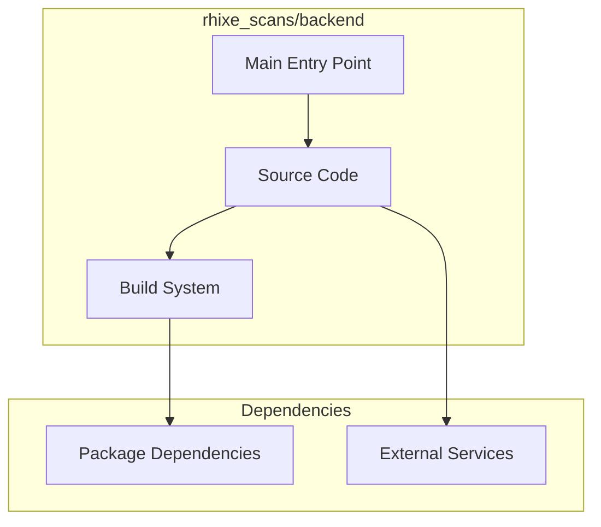

# rhixe_scans/backend Architecture

**Generated:** 2026-07-28  
**Project Type:** Python/Django (Backend)  
**Architecture Pattern:** Django REST API backend for scans platform

## Overview

Django REST API backend powering the rhixe_scans manga scanlation platform.

## Technology Stack

Django, Python, DRF

## Source Layout

Standard Django app structure

## Architecture Diagram

## Key Patterns

- **Django REST API backend for scans platform**
- Version control: Shared rhixe_scans git

## Cross-Cutting Concerns

- **Linting/Formatting:** Aligned with workspace root configs (ESLint, Prettier, Ruff)
- **Documentation:** AGENTS.md + standard doc files per project convention
- **Dependencies:** Managed via project-specific package manager

## Related Documents

- [Folder Structure](./rhixe_scans-backend_folders.md)
- [Technology Stack](./rhixe_scans-backend_techstack.md)
