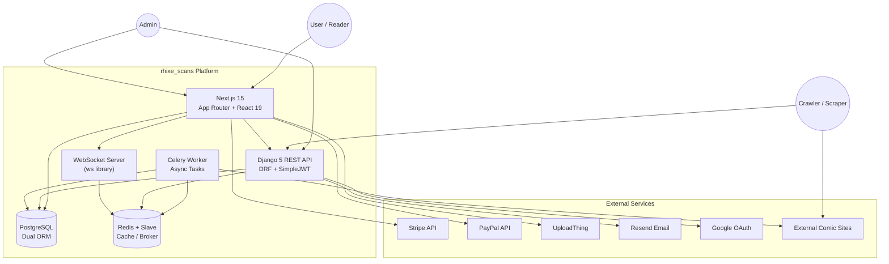
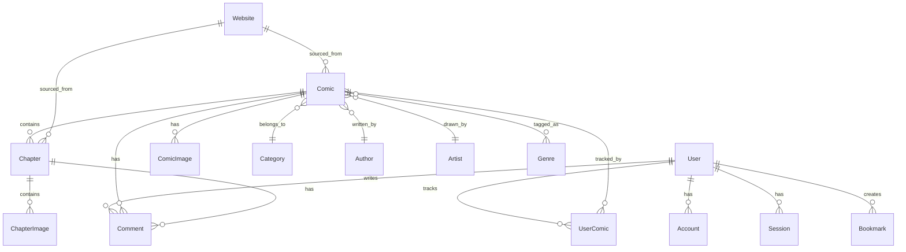

# rhixe_scans — Architecture Blueprint

> **Project:** rhixe_scans — Full-Stack Comic Reading Platform
> **Generated:** 2026-07-24
> **Source:** `projects/rhixe_scans/`

---

## 1. System Overview

rhixe_scans is a **dual-backend comic reading platform** combining a **Django REST API** (content management, crawling, user auth) with a **Next.js frontend** (reader UI, dashboard, admin). The system ingests comics via automated web scraping/crawling, stores them in PostgreSQL, serves them through a REST API, and presents them via a modern React reader interface with payment gateways for subscriptions.

```
┌─────────────────────────────────────────────────────────────────────┐
│                        rhixe_scans Platform                         │
│                                                                     │
│  ┌────────────────────────────┐   ┌──────────────────────────────┐  │
│  │     Django Backend (API)   │   │    Next.js Frontend (App)    │  │
│  │  Django 5 + DRF + Celery   │───│  Next.js 15 + React 19 + TS  │  │
│  │  Port 8000                 │   │  Port 3000                   │  │
│  └───────────┬────────────────┘   └──────────────┬───────────────┘  │
│              │                                    │                  │
│              ▼                                    ▼                  │
│  ┌─────────────────────────────────────────────────────────────┐    │
│  │                    PostgreSQL Database                       │    │
│  │         Prisma ORM (Next.js) + Django ORM (Backend)         │    │
│  └─────────────────────────────────────────────────────────────┘    │
│              │                                    │                  │
│              ▼                                    ▼                  │
│  ┌──────────────┐  ┌──────────────┐  ┌──────────────────────┐      │
│  │  Redis Cache  │  │ UploadThing  │  │  Stripe / PayPal     │      │
│  │  + Celery     │  │ (Media)      │  │  (Payments)          │      │
│  └──────────────┘  └──────────────┘  └──────────────────────┘      │
└─────────────────────────────────────────────────────────────────────┘
```

---

## 2. High-Level Architecture

### 2.1 Dual-Application Pattern

| Layer | Technology | Role |
|---|---|---|
| **Frontend SPA** | Next.js 15 App Router | Comic reader, user dashboard, admin panel |
| **Backend API** | Django 5 + DRF | Content management, crawler orchestration, REST API |
| **Database** | PostgreSQL | Primary data store (both apps share the same DB) |
| **Task Queue** | Celery + Redis | Async crawling, image processing, notifications |
| **Cache / PubSub** | Redis + Redis-Slave | Session cache, real-time WebSocket relays |
| **Media Storage** | UploadThing / Local FS | Comic image uploads & storage |
| **Payments** | Stripe + PayPal | Subscription & one-time payments |
| **Email** | Resend | Transactional emails (welcome, receipts) |

### 2.2 Architecture Decisions

- **Dual ORM:** Django ORM for the admin backend (mature migrations, admin UI), Prisma ORM for the Next.js frontend (type-safe queries, React Server Components compatibility). Both point to the same PostgreSQL database.
- **Cookiecutter Django template** heritage: The backend follows the [cookiecutter-django](https://github.com/cookiecutter/cookiecutter-django) structure with `config/` (settings), `api/` (apps), `compose/` (Docker).
- **Separate Docker Compose profiles:** `local.yml`, `production.yml`, `docs.yml` for different deployment targets.
- **Crawler subsystem:** Standalone Scrapy-based `crawler/` module inside the backend for automated comic/chapter discovery and download.

---

## 3. Data Flow

### 3.1 Content Ingestion Pipeline

```
External Comic Sites
        │
        ▼
  ┌──────────┐    ┌───────────┐    ┌──────────────┐
  │  Crawler  │───▶│  Celery   │───▶│  Django API  │
  │ (Scrapy)  │    │  Worker   │    │  (DRF Views) │
  └──────────┘    └───────────┘    └──────┬───────┘
         │                                 │
         ▼                                 ▼
   ┌──────────┐                    ┌──────────────┐
   │ Download │                    │  PostgreSQL   │
   │ (Images) │                    │  (Comics,     │
   └──────────┘                    │   Chapters,   │
                                   │   Images)     │
                                   └──────────────┘
```

### 3.2 User Request Flow

```
Browser ──▶ Next.js App Router
               │
               ├──▶ Server Components    ──▶ Prisma ──▶ PostgreSQL
               ├──▶ API Routes           ──▶ Django API (port 8000)
               ├──▶ Server Actions       ──▶ Prisma ──▶ PostgreSQL
               │
               ▼
         Comic Reader (Embla Carousel)
               │
               ├──▶ UploadThing (images)
               ├──▶ Stripe/PayPal (payments)
               └──▶ WebSocket (real-time notifications)
```

### 3.3 Authentication Flow

```
User ──▶ Next.js (NextAuth v5)
            │
            ├──▶ Credentials  ──▶ Prisma ──▶ PostgreSQL
            ├──▶ Google OAuth ──▶ allauth ──▶ Django backend
            │
            ▼
         JWT / Session Token
            │
            ├──▶ Next.js middleware (route protection)
            └──▶ Django REST API (Bearer token)
```

---

## 4. Deployment Architecture

```
                         ┌─────────────┐
                         │   Vercel /   │
                         │   Docker     │
                         └──────┬──────┘
                                │
        ┌───────────────────────┼───────────────────────┐
        │                       │                       │
        ▼                       ▼                       ▼
┌──────────────┐       ┌──────────────┐       ┌──────────────┐
│  Django App  │       │  Next.js App │       │  PostgreSQL  │
│  (8 replicas)│       │  (Static)    │       │  (Primary)   │
│  + Celery    │       │              │       │              │
│  + Redis     │       │              │       │              │
└──────────────┘       └──────────────┘       └──────────────┘
```

**Docker Services (from `docker-compose.local.yml`):**

| Service | Container | Port | Purpose |
|---|---|---|---|
| `django` | `rhixe/api:django` | 8000 | Django Gunicorn server |
| `postgres` | `rhixe/api:postgres` | 5432 | Database |
| `redis` | `rhixe/api:redis` | 6379 | Cache & broker |
| `redis-slave` | `rhixe/api:redis-slave` | 6380 | Redis replica |
| `celeryworker` | `rhixe/api:celeryworker` | — | Async task runner |
| `celerybeat` | `rhixe/api:celerybeat` | — | Scheduled tasks |
| `flower` | `rhixe/api:flower` | 5555 | Celery monitoring |
| `node` | `rhixe/api:node` | 3000 | Next.js dev server |

---

## 5. System Context Diagram



---

## 6. Database Schema Relationships



---

## 7. Component Architecture — Next.js Frontend

```
src/
├── app/                    # Next.js App Router (file-based routing)
│   ├── (auth)/             # Authentication pages (sign-in, sign-up, logout)
│   ├── (root)/             # Public pages (home, browse comics)
│   ├── admin/              # Admin dashboard (protected)
│   ├── dashboard/          # User dashboard (protected)
│   ├── api/auth/           # NextAuth API route [...nextauth]
│   └── layout.tsx          # Root layout
├── components/             # React components
│   ├── admin/              # Admin-specific components
│   ├── auth/               # Auth forms & UI
│   ├── shared/             # Shared components (header, pagination)
│   └── ui/                 # shadcn/ui primitives (30+ components)
├── hooks/                  # Custom React hooks
├── lib/                    # Utilities & server actions
│   ├── actions/            # Server Actions (bookmark, chapter, comic, user)
│   ├── data/               # Data access layers (artist, author, etc.)
│   └── constants/          # App constants
├── db/                     # Prisma schema + migrations
├── types/                  # TypeScript type definitions
└── assets/                 # Static styles
```

## 8. Component Architecture — Django Backend

```
backend/
├── config/                 # Django settings (base, local, production, test)
│   ├── celery_app.py       # Celery application configuration
│   ├── urls.py             # Root URL configuration (API + admin)
│   └── wsgi.py             # WSGI entry point
├── api/                    # Django apps
│   ├── home/               # Home page views & context processors
│   ├── libary/             # Core domain models (comics, chapters, images)
│   │   ├── models.py       # Django ORM models (Comic, Chapter, etc.)
│   │   ├── serializers.py  # DRF serializers
│   │   ├── views/          # DRF ViewSets (comic, chapter, image, genre, etc.)
│   │   ├── urls/           # Per-resource URL routing
│   │   ├── filters.py      # Django-filter backends
│   │   ├── forms.py        # Django forms
│   │   ├── tables.py       # django-tables2 definitions
│   │   └── signals.py      # Django signals for side effects
│   ├── users/              # Custom user model (email-based auth)
│   └── contrib/            # Site framework migrations
├── crawler/                # Content ingestion subsystem
│   ├── main.py             # Scrapy spider entry point
│   ├── items.py            # Scrapy item definitions
│   ├── models.py           # Crawler data models
│   ├── settings.py         # Scrapy settings
│   └── tasks.py            # Celery tasks for crawling
├── downloader/             # Image download subsystem
│   └── main.py             # Download orchestration
└── manage.py               # Django management entry point
```

---

## 9. Key Architectural Patterns

### 9.1 Server Actions (Next.js)
Data mutations use Next.js Server Actions (in `src/lib/actions/`), running Prisma queries server-side without exposing an additional API layer for frontend mutations.

### 9.2 REST API (Django DRF)
External integrations (crawler, third-party tools) and the Next.js frontend communicate with the Django backend via REST endpoints under `/api/`, secured with JWT (SimpleJWT) and session auth.

### 9.3 Celery Task Pipeline
Crawling and image downloading are offloaded to Celery workers, with Redis as the broker. Flower provides monitoring. The pipeline: discover comics → queue chapter crawl → download images → update database.

### 9.4 Dual Payment Providers
Stripe (primary, client-side via `@stripe/react-stripe-js`) and PayPal (secondary via `@paypal/react-paypal-js`) are both integrated on the frontend, with server-side verification through each provider's SDK.

### 9.5 Real-Time Updates
WebSocket connections (via the `ws` library) push chapter release notifications and live updates to connected clients, relayed through Redis for cross-process communication.
