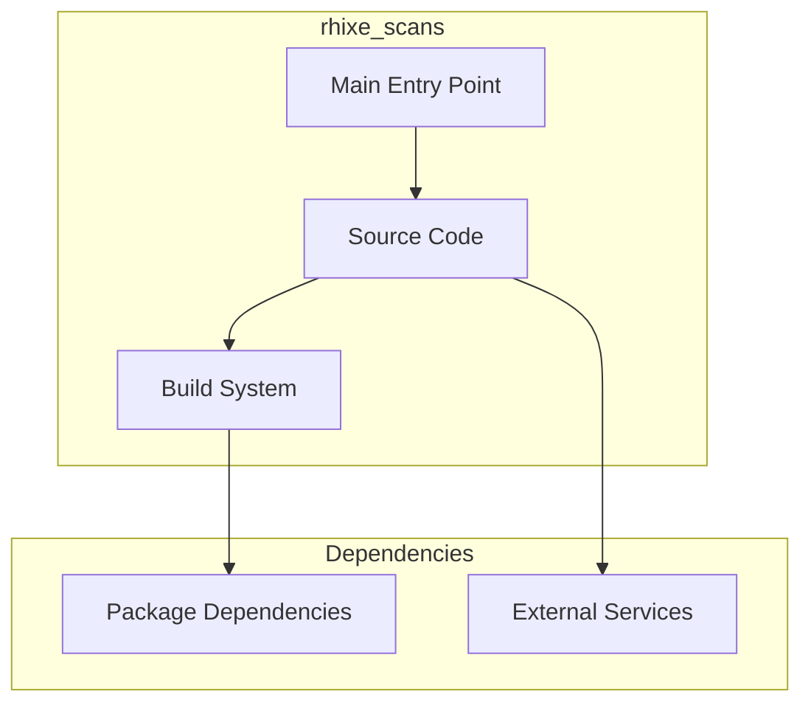

# rhixe_scans Architecture

**Generated:** 2026-07-28  
**Project Type:** Full-Stack (Next.js + Django)  
**Architecture Pattern:** Next.js frontend + Django REST backend

## Overview

Manga/comic scanlation platform with Next.js frontend and Django REST API backend.

## Technology Stack

Next.js, React, Bun, TypeScript, Tailwind CSS, Django, Python, DRF

## Source Layout

frontend/src/, backend/

## Architecture Diagram

## Key Patterns

- **Next.js frontend + Django REST backend**
- Version control: Shared monorepo git

## Cross-Cutting Concerns

- **Linting/Formatting:** Aligned with workspace root configs (ESLint, Prettier, Ruff)
- **Documentation:** AGENTS.md + standard doc files per project convention
- **Dependencies:** Managed via project-specific package manager

## Related Documents

- [Folder Structure](./rhixe_scans_folders.md)
- [Technology Stack](./rhixe_scans_techstack.md)
