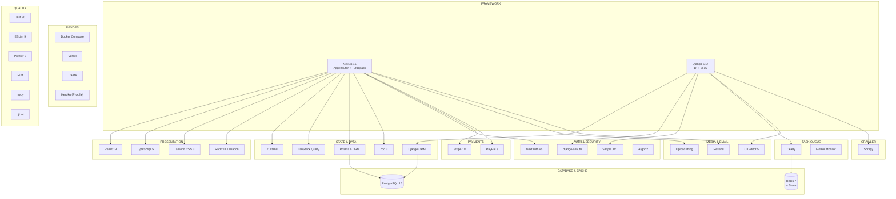
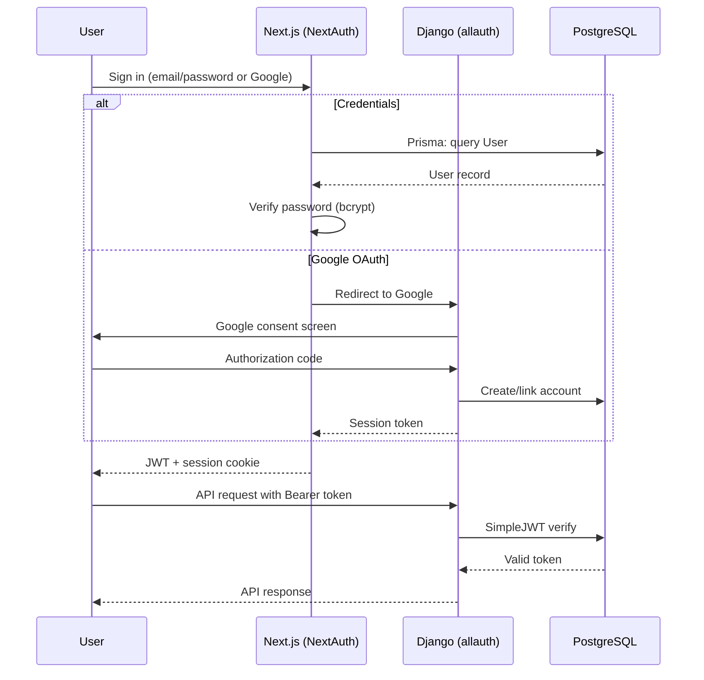
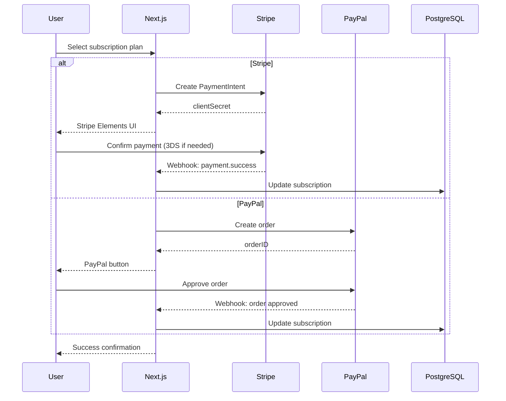

# rhixe_scans — Technology Stack Blueprint

> **Project:** rhixe_scans — Full-Stack Comic Reading Platform
> **Generated:** 2026-07-24
> **Source:** `projects/rhixe_scans/`

---

## 1. Stack Overview

---

## 2. Frontend Technologies

### 2.1 Core Framework

| Technology | Version | Purpose | Rationale |
|---|---|---|---|
| **Next.js** | 15.3.3 | React framework (App Router) | File-based routing, RSC, Turbopack dev, SSR/SSG |
| **React** | 19.1.0 | UI library | Latest stable with concurrent features |
| **TypeScript** | 5.x | Type safety | Strict mode enabled (`strict: true`) |
| **Turbopack** | — | Rust-based bundler | Next.js 15 default dev server for fast refresh |

### 2.2 Styling & UI

| Technology | Version | Purpose |
|---|---|---|
| **Tailwind CSS** | 3.4.1 | Utility-first CSS framework |
| **Radix UI Primitives** | latest | Accessible headless UI components (16 packages) |
| **shadcn/ui** | latest | Component collection built on Radix + Tailwind |
| **Lucide React** | 0.516.0 | Icon library |
| **Class Variance Authority** | 0.7.1 | Component variant management |
| **Tailwind Merge** | 3.3.1 | Intelligent class merging |
| **Tailwind CSS Animate** | 1.0.7 | Tailwind animation utilities |
| **Embla Carousel** | 8.6.0 | Performant carousel (comic page navigation) |
| **Recharts** | 2.15.3 | Dashboard charts |
| **Sonner** | 2.0.5 | Toast notifications |

### 2.3 State Management

| Technology | Version | Purpose |
|---|---|---|
| **Zustand** | latest | Lightweight client state management |
| **TanStack Query** | latest | Server state caching and synchronization |
| **TanStack React Table** | 8.21.3 | Data table component (admin panels) |

### 2.4 Forms & Validation

| Technology | Version | Purpose |
|---|---|---|
| **React Hook Form** | 7.58.1 | Performant form state management |
| **Zod** | 3.25.67 | Schema validation (all API inputs) |
| **@hookform/resolvers** | 5.1.1 | Zod integration with RHF |

### 2.5 Utilities

| Technology | Version | Purpose |
|---|---|---|
| **Slugify** | 1.6.6 | URL slug generation |
| **Query String** | 9.2.1 | URL query parameter parsing |
| **UUID** | 11.1.0 | Unique ID generation |
| **use-debounce** | 10.0.5 | Debounced input handling |
| **clsx** | 2.1.1 | Conditional class construction |
| **Pretty Bytes** | 7.0.0 | Human-readable file sizes |

---

## 3. Backend Technologies

### 3.1 Django Ecosystem

| Technology | Version | Purpose |
|---|---|---|
| **Django** | 5.1+ | Web framework (Cookiecutter template) |
| **Django REST Framework** | latest | REST API framework |
| **Django CORS Headers** | latest | CORS management |
| **Django Filter** | latest | Query parameter filtering |
| **Django Celery Beat** | latest | Scheduled task management |
| **Django Celery Results** | latest | Task result backend |
| **django-allauth** | latest | Authentication (email, Google OAuth) |
| **dj-rest-auth** | latest | REST auth endpoints |
| **djangorestframework-simplejwt** | latest | JWT authentication |
| **django-ckeditor-5** | latest | Rich text editing (comic descriptions) |
| **django-crispy-forms** | latest | Form rendering |
| **crispy-tailwind** | latest | Tailwind form templates |
| **django-webpack-loader** | latest | Webpack asset loading |
| **django-import-export** | latest | Admin data import/export |
| **Unfold** | latest | Modern Django Admin theme |
| **django-coverage-plugin** | latest | Coverage for templates |
| **drf-spectacular** | latest | OpenAPI schema generation (Swagger UI) |
| **Celery Progress** | latest | Task progress bars |
| **Whitenoise** | latest | Static file serving |
| **django-dynamic-formsets** | latest | Dynamic form handling |

### 3.2 Python Tooling

| Technology | Version | Purpose |
|---|---|---|
| **Python** | 3.12 | Runtime |
| **Poetry / pip** | — | Dependency management (`pyproject.toml`) |
| **Gunicorn** | latest | Production WSGI server |
| **Pillow** | latest | Image processing |
| **psycopg2** | latest | PostgreSQL adapter |
| **redis** | latest | Redis client (hiredis parser) |
| **celery** | latest | Async task queue |
| **flower** | latest | Celery monitoring dashboard |
| **gTTS / Flite** | latest | Text-to-speech (accessibility) |

### 3.3 Code Quality (Python)

| Tool | Version | Purpose |
|---|---|---|
| **Ruff** | latest | Python linter (200+ rules) |
| **mypy** | latest | Type checking with django-stubs |
| **djLint** | latest | Django template linting |
| **Pytest** | latest | Test runner with Django plugin |
| **Coverage.py** | latest | Code coverage |
| **django-debug-toolbar** | latest | Development debug panel |

---

## 4. Database Technologies

| Technology | Purpose | Configuration |
|---|---|---|
| **PostgreSQL** | Primary relational database | Dual ORM access (Prisma + Django ORM) |
| **Redis 7** | Cache, Celery broker, session store | Master + slave replica |
| **Prisma 6** | Type-safe ORM (Next.js side) | `src/db/schema.prisma`, 18 models |
| **Django ORM** | Mature ORM (backend side) | Custom managers, signals, migrations |

### 4.1 Database Models

| Model | App | Key Fields |
|---|---|---|
| `User` | Both | email, password, emailVerified |
| `Comic` | Both | title, slug, description, status, rating |
| `Chapter` | Both | name, slug, title, numimages |
| `Genre` / `Category` / `Author` / `Artist` | Both | name (unique) |
| `Bookmark` | Prisma | userId, items (JSON) |
| `ComicImage` / `ChapterImage` | Both | link, image, status, checksum |
| `Comment` | Django | text (CKEditor), chapter, comic, user |
| `Account` / `Session` | Prisma | NextAuth provider accounts |
| `UserComic` | Django | Many-to-many through table |

---

## 5. Authentication & Security

| Technology | Version | Purpose |
|---|---|---|
| **NextAuth v5** | 5.0.0-beta.25 | Next.js authentication (credentials, Google) |
| **django-allauth** | latest | Django authentication (email, Google OAuth) |
| **SimpleJWT** | latest | JWT tokens for API access |
| **Argon2** | — | Password hashing (recommended by OWASP) |
| **bcrypt** | — | Additional password hashing |
| **Zod** | 3.25.67 | Input validation on all API boundaries |
| **Supabase SSR** | 0.6.1 | Optional Supabase auth integration |
| **CSP headers** | — | Content Security Policy via Django |

---

## 6. Payment Processing

| Technology | Version | Purpose | Integration |
|---|---|---|---|
| **Stripe** | 18.2.1 | Primary payment processor | `@stripe/react-stripe-js` + `stripe` (server) |
| **PayPal** | 8.8.3 | Secondary payment processor | `@paypal/react-paypal-js` |

Both providers are integrated client-side with server-side webhook verification. Dual-provider architecture supports broader audience reach.

---

## 7. Media & File Storage

| Technology | Version | Purpose |
|---|---|---|
| **UploadThing** | 7.7.2 | Comic image uploads (S3-compatible) |
| **@uploadthing/react** | 7.3.1 | UploadThing React integration |
| **Django FileField** | built-in | Local media storage fallback |
| **Pillow** | latest | Image validation and processing |
| **CKEditor 5** | latest | Rich text editor for comic descriptions |

---

## 8. Real-Time Communications

| Technology | Version | Purpose |
|---|---|---|
| **ws** | 8.18.2 | WebSocket server (chapter notifications) |
| **Redis Pub/Sub** | — | Cross-process WebSocket message relay |
| **Celery Progress** | latest | Task progress broadcast |

---

## 9. Email System

| Technology | Version | Purpose |
|---|---|---|
| **Resend** | 4.6.0 | Transactional email delivery |
| **React Email** | 4.0.16 | Email template components |
| **@react-email/components** | 0.1.0 | Email component library |
| **Django SMTP** | built-in | Fallback email backend |

---

## 10. Crawler & Content Pipeline

| Technology | Version | Purpose |
|---|---|---|
| **Scrapy** | latest | Web scraping framework |
| **Celery** | latest | Async crawl task orchestration |
| **Redis** | 7 | Task queue broker |
| **Flower** | latest | Task monitoring dashboard |

---

## 11. Authentication Flow Diagram

---

## 12. Payment Flow Diagram

---

## 13. Deployment Technologies

| Technology | Purpose |
|---|---|
| **Docker Compose** | Local and production container orchestration |
| **Vercel** | Next.js frontend deployment |
| **Heroku** | Alternative deployment (Procfile) |
| **Traefik** | Reverse proxy / SSL termination |
| **ReadTheDocs** | Documentation hosting |
| **AWS CLI** | Cloud storage and deployment utilities |

---

## 14. Development Toolchain

| Tool | Version | Purpose |
|---|---|---|
| **Bun** | 1.3.14+ | JavaScript runtime & package manager |
| **npm** | — | Fallback package manager |
| **Jest** | 30.0.0 | TypeScript/React unit tests |
| **ts-jest** | 29.4.0 | TypeScript Jest transformer |
| **ESLint** | 9.x | TypeScript/JSX linting (flat config) |
| **Prettier** | 3.5.3 | Code formatting (with Tailwind plugin) |
| **Ruff** | latest | Python linting (200+ rules) |
| **mypy** | latest | Python type checking |
| **djLint** | latest | Django template linting |
| **Pytest** | latest | Python test runner |
| **EditorConfig** | — | Cross-editor formatting consistency |
| **Pre-commit** | — | Git hook automation |
| **npm-check-updates** | 18.0.1 | Dependency update management |

---

## 15. Technology Stack Summary

| Category | Primary | Secondary |
|---|---|---|
| **Frontend Framework** | Next.js 15 (App Router) | — |
| **UI Library** | React 19 + TypeScript 5 | — |
| **Styling** | Tailwind CSS 3 + Radix/shadcn | CVA, clsx, tailwind-merge |
| **State** | Zustand + TanStack Query | — |
| **Backend** | Django 5 + DRF | Celery + Flower |
| **Database** | PostgreSQL (dual ORM) | Redis 7 |
| **ORM (Frontend)** | Prisma 6 | — |
| **ORM (Backend)** | Django ORM | — |
| **Auth (Frontend)** | NextAuth v5 | Supabase SSR |
| **Auth (Backend)** | django-allauth + SimpleJWT | Argon2 |
| **Payments** | Stripe 18 | PayPal 8 |
| **Media** | UploadThing | Django FileField |
| **Realtime** | WebSocket (ws) | Redis Pub/Sub |
| **Email** | Resend + React Email | Django SMTP |
| **Crawler** | Scrapy | Celery |
| **Containerization** | Docker Compose | — |
| **Deploy** | Vercel + Docker | Heroku, Traefik |
| **Testing (JS)** | Jest + ts-jest | — |
| **Testing (Python)** | Pytest | Coverage.py |
| **Linting (JS)** | ESLint 9 + Prettier 3 | — |
| **Linting (Python)** | Ruff + mypy + djLint | — |
