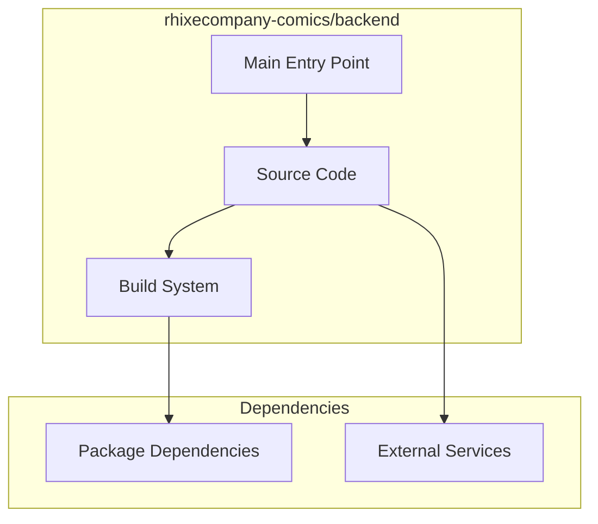

# rhixecompany-comics/backend Architecture

**Generated:** 2026-07-28  
**Project Type:** Python/Django (Backend)  
**Architecture Pattern:** Django + Docker backend for comics platform

## Overview

Django REST API backend with Docker deployment for the rhixecompany-comics platform.

## Technology Stack

Django, Python, Docker Compose, PostgreSQL

## Source Layout

Standard Django app structure, Docker Compose

## Architecture Diagram

## Key Patterns

- **Django + Docker backend for comics platform**
- Version control: Shared rhixecompany-comics git

## Cross-Cutting Concerns

- **Linting/Formatting:** Aligned with workspace root configs (ESLint, Prettier, Ruff)
- **Documentation:** AGENTS.md + standard doc files per project convention
- **Dependencies:** Managed via project-specific package manager

## Related Documents

- [Folder Structure](./rhixecompany-comics-backend_folders.md)
- [Technology Stack](./rhixecompany-comics-backend_techstack.md)
