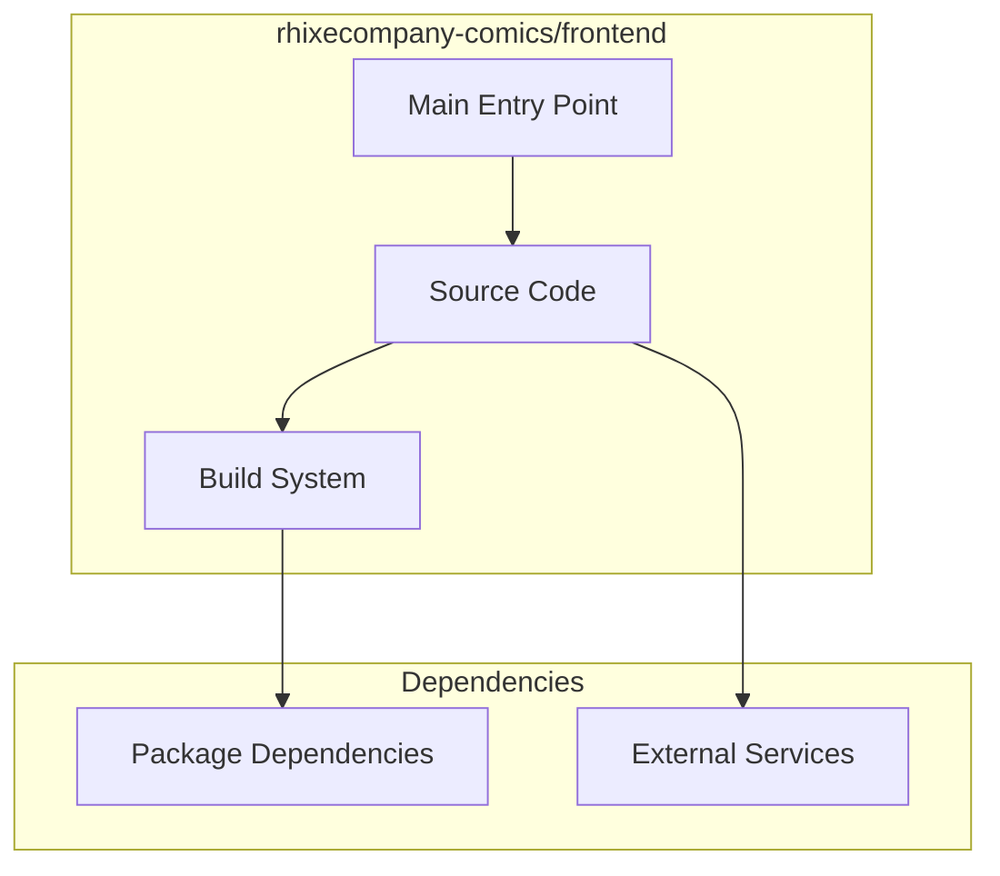

# rhixecompany-comics/frontend Architecture

**Generated:** 2026-07-28  
**Project Type:** TypeScript/Bun (Next.js)  
**Architecture Pattern:** Next.js frontend for comics platform

## Overview

Next.js frontend with Tailwind CSS for the rhixecompany-comics publishing platform.

## Technology Stack

Next.js, React, Bun, TypeScript, Tailwind CSS, shadcn/ui

## Source Layout

src/app/, src/components/

## Architecture Diagram

## Key Patterns

- **Next.js frontend for comics platform**
- Version control: Shared rhixecompany-comics git

## Cross-Cutting Concerns

- **Linting/Formatting:** Aligned with workspace root configs (ESLint, Prettier, Ruff)
- **Documentation:** AGENTS.md + standard doc files per project convention
- **Dependencies:** Managed via project-specific package manager

## Related Documents

- [Folder Structure](./rhixecompany-comics-frontend_folders.md)
- [Technology Stack](./rhixecompany-comics-frontend_techstack.md)
