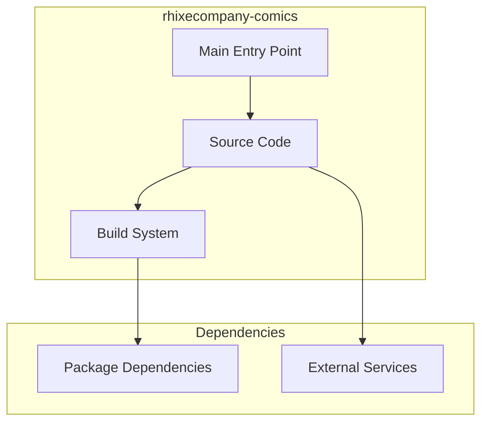

# rhixecompany-comics Architecture

**Generated:** 2026-07-28  
**Project Type:** Full-Stack (Next.js + Django)  
**Architecture Pattern:** Next.js frontend + Django backend + Docker

## Overview

Comic publishing platform with Next.js frontend, Django backend APIs, and Docker deployment.

## Technology Stack

Next.js, React, Bun, TypeScript, Tailwind CSS, Django, Python, Docker Compose, PostgreSQL

## Source Layout

frontend/src/, backend/, docker-compose.yml

## Architecture Diagram

## Key Patterns

- **Next.js frontend + Django backend + Docker**
- Version control: Shared monorepo git

## Cross-Cutting Concerns

- **Linting/Formatting:** Aligned with workspace root configs (ESLint, Prettier, Ruff)
- **Documentation:** AGENTS.md + standard doc files per project convention
- **Dependencies:** Managed via project-specific package manager

## Related Documents

- [Folder Structure](./rhixecompany-comics_folders.md)
- [Technology Stack](./rhixecompany-comics_techstack.md)
