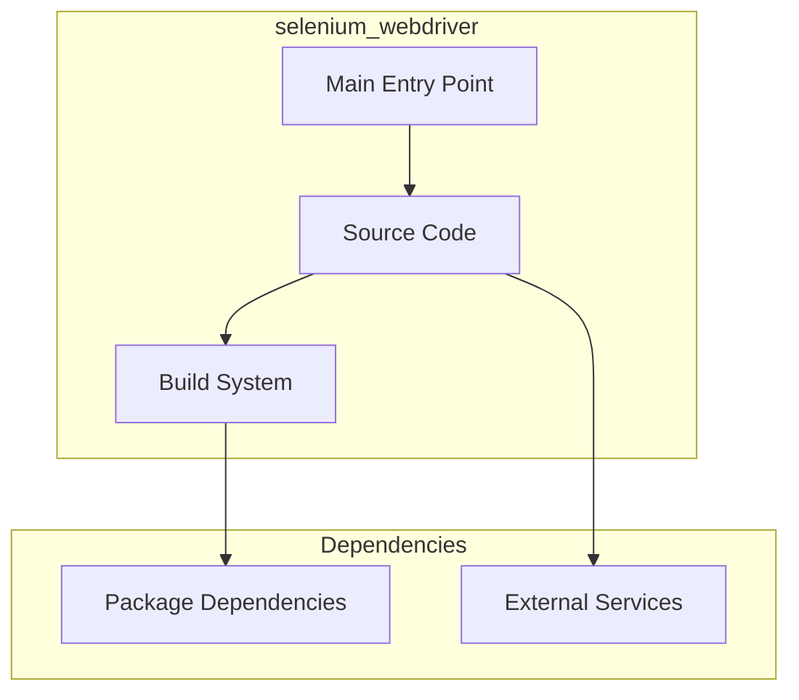

# selenium_webdriver Architecture

**Generated:** 2026-07-28  
**Project Type:** TypeScript/Bun (Utility)  
**Architecture Pattern:** Selenium WebDriver browser automation

## Overview

Browser automation project using Selenium WebDriver with TypeScript/Bun bindings.

## Technology Stack

Bun, TypeScript, Selenium, Prettier

## Source Layout

src/

## Architecture Diagram

## Key Patterns

- **Selenium WebDriver browser automation**
- Version control: Shared monorepo git

## Cross-Cutting Concerns

- **Linting/Formatting:** Aligned with workspace root configs (ESLint, Prettier, Ruff)
- **Documentation:** AGENTS.md + standard doc files per project convention
- **Dependencies:** Managed via project-specific package manager

## Related Documents

- [Folder Structure](./selenium_webdriver_folders.md)
- [Technology Stack](./selenium_webdriver_techstack.md)
