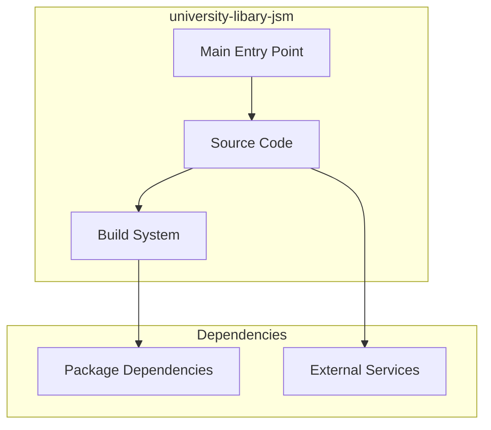

# university-libary-jsm Architecture

**Generated:** 2026-07-28  
**Project Type:** TypeScript/Bun (Next.js)  
**Architecture Pattern:** Next.js full-stack with NextAuth and Drizzle

## Overview

University library management system with book catalog, user authentication, and reading lists.

## Technology Stack

Next.js, React, Node.js, TypeScript, Tailwind CSS, Drizzle ORM, NextAuth.js, shadcn/ui

## Source Layout

app/, components/, lib/, database/

## Architecture Diagram

## Key Patterns

- **Next.js full-stack with NextAuth and Drizzle**
- Version control: Shared monorepo git

## Cross-Cutting Concerns

- **Linting/Formatting:** Aligned with workspace root configs (ESLint, Prettier, Ruff)
- **Documentation:** AGENTS.md + standard doc files per project convention
- **Dependencies:** Managed via project-specific package manager

## Related Documents

- [Folder Structure](./university-libary-jsm_folders.md)
- [Technology Stack](./university-libary-jsm_techstack.md)
